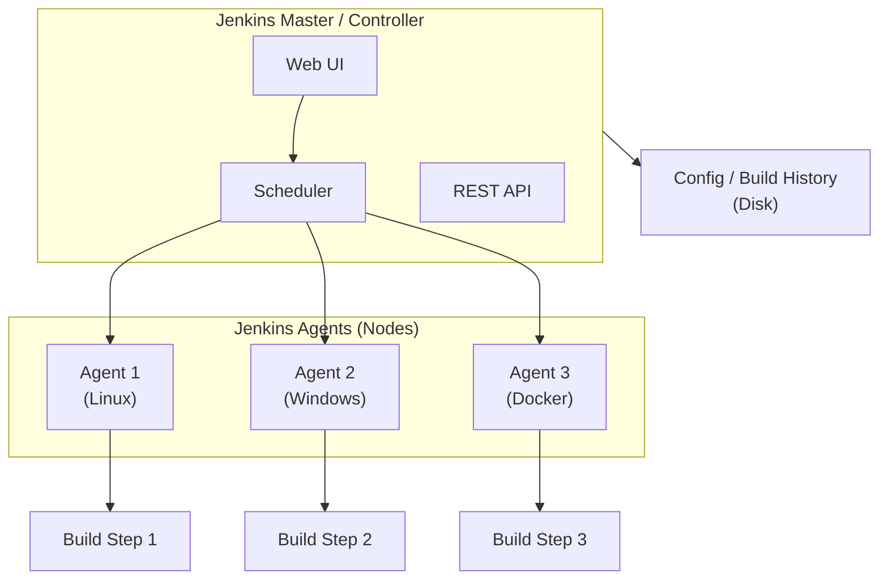

# DevOps - Jenkins

## 1. Tổng quan

**Jenkins** là automation server open-source được sử dụng rộng rãi nhất, được viết bằng Java. Nó orchestrates các CI/CD pipelines thông qua kiến trúc plugin-based, cho phép tự động hóa việc build, test, và deploy phần mềm.

### Các tính năng chính

- Hệ sinh thái plugin (18,000+ plugins)
- Distributed builds qua agents/nodes
- Pipeline as Code (Jenkinsfile)
- Blue Ocean modern UI
- Strong community support

---

## 2. Kiến trúc

### 2.1. Master/Controller + Agents/Nodes



| Component | Chức năng |
|-----------|-----------|
| **Master/Controller** | Lên lịch build jobs, phục vụ web UI, quản lý configuration, lưu trữ build history |
| **Agents/Nodes** | Execute các build jobs được assign bởi master. Có thể là static hoặc dynamic (Docker, Kubernetes) |
| **Executor** | Slot trên agent chạy một build tại một thời điểm. Multiple executors = parallel builds |

### 2.2. Khởi tạo Agents

```bash
# Launch agent via JNLP (Java Web Start)
java -jar agent.jar -jnlpUrl http://jenkins:8080/computer/agent1/slave-agent.jnlp -workDir "/home/jenkins/agent"

# Launch agent via SSH
ssh jenkins@agent-node "java -jar /usr/share/jenkins/agent.jar" \
  -jnlpUrl http://jenkins:8080/computer/agent1/slave-agent.jnlp

# Agent labels cho targeted builds
# Node label: "docker", "linux", "high-memory"
```

### 2.3. Kubernetes Agent (Dynamic Agents)

```yaml
# jenkins-agent.yaml (Kubernetes Pod Template)
apiVersion: v1
kind: Pod
metadata:
  name: jenkins-agent
spec:
  serviceAccountName: jenkins
  containers:
    - name: jnlp
      image: jenkins/inbound-agent:latest
      env:
        - name: JENKINS_URL
          value: "http://jenkins:8080"
      resources:
        requests:
          cpu: 500m
          memory: 512Mi
        limits:
          cpu: 1000m
          memory: 1Gi
    - name: docker
      image: docker:latest
      command:
        - cat
      tty: true
      volumeMounts:
        - name: docker-socket
          mountPath: /var/run/docker.sock
  volumes:
    - name: docker-socket
      hostPath:
        path: /var/run/docker.sock
```

---

## 3. Jenkinsfile: Declarative vs Scripted Pipeline

### 3.1. Declarative Pipeline (Recommended)

```groovy
pipeline {
    agent any   // or agent { label 'docker' } or agent kubernetes

    options {
        timestamps()
        timeout(time: 30, unit: 'MINUTES')
        buildDiscarder(logRotator(numToKeepStr: '10'))
    }

    environment {
        DOCKER_IMAGE = 'myapp'
        DOCKER_REGISTRY = 'registry.example.com'
    }

    stages {
        stage('Checkout') {
            steps {
                echo 'Cloning repository...'
                checkout scm
            }
        }

        stage('Build') {
            steps {
                echo 'Building application...'
                sh 'npm ci'
                sh 'npm run build'
            }
        }

        stage('Test') {
            steps {
                echo 'Running tests...'
                sh 'npm test -- --coverage'
            }
            post {
                always {
                    junit '**/test-results/**/*.xml'
                    publishCoverage(
                        adapters: [jacocoAdapter('coverage/coverage.xml')]
                    )
                }
            }
        }

        stage('Security Scan') {
            steps {
                echo 'Running security scan...'
                sh 'trivy image --exit-code 1 --severity HIGH myapp:$BUILD_NUMBER || true'
            }
        }

        stage('Build Docker Image') {
            steps {
                echo 'Building Docker image...'
                sh '''
                    docker build -t $DOCKER_REGISTRY/$DOCKER_IMAGE:$BUILD_NUMBER .
                    docker build -t $DOCKER_REGISTRY/$DOCKER_IMAGE:latest .
                '''
            }
        }

        stage('Deploy to Staging') {
            when {
                branch 'develop'
            }
            steps {
                echo 'Deploying to staging...'
                sh 'kubectl apply -f k8s/staging/ --namespace=staging'
            }
        }

        stage('Deploy to Production') {
            when {
                branch 'main'
            }
            steps {
                echo 'Deploying to production...'
                sh 'kubectl apply -f k8s/prod/ --namespace=production'
                sh 'kubectl rollout status deployment/myapp -n production'
            }
        }
    }

    post {
        always {
            echo 'Cleaning up...'
            cleanWs()
        }
        success {
            echo 'Pipeline succeeded!'
            slackSend(
                color: 'good',
                message: "Build #${env.BUILD_NUMBER} succeeded: ${env.BUILD_URL}"
            )
        }
        failure {
            echo 'Pipeline failed!'
            slackSend(
                color: 'danger',
                message: "Build #${env.BUILD_NUMBER} failed: ${env.BUILD_URL}"
            )
            mail to: 'team@example.com',
                 subject: "Jenkins Build #${env.BUILD_NUMBER} Failed",
                 body: "Check ${env.BUILD_URL}"
        }
    }
}
```

### 3.2. Scripted Pipeline (Advanced)

```groovy
node('docker') {
    stage('Checkout') {
        checkout scm
    }

    stage('Build') {
        def image = docker.build("myapp:${env.BUILD_NUMBER}")
    }

    stage('Test') {
        try {
            image.inside {
                sh 'npm test'
            }
        } finally {
            junit '**/test-results/**/*.xml'
        }
    }

    stage('Push') {
        docker.withRegistry('https://registry.example.com', 'docker-registry-creds') {
            image.push('latest')
            image.push(env.BUILD_NUMBER)
        }
    }
}
```

### 3.3. Sự khác biệt chính

| Khía cạnh | Declarative | Scripted |
|-----------|------------|----------|
| **Syntax** | YAML-like, structured | Groovy DSL |
| **Learning curve** | Dễ hơn | Steeper |
| **Flexibility** | Giới hạn trong các directives có sẵn | Full Groovy power |
| **Error handling** | `post` block | `try/catch/finally` |
| **Phù hợp cho** | Standard CI/CD pipelines | Complex conditional logic |

---

## 4. Groovy Scripting Basics

### 4.1. Variables và Data Types

```groovy
// Variables
def name = "myapp"
def version = 1.0
def isEnabled = true
def ports = [8080, 443, 3000]
def config = [env: "prod", replicas: 3]

// String interpolation
echo "Building ${name} version ${version}"
echo "Build number: ${env.BUILD_NUMBER}"
```

### 4.2. Conditionals và Loops

```groovy
// If-else
if (env.BRANCH_NAME == 'main') {
    echo "Deploying to production"
} else if (env.BRANCH_NAME == 'develop') {
    echo "Deploying to staging"
} else {
    echo "Deploying to preview"
}

// For loop
for (def i = 0; i < 3; i++) {
    echo "Deployment attempt ${i + 1}"
}

// Each
def services = ['api', 'web', 'worker']
services.each { service ->
    sh "kubectl delete deployment ${service}"
}
```

### 4.3. Methods và Functions

```groovy
def buildImage(String service, String tag) {
    sh "docker build -t ${service}:${tag} ./services/${service}"
    return "${service}:${tag}"
}

def deployToK8s(String namespace, String image) {
    sh "kubectl set image deployment/myapp app=${image} -n ${namespace}"
    sh "kubectl rollout status deployment/myapp -n ${namespace}"
}

def rollbackK8s(String namespace) {
    sh "kubectl rollout undo deployment/myapp -n ${namespace}"
}
```

### 4.4. Shared Libraries (Tái sử dụng)

```groovy
// vars/deploy.groovy
def call(String environment, String imageTag) {
    pipeline {
        stages {
            stage('Deploy') {
                steps {
                    script {
                        sh "kubectl config use-context ${environment}"
                        sh "kubectl set image deployment/app app=${imageTag}"
                    }
                }
            }
        }
    }
}
```

---

## 5. Distributed Builds với Agents

### 5.1. Agent Labels và Selectors

```groovy
// Sử dụng labeled agent
pipeline {
    agent { label 'docker' }
    // Chạy trên bất kỳ agent nào có label 'docker'
}

// Sử dụng nhiều labels (AND logic)
agent { label 'linux && docker' }

// Sử dụng expression
agent {
    node {
        label 'docker'
        customWorkspace '/custom/workspace'
    }
}
```

### 5.2. Agent Configuration

```bash
# Manage nodes via CLI
java -jar jenkins-cli.jar -s http://jenkins:8080 list-nodes

# Add node via CLI
java -jar jenkins-cli.jar -s http://jenkins:8080 create-node agent1 \
    -description "Docker agent" \
    -remoteFS /home/jenkins \
    -numExecutors 2 \
    -labels "docker linux" \
    -mode EXCLUSIVE
```

### 5.3. Kubernetes Cloud Configuration

```groovy
// jenkins.yaml (JCasC - Jenkins Configuration as Code)
jenkins:
  clouds:
    - kubernetes:
        name: "kubernetes"
        serverUrl: "https://kubernetes.default"
        namespace: "jenkins"
        jenkinsUrl: "http://jenkins:8080"
        jenkinsTunnel: "jenkins:50000"
        containerCap: 100
        maxRequestsPerHostStr: "32"
        templates:
          - name: "jenkins-agent"
            namespace: "jenkins"
            label: "jenkins-agent"
            containers:
              - name: "jnlp"
                image: "jenkins/inbound-agent:latest"
                workingDir: "/home/jenkins"
                resourceRequestCpu: "500m"
                resourceLimitCpu: "1000m"
                resourceRequestMemory: "512Mi"
                resourceLimitMemory: "1Gi"
            yaml: |
              apiVersion: v1
              kind: Pod
              spec:
                securityContext:
                  runAsUser: 1000
                containers:
                  - name: jnlp
                    image: jenkins/inbound-agent:latest
                    tty: true
```

---

## 6. Credentials và Secret Management

### 6.1. Credential Types

| Type | Use Case |
|------|----------|
| **Username with password** | Docker registry, generic credentials |
| **SSH Username with private key** | Git SSH access |
| **Secret file** | Keystore, certificate files |
| **Secret text** | API keys, tokens, passwords |
| **Certificate** | Client-side SSL certificates |

### 6.2. Sử dụng Credentials trong Pipeline

```groovy
pipeline {
    agent any
    environment {
        // Credentials ID từ Jenkins UI (Manage Jenkins -> Credentials)
        DOCKER_REGISTRY_CREDS = credentials('docker-registry-creds')
    }
    stages {
        stage('Build') {
            steps {
                // Username and password available as env vars
                sh '''
                    echo $DOCKER_REGISTRY_CREDS_USR
                    echo $DOCKER_REGISTRY_CREDS_PSW
                '''

                // For secret text (token)
                sh 'curl -H "Authorization: Bearer $TOKEN" https://api.example.com'
            }
        }

        stage('Deploy with SSH Key') {
            steps {
                withCredentials([
                    sshUserPrivateKey(
                        keyFileVariable: 'SSH_KEY',
                        credentialsId: 'deploy-ssh-key',
                        usernameVariable: 'SSH_USER'
                    )
                ]) {
                    sh '''
                        export SSH_KEY
                        ssh -i $SSH_KEY $SSH_USER@server "kubectl get pods"
                    '''
                }
            }
        }
    }
}
```

### 6.3. HashiCorp Vault Integration

```groovy
// Với HashiCorp Vault plugin
pipeline {
    agent any
    environment {
        VAULT_CREDS = credentials('vault-secret')
    }
    stages {
        stage('Fetch Secrets from Vault') {
            steps {
                script {
                    def secrets = vaultSecrets(
                        secretPath: 'secret/myapp/prod',
                        secretValues: [
                            [envVar: 'DB_PASSWORD', vaultKey: 'password'],
                            [envVar: 'API_KEY', vaultKey: 'api-key']
                        ]
                    )
                }
            }
        }
    }
}
```

---

## 7. So sánh CI/CD Tools

### Jenkins vs GitHub Actions vs GitLab CI vs CircleCI

| Khía cạnh | Jenkins | GitHub Actions | GitLab CI | CircleCI |
|-----------|---------|---------------|-----------|----------|
| **Hosting** | Self-hosted | SaaS + self-hosted | SaaS + self-hosted | SaaS + self-hosted |
| **Configuration** | Jenkinsfile (Groovy) | YAML workflow | YAML CI/CD config | YAML config |
| **Scalability** | Self-managed agents | GitHub-hosted + self-hosted runners | GitLab-hosted + self-managed | Cloud + self-hosted |
| **Ecosystem** | 18,000+ plugins | Marketplace actions | Auto DevOps, integrat | Orbs (reusable configs) |
| **Learning curve** | Steeper (Groovy) | Moderate (YAML) | Moderate (YAML) | Moderate (YAML) |
| **Pricing** | Free (self-hosted) | Free tier + per-minute | Free tier + per-minute | Free tier + credits |
| **Container support** | Via plugins | Native | Native | Native |
| **Secret management** | Credentials store + Vault | GitHub Secrets | GitLab CI/CD Variables | Contexts + Vault |
| **Phù hợp cho** | Enterprise với complex needs | GitHub repos, open-source | GitLab repos, integrated | Fast execution, orbs |

### Ví dụ GitHub Actions (để so sánh)

```yaml
# .github/workflows/ci.yml
name: CI/CD

on:
  push:
    branches: [main, develop]
  pull_request:
    branches: [main]

jobs:
  build:
    runs-on: ubuntu-latest
    steps:
      - uses: actions/checkout@v4
      - uses: actions/setup-node@v4
        with:
          node-version: '20'
          cache: 'npm'
      - run: npm ci
      - run: npm test
      - run: npm run build

  deploy:
    needs: build
    if: github.ref == 'refs/heads/main'
    runs-on: ubuntu-latest
    steps:
      - uses: actions/checkout@v4
      - uses: google-github-actions/deploy-cloudrun@v1
        with:
          service: myapp
          image: gcr.io/${{ secrets.GCP_PROJECT }}/myapp:${{ github.sha }}
```

---

## 8. Blue Ocean UI

**Blue Ocean** là Jenkins' modern, redesigned user interface tập trung vào pipelines và làm cho CI/CD dễ hiểu hơn.

### Các tính năng chính

- **Pipeline Editor**: Visual pipeline editor (Groove-based, không khuyến khích cho production)
- **Pipeline Runs**: Trực quan hóa rõ ràng các build stages và steps
- **Branches/PRs**: GitHub/Bitbucket integration với automatic pipeline creation
- **Failure Diagnosis**: Xác định chính xác step nào failed
- **Personalized Dashboard**: Tập trung vào các pipelines bạn quan tâm

```bash
# Install Blue Ocean plugin
# Manage Jenkins -> Manage Plugins -> Available -> Blue Ocean

# Access Blue Ocean UI
# http://jenkins:8080/blue
```

---

## 9. Câu hỏi phỏng vấn

**Q: Sự khác biệt giữa declarative và scripted pipeline?**

> **Declarative pipelines** sử dụng structured, YAML-like syntax dễ học hơn và validates chính nó trước khi execute. Chúng phù hợp cho standard CI/CD workflows. **Scripted pipelines** sử dụng Groovy DSL và cung cấp full programming flexibility — có thể dùng loops, try/catch blocks, và complex conditionals. Declarative được khuyến khích cho hầu hết use cases, với scripted dùng cho advanced custom logic.

**Q: Làm thế nào để bảo mật Jenkins?**

- Sử dụng **Role-Based Access Control (RBAC)** với Matrix Authorization Strategy plugin
- Lưu trữ secrets trong **credentials store** (không trong Jenkinsfile)
- Sử dụng **Agent-to-Master Security** (bật "Require IP whitelist" và agent access control)
- **Cập nhật thường xuyên** Jenkins và tất cả plugins
- Sử dụng **Jenkins Configuration as Code (JCasC)** để version control configuration
- Thiết lập **audit logging** cho compliance
- Sử dụng **Kubernetes secrets** hoặc **HashiCorp Vault** cho secret management
- Giới hạn build agents' access đến master filesystem

**Q: Làm thế nào để xử lý long-running builds và timeout management?**

> Sử dụng `timeout` step trong pipeline options, cấu hình build executor timeouts, và chia các large builds thành smaller parallel stages. Với các builds rất dài, sử dụng `catchError` với `build: false` để prevent cascading failures, và cân nhắc checkpoint plugins cho resumable builds.

**Q: Sự khác biệt giữa `agent any` và `agent none`?**

> `agent any` có nghĩa pipeline có thể chạy trên bất kỳ agent nào available. `agent none` có nghĩa không có agent được allocate ở pipeline level — mỗi stage phải specify agent riêng. Điều này hữu ích khi các stages khác nhau cần các agent types khác nhau hoặc khi bạn muốn kiểm soát tối đa nơi mỗi stage chạy.
