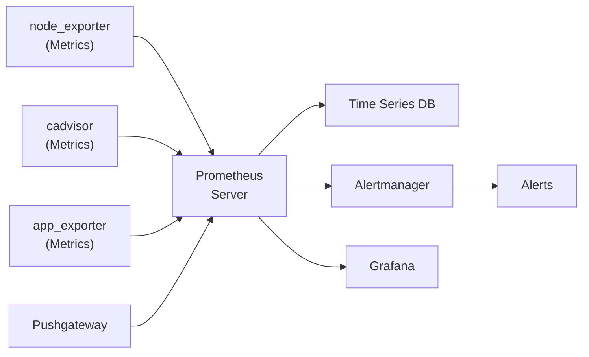
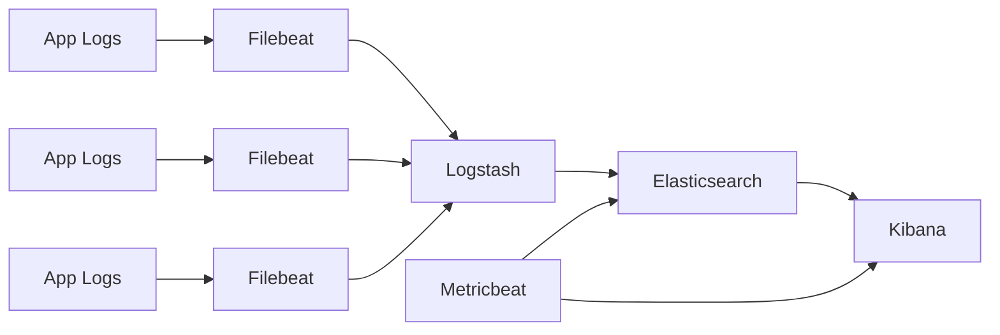
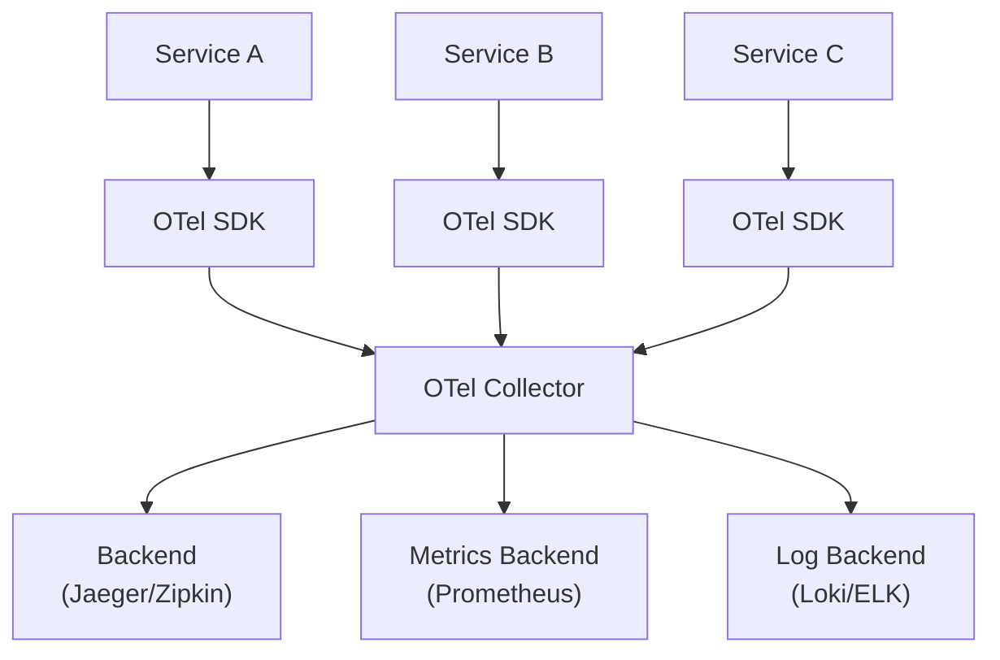

# DevOps - Monitoring & Logging

## 1. Ba Trụ cột của Observability

Observability trong hệ thống hiện đại dựa trên ba trụ cột:

| Trụ cột | Đo lường | Công cụ |
|---------|---------|---------|
| **Metrics** | Dữ liệu số theo thời gian (CPU, request rate) | Prometheus, Grafana, CloudWatch |
| **Logs** | Các sự kiện riêng lẻ có timestamp | ELK, Loki, CloudWatch Logs |
| **Traces** | Đường đi của request qua các distributed services | OpenTelemetry, Jaeger, Zipkin |

### Tại sao cần cả ba

- **Metrics** cho biết *điều gì* đang xảy ra (tổng quan)
- **Logs** cho biết *tại sao* nó xảy ra (chi tiết ngữ cảnh)
- **Traces** cho biết *ở đâu* trong chuỗi request (mối quan hệ nhân quả)

---

## 2. Prometheus

**Prometheus** là một bộ công cụ open-source cho monitoring và alerting. Nó pull (scrape) metrics từ các targets đã được cấu hình tại các khoảng thời gian đều đặn và lưu trữ dưới dạng time series data.

### 2.1. Kiến trúc



### 2.2. Cài đặt và Cấu hình Prometheus

```yaml
# prometheus.yml
global:
  scrape_interval: 15s
  evaluation_interval: 15s

alerting:
  alertmanagers:
    - static_configs:
        - targets:
          - alertmanager:9093

rule_files:
  - "alerts/*.yml"

scrape_configs:
  - job_name: "prometheus"
    static_configs:
      - targets: ["localhost:9090"]

  - job_name: "node-exporter"
    static_configs:
      - targets: ["node-exporter:9100"]

  - job_name: "myapp"
    static_configs:
      - targets: ["myapp:8080"]
```

```bash
# Cài đặt qua Helm
helm install prometheus prometheus-community/prometheus

# Port-forward để truy cập UI
kubectl port-forward svc/prometheus-server 9090:80
```

### 2.3. PromQL - Prometheus Query Language

```promql
# Request rate (requests per second)
rate(http_requests_total{service="myapp"}[5m])

# Error rate
rate(http_requests_total{service="myapp", status=~"5.."}[5m])

# 99th percentile latency
histogram_quantile(0.99, rate(http_request_duration_seconds_bucket{service="myapp"}[5m]))

# CPU usage percentage
100 - (avg by (instance) (rate(node_cpu_seconds_total{mode="idle"}[5m])) * 100)

# Memory usage
node_memory_MemAvailable_bytes / node_memory_MemTotal_bytes * 100

# Requests per second by service
sum by (service) (rate(http_requests_total[5m]))

# Pods restarting frequently
rate(kube_pod_container_status_restarts_total[5m]) > 0.1
```

### 2.4. Các Exporters quan trọng

| Exporter | Thu thập | Port |
|----------|---------|------|
| **node_exporter** | CPU, memory, disk, network | 9100 |
| **cadvisor** | Container resource usage | 8080 |
| **blackbox_exporter** | HTTP/TCP/ICMP probes | 9115 |
| **mysqld_exporter** | MySQL/MariaDB metrics | 9104 |
| **postgres_exporter** | PostgreSQL metrics | 9187 |
| **nginx-ingress-controller** | Ingress request metrics | 10254 |
| **Pushgateway** | Batch job metrics (pushed) | 9091 |

### 2.5. Pushgateway

Prometheus thông thường **pulls** metrics. Với các batch jobs ngắn hạn kết thúc trước lần scrape tiếp theo, dùng **Pushgateway** để push metrics.

```bash
# Push a metric to Pushgateway
echo "my_batch_job_duration 5.32" | curl --data-binary @- http://pushgateway:9091/metrics/job/my_batch_job

# Push with labels
cat <<EOF | curl --data-binary @- http://pushgateway:9091/metrics/job/my_batch_job
# TYPE my_batch_job_duration gauge
my_batch_job_duration{env="production"} 5.32
my_batch_job_records_processed{env="production"} 1500
EOF
```

---

## 3. Grafana

**Grafana** là nền tảng open-source cho analytics và interactive visualization. Nó kết nối với các data sources (Prometheus, Elasticsearch, etc.) và tạo dashboards.

### 3.1. Thêm Prometheus làm Data Source

```yaml
# Via Grafana provisioning
apiVersion: v1
kind: ConfigMap
metadata:
  name: grafana-datasources
data:
  datasources.yaml: |
    apiVersion: 1
    datasources:
      - name: Prometheus
        type: prometheus
        access: proxy
        url: http://prometheus-server:80
        isDefault: true
        editable: false
```

### 3.2. Ví dụ Dashboard Panels

```promql
# Panel 1: Request Rate
sum by (status) (rate(http_requests_total{service=~"$service"}[5m]))

# Panel 2: Error Rate %
sum(rate(http_requests_total{service=~"$service",status=~"5.."}[5m]))
  /
sum(rate(http_requests_total{service=~"$service"}[5m])) * 100

# Panel 3: P99 Latency
histogram_quantile(0.99,
  sum by (le) (rate(http_request_duration_seconds_bucket{service=~"$service"}[5m]))
)

# Panel 4: CPU Usage
avg by (pod) (rate(container_cpu_usage_seconds_total{pod=~"$service.*"}[5m]))

# Panel 5: Memory Usage
avg by (pod) (container_memory_usage_bytes{pod=~"$service.*"})
```

### 3.3. Alerting Rules

```yaml
# alerts/high-error-rate.yml
groups:
  - name: myapp.alerts
    rules:
      - alert: HighErrorRate
        expr: |
          sum(rate(http_requests_total{service="myapp",status=~"5.."}[5m]))
          /
          sum(rate(http_requests_total{service="myapp"}[5m])) > 0.05
        for: 5m
        labels:
          severity: critical
        annotations:
          summary: "High error rate on myapp"
          description: "Error rate is {{ $value | printf \"%.2f\" }}%"

      - alert: HighLatency
        expr: |
          histogram_quantile(0.99,
            sum by (le) (rate(http_request_duration_seconds_bucket{service="myapp"}[5m]))
          ) > 2
        for: 5m
        labels:
          severity: warning
        annotations:
          summary: "High P99 latency on myapp"
          description: "P99 latency is {{ $value | printf \"%.2f\" }}s"

      - alert: PodRestartingTooMuch
        expr: |
          rate(kube_pod_container_status_restarts_total{service="myapp"}[5m]) > 0.01
        for: 5m
        labels:
          severity: warning
```

---

## 4. SLI / SLO / SLA

Hiểu sự khác biệt giữa ba khái niệm này rất quan trọng để đặt các target về độ tin cậy.

| Khái niệm | Định nghĩa | Ví dụ |
|-----------|-----------|-------|
| **SLI** (Service Level Indicator) | Metric bạn đo lường | Request latency < 200ms |
| **SLO** (Service Level Objective) | Target bạn đặt ra | 99.9% requests < 200ms |
| **SLA** (Service Level Agreement) | Lời hứa với khách hàng | Contractually 99.9% uptime |

### Ví dụ SLI/SLO

```promql
# Availability SLI (request success rate)
100 - (
  sum(rate(http_requests_total{service="myapp",status=~"5.."}[5m]))
  /
  sum(rate(http_requests_total{service="myapp"}[5m]))
) * 100

# Latency SLI (P99)
histogram_quantile(0.99,
  sum by (le) (rate(http_request_duration_seconds_bucket{service="myapp"}[5m]))
)

# Error Budget (1 - SLO)
# Nếu SLO là 99.9%, error budget là 0.1% requests được phép fail
# Mỗi tháng: 43.8 phút downtime được phép
```

---

## 5. ELK Stack

**ELK Stack** (Elasticsearch, Logstash, Kibana) là nền tảng phổ biến cho log aggregation và phân tích.



### 5.1. Elasticsearch

Một distributed, RESTful search và analytics engine có khả năng lưu trữ và tìm kiếm lượng lớn log data.

```bash
# Query logs via Elasticsearch API
curl -X GET "localhost:9200/logs-*/_search" -H 'Content-Type: application/json' -d '{
  "query": {
    "bool": {
      "must": [
        { "match": { "service": "myapp" } },
        { "range": { "@timestamp": { "gte": "now-1h" } } }
      ]
    }
  },
  "sort": [{ "@timestamp": "desc" }],
  "size": 100
}'
```

### 5.2. Logstash Pipeline

```ruby
# logstash.conf
input {
  beats {
    port => 5044
  }
}

filter {
  # Parse JSON logs
  if [message] =~ /^\{/ {
    json {
      source => "message"
      target => "parsed"
    }
  }

  # Parse nginx/access logs
  grok {
    match => { "message" => "%{IPORHOST:client_ip} - %{DATA:user} \[%{HTTPDATE:timestamp}\] \"%{WORD:method} %{URIPATHPARAM:request} HTTP/%{NUMBER:http_version}\" %{NUMBER:status:int} %{NUMBER:bytes:int}" }
  }

  # Enrich with GeoIP
  geoip {
    source => "client_ip"
    target => "geoip"
  }

  # Parse timestamps
  date {
    match => [ "timestamp", "ISO8601" ]
    target => "@timestamp"
  }
}

output {
  elasticsearch {
    hosts => ["elasticsearch:9200"]
    index => "logs-%{+YYYY.MM.dd}"
  }
}
```

### 5.3. Filebeat (Lightweight Beats Agent)

```yaml
# filebeat.yml
filebeat.inputs:
  - type: container
    paths:
      - /var/log/containers/*.log
    processors:
      - add_kubernetes_metadata:
          host: ${NODE_NAME}
          matchers:
            - logs_path:
                logs_path: "/var/log/containers/"

  - type: log
    paths:
      - /var/log/nginx/access.log
    fields:
      service: nginx

output.logstash:
  hosts: ["logstash:5044"]

processors:
  - add_host_metadata:
      when.not.contains.tags: forwarded
  - add_cloud_metadata: ~
  - add_docker_metadata: ~
```

### 5.4. Metricbeat

```yaml
# metricbeat.yml
metricbeat.modules:
  - module: system
    metricsets:
      - cpu
      - memory
      - network
      - process
    period: 10s

  - module: kubernetes
    metricsets:
      - node
      - pod
      - container
      - volume
    period: 10s
    hosts: ["localhost:10255"]

  - module: prometheus
    metricsets:
      - collector
    hosts: ["prometheus:9090"]
    period: 10s

output.elasticsearch:
  hosts: ["elasticsearch:9200"]
```

### 5.5. Kibana Discover & Visualization

Các tính năng chính của Kibana:
- **Discover**: Tìm kiếm toàn văn, lọc theo fields, phân tích theo time-range
- **Visualize**: Bar, line, pie, map, heatmap, markdown widgets
- **Dashboard**: Kết hợp các visualizations thành unified views
- **Dev Tools**: Query DSL editor cho Elasticsearch

```json
// Kibana Query DSL
{
  "query": {
    "bool": {
      "must": [
        { "match": { "log.level": "ERROR" } },
        { "range": { "@timestamp": { "gte": "now-1h" } } }
      ],
      "should": [
        { "term": { "service.keyword": "api-gateway" } },
        { "term": { "service.keyword": "payment-service" } }
      ],
      "minimum_should_match": 1
    }
  }
}
```

---

## 6. Loki - Log Aggregation Alternative

**Loki** là một log aggregation system horizontally-scalable, highly-available, lấy cảm hứng từ Prometheus. Không giống ELK, Loki không index log content — nó chỉ index log labels.

### Loki vs ELK

| Khía cạnh | Loki | ELK |
|-----------|------|-----|
| **Indexing** | Chỉ dựa trên Labels | Full-text index |
| **Chi phí lưu trữ** | Thấp hơn nhiều | Cao hơn |
| **Query language** | LogQL | Query DSL |
| **Performance** | Nhanh hơn cho label queries | Tốt hơn cho full-text search |
| **Scalability** | Xuất sắc | Tốt |
| **Phù hợp cho** | Kubernetes logs, metrics correlation | Phân tích log phức tạp |

### LogQL - Loki Query Language

```logql
# Simple log query
{service="myapp", env="production"}

# Filter by level
{service="myapp"} |= "ERROR"

# Count error logs per minute
sum by (service) (
  rate({service=~".+"} |= "ERROR"[5m])
)

# Extract fields with regex
{service="myapp"} | json | status_code >= 500

# Metrics from logs
sum by (service) (
  rate({service="myapp"} | json | status_code >= 500[5m])
)
  /
sum by (service) (
  rate({service="myapp"}[5m])
) * 100

# Parse nginx logs
{service="nginx"} | pattern `<ip> - <user> [<ts>] "<method> <uri> <proto>" <status> <size>"`
```

---

## 7. RED & USE Methods

Hai frameworks bổ sung để xác định metrics cần theo dõi.

### 7.1. RED Method (Request-Driven Services)

| Metric | PromQL | Mô tả |
|--------|--------|-------|
| **Rate** | `sum(rate(http_requests_total[5m]))` | Bao nhiêu requests mỗi giây |
| **Errors** | `sum(rate(http_requests_total{status=~"5.."}[5m]))` | Tỷ lệ requests thất bại |
| **Duration** | `histogram_quantile(0.99, rate(http_request_duration_seconds_bucket[5m]))` | Phân phối thời gian phản hồi |

### 7.2. USE Method (Resource-Driven Services)

| Metric | Cho biết điều gì |
|--------|-------------------|
| **Utilization** | Tài nguyên đang bận bao nhiêu? (VD: CPU % đang sử dụng) |
| **Saturation** | Có bao nhiêu backlog? (VD: queue length) |
| **Errors** | Có internal errors không? (VD: failed operations) |

```promql
# Utilization - CPU
rate(node_cpu_seconds_total{mode!="idle"}[5m])

# Saturation - Load average
node_load1 / count(node_cpu_seconds_total{mode="idle"})

# Saturation - Memory
node_memory_SReclaimable_bytes / node_memory_MemTotal_bytes

# Errors - Disk I/O errors
rate(node_disk_io_time_seconds_total{device="sda"}[5m])
```

---

## 8. Distributed Tracing với OpenTelemetry

**Distributed tracing** theo dõi một request khi nó đi qua nhiều services, giúp xác định chính xác performance bottlenecks và failures trong microservices architectures.

### 8.1. Kiến trúc OpenTelemetry



### 8.2. Instrumenting a Node.js Application

```javascript
// tracing.js
const { NodeSDK } = require('@opentelemetry/sdk-node');
const { OTLPTraceExporter } = require('@opentelemetry/exporter-trace-otlp-http');
const { HttpInstrumentation } = require('@opentelemetry/instrumentation-http');
const { ExpressInstrumentation } = require('@opentelemetry/instrumentation-express');
const { Resource } = require('@opentelemetry/resources');
const { SemanticResourceAttributes } = require('@opentelemetry/semantic-conventions');

const sdk = new NodeSDK({
  resource: new Resource({
    [SemanticResourceAttributes.SERVICE_NAME]: 'my-service',
    [SemanticResourceAttributes.SERVICE_VERSION]: '1.0.0',
  }),
  traceExporter: new OTLPTraceExporter({
    url: 'http://otel-collector:4318/v1/traces',
  }),
  instrumentations: [
    new HttpInstrumentation(),
    new ExpressInstrumentation(),
  ],
});

sdk.start();
```

### 8.3. Trace Context Propagation

Traces phải propagate qua các service boundaries qua HTTP headers.

```javascript
// Propagate trace context via W3C Trace Context headers
// Outgoing HTTP request automatically injects trace context
const response = await fetch('http://api-service/users', {
  headers: {
    'Content-Type': 'application/json',
    // Trace context headers are automatically injected by OTel SDK
  }
});
```

---

## 9. Câu hỏi phỏng vấn

**Q: Sự khác biệt giữa Prometheus pull và push models?**

> **Pull model** (mặc định của Prometheus): Prometheus scrape metrics từ targets tại các khoảng thời gian đã cấu hình. Ưu điểm: dễ chạy behind firewalls, targets không cần biết về Prometheus, kiến trúc đơn giản. **Push model** (qua Pushgateway): Targets push metrics lên Pushgateway, Prometheus scrape từ đó. Dùng cho các batch jobs ngắn hạn có thể kết thúc trước lần scrape tiếp theo.

**Q: Làm thế nào để xử lý alerting fatigue?**

> Sử dụng multi-level alerts (warning trước critical), set `for` durations phù hợp (chờ trước khi fire để lọc spikes), aggregate các alerts tương tự, dùng alert routing với deduplication, và thường xuyên xem lại và tune alert thresholds. Mục tiêu là alerts cần action, không phải noise.

**Q: Sự khác biệt giữa structured logging và plain text logging?**

> **Plain text logs** là strings đọc được bằng người nhưng khó parse bằng code. **Structured logs** (thường là JSON) có các fields nhất quán (timestamp, level, service, message, metadata) dễ query, filter, và phân tích. Structured logs là thiết yếu cho các log aggregation systems như ELK hoặc Loki.

**Q: Làm thế nào để monitor một microservices application?**

> Sử dụng **RED method** cho request-driven services (rate, errors, duration per endpoint) và **USE method** cho resource-driven components (CPU, memory, disk utilization và saturation). Implement distributed tracing với OpenTelemetry để trace requests qua các service boundaries. Correlate metrics, logs, và traces sử dụng common trace ID/span ID. Đặt SLOs và tạo dashboards phản ánh user-facing health.
