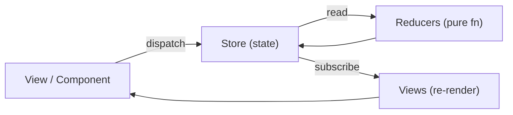

# Frontend - State Management

## 1. Tổng quan

**State management** là cách quản lý **dữ liệu (state)** trong ứng dụng — đặc biệt quan trọng khi ứng dụng lớn, có nhiều components chia sẻ dữ liệu.

### 1.1. Tại sao cần State Management?

| Vấn đề | Giải pháp |
|---------|-----------|
| **Prop drilling** — truyền props qua nhiều cấp components | State management (global store) |
| **Shared state** — nhiều components cần cùng data | Centralized store |
| **Complex state logic** — async operations, optimistic updates | Store với actions |
| **Predictability** — state thay đổi khó track | Immutable state + actions |

### 1.2. Types of State

| Loại | Mô tả | Ví dụ |
|------|-------|-------|
| **Local state** | State chỉ dùng trong 1 component | Form input, toggle |
| **Shared state** | State chia sẻ giữa nhiều components | User info, theme |
| **Server state** | Data từ server, cần sync | Users, posts, products |
| **URL state** | State trong URL (params, query) | Pagination, filters |
| **Form state** | State của form | Validation, dirty tracking |

---

## 2. Redux (React)

### 2.1. Core Concepts

Redux tuân theo 3 nguyên tắc:

1. **Single source of truth** — Một store duy nhất cho toàn bộ app.
2. **State is read-only** — State chỉ read, không modify trực tiếp.
3. **Changes via pure functions** — Reducers là pure functions.

### 2.2. Redux Toolkit (Recommended)

```typescript
// store/todoSlice.ts
import { createSlice, PayloadAction } from '@reduxjs/toolkit';

interface Todo {
  id: string;
  text: string;
  completed: boolean;
}

interface TodoState {
  todos: Todo[];
  filter: 'all' | 'active' | 'completed';
  loading: boolean;
}

const initialState: TodoState = {
  todos: [],
  filter: 'all',
  loading: false
};

const todoSlice = createSlice({
  name: 'todos',
  initialState,
  reducers: {
    addTodo: (state, action: PayloadAction<string>) => {
      state.todos.push({
        id: crypto.randomUUID(),
        text: action.payload,
        completed: false
      });
    },
    toggleTodo: (state, action: PayloadAction<string>) => {
      const todo = state.todos.find(t => t.id === action.payload);
      if (todo) {
        todo.completed = !todo.completed;
      }
    },
    removeTodo: (state, action: PayloadAction<string>) => {
      state.todos = state.todos.filter(t => t.id !== action.payload);
    },
    setFilter: (state, action: PayloadAction<'all' | 'active' | 'completed'>) => {
      state.filter = action.payload;
    }
  }
});

export const { addTodo, toggleTodo, removeTodo, setFilter } = todoSlice.actions;
export default todoSlice.reducer;
```

### 2.3. Store Configuration

```typescript
// store/index.ts
import { configureStore } from '@reduxjs/toolkit';
import { TypedUseSelectorHook, useDispatch, useSelector } from 'react-redux';
import todoReducer from './todoSlice';
import userReducer from './userSlice';

export const store = configureStore({
  reducer: {
    todos: todoReducer,
    users: userReducer
  },
  middleware: (getDefaultMiddleware) =>
    getDefaultMiddleware({
      serializableCheck: false  // Ignore non-serializable values (dates, etc.)
    }),
  devTools: process.env.NODE_ENV !== 'production'
});

// Types
export type RootState = ReturnType<typeof store.getState>;
export type AppDispatch = typeof store.dispatch;

// Typed hooks
export const useAppDispatch: () => AppDispatch = useDispatch;
export const useAppSelector: TypedUseSelectorHook<RootState> = useSelector;
```

### 2.4. Redux Data Flow



### 2.5. Using in Components

```tsx
// TodoList.tsx
import { useAppDispatch, useAppSelector } from '../store';
import { addTodo, toggleTodo, removeTodo, setFilter } from '../store/todoSlice';
import { useState } from 'react';

export function TodoList() {
  const dispatch = useAppDispatch();
  const { todos, filter } = useAppSelector(state => state.todos);
  const [text, setText] = useState('');

  const filteredTodos = todos.filter(todo => {
    if (filter === 'active') return !todo.completed;
    if (filter === 'completed') return todo.completed;
    return true;
  });

  const handleAdd = (): void => {
    if (text.trim()) {
      dispatch(addTodo(text.trim()));
      setText('');
    }
  };

  return (
    <div>
      <input
        value={text}
        onChange={e => setText(e.target.value)}
        onKeyDown={e => e.key === 'Enter' && handleAdd()}
      />
      <button onClick={handleAdd}>Add</button>

      <div className="filters">
        {(['all', 'active', 'completed'] as const).map(f => (
          <button
            key={f}
            className={filter === f ? 'active' : ''}
            onClick={() => dispatch(setFilter(f))}
          >
            {f}
          </button>
        ))}
      </div>

      <ul>
        {filteredTodos.map(todo => (
          <li key={todo.id}>
            <input
              type="checkbox"
              checked={todo.completed}
              onChange={() => dispatch(toggleTodo(todo.id))}
            />
            <span style={{ textDecoration: todo.completed ? 'line-through' : 'none' }}>
              {todo.text}
            </span>
            <button onClick={() => dispatch(removeTodo(todo.id))}>X</button>
          </li>
        ))}
      </ul>
    </div>
  );
}
```

---

## 3. Vuex (Vue 2) & Pinia (Vue 3)

> **Pinia là state management được recommend cho Vue 3**. Vuex vẫn dùng cho Vue 2.

### 3.1. Pinia (Vue 3)

```typescript
// stores/counterStore.ts
import { defineStore } from 'pinia';
import { ref, computed } from 'vue';

export const useCounterStore = defineStore('counter', () => {
  const count = ref(0);
  const multiplier = ref(2);

  const doubled = computed(() => count.value * 2);
  const multiplied = computed(() => count.value * multiplier.value);

  function increment(): void {
    count.value++;
  }

  function decrement(): void {
    count.value--;
  }

  function reset(): void {
    count.value = 0;
  }

  function setMultiplier(value: number): void {
    multiplier.value = value;
  }

  return {
    count,
    multiplier,
    doubled,
    multiplied,
    increment,
    decrement,
    reset,
    setMultiplier
  };
});
```

### 3.2. Using in Vue Components

```vue
<script setup>
import { useCounterStore } from '../stores/counterStore';
import { storeToRefs } from 'pinia';

const store = useCounterStore();
// Dùng storeToRefs để giữ reactivity cho state/getters
const { count, doubled, multiplied } = storeToRefs(store);
const { increment, decrement, reset } = store;
</script>
```

---

## 4. Context API (React)

**Context API** là built-in React solution cho việc share state across components mà không cần prop drilling.

```tsx
// context/ThemeContext.tsx
import { createContext, useContext, useState, ReactNode } from 'react';

type Theme = 'light' | 'dark';

interface ThemeContextType {
  theme: Theme;
  toggleTheme: () => void;
}

const ThemeContext = createContext<ThemeContextType | undefined>(undefined);

export function ThemeProvider({ children }: { children: ReactNode }) {
  const [theme, setTheme] = useState<Theme>('light');

  const toggleTheme = (): void => {
    setTheme(prev => prev === 'light' ? 'dark' : 'light');
  };

  return (
    <ThemeContext.Provider value={{ theme, toggleTheme }}>
      {children}
    </ThemeContext.Provider>
  );
}

export function useTheme(): ThemeContextType {
  const context = useContext(ThemeContext);
  if (!context) {
    throw new Error('useTheme must be used within ThemeProvider');
  }
  return context;
}
```

```tsx
// App.tsx
import { ThemeProvider } from './context/ThemeContext';

function App() {
  return (
    <ThemeProvider>
      <MyApp />
    </ThemeProvider>
  );
}

// ThemedButton.tsx
import { useTheme } from './context/ThemeContext';

function ThemedButton() {
  const { theme, toggleTheme } = useTheme();

  return (
    <button
      className={theme}
      onClick={toggleTheme}
    >
      Current theme: {theme}
    </button>
  );
}
```

---

## 5. Zustand (React)

**Zustand** là lightweight state management library cho React — đơn giản, ít boilerplate.

```typescript
// store/useUserStore.ts
import { create } from 'zustand';
import { devtools, persist } from 'zustand/middleware';

interface User {
  id: number;
  name: string;
  email: string;
}

interface UserState {
  users: User[];
  currentUser: User | null;
  loading: boolean;
  // Actions
  fetchUsers: () => Promise<void>;
  addUser: (user: Omit<User, 'id'>) => void;
  setCurrentUser: (user: User | null) => void;
}

export const useUserStore = create<UserState>()(
  devtools(
    persist(
      (set) => ({
        users: [],
        currentUser: null,
        loading: false,

        fetchUsers: async () => {
          set({ loading: true });
          try {
            const res = await fetch('/api/users');
            const users = await res.json();
            set({ users, loading: false });
          } catch {
            set({ loading: false });
          }
        },

        addUser: (userData) => {
          set(state => ({
            users: [
              ...state.users,
              { ...userData, id: Date.now() }
            ]
          }));
        },

        setCurrentUser: (user) => {
          set({ currentUser: user });
        }
      }),
      { name: 'user-storage' }  // Persist to localStorage
    )
  )
);
```

```tsx
// Usage
function UserList() {
  const { users, loading, fetchUsers, addUser } = useUserStore();

  // Select specific slices (re-renders less)
  const count = useUserStore(state => state.users.length);
}
```

---

## 6. Jotai (React)

**Jotai** là atomic state management — state được chia thành các **atoms** nhỏ.

```typescript
// atoms/index.ts
import { atom } from 'jotai';

// Primitive atoms
const countAtom = atom(0);
const nameAtom = atom('Huy');

// Derived atom (computed)
const doubledAtom = atom((get) => get(countAtom) * 2);

// Write atom (với get/set)
const counterAtom = atom(
  (get) => get(countAtom),
  (set, newValue: number | ((prev: number) => number)) => {
    if (typeof newValue === 'function') {
      set(countAtom, newValue(get(countAtom)));
    } else {
      set(countAtom, newValue);
    }
  }
);

// Async atom
const userAtom = atom(async (get) => {
  const id = get(currentUserIdAtom);
  const res = await fetch(`/api/users/${id}`);
  return res.json();
});
```

```tsx
// Component
import { useAtom } from 'jotai';

function Counter() {
  const [count, setCount] = useAtom(countAtom);
  const [doubled] = useAtom(doubledAtom);

  return (
    <div>
      <p>Count: {count}</p>
      <p>Doubled: {doubled}</p>
      <button onClick={() => setCount(c => c + 1)}>+</button>
    </div>
  );
}
```

---

## 7. Comparison & When to Use

### 7.1. Comparison Table

| Library | Size | Boilerplate | TypeScript | Complexity | Best for |
|---------|------|-------------|-----------|-----------|----------|
| **Context API** | 0KB (built-in) | Medium | Manual | Simple | Small apps, simple shared state |
| **Zustand** | ~1KB | Low | Good | Simple | Medium apps, simple needs |
| **Jotai** | ~2KB | Low | Good | Medium | Fine-grained reactivity |
| **Redux Toolkit** | ~15KB | Medium | Excellent | Medium-High | Large apps, complex state |
| **Pinia** | ~3KB | Low | Excellent | Simple | Vue 3 apps |
| **Vuex** | ~15KB | High | Good | Medium | Vue 2 apps |

### 7.2. Decision Guide

```
App nhỏ (1-5 components)?
  └── Có → Local state (useState, ref)
  └── Không ↓

Props drilling > 2-3 levels?
  └── Có → Context API hoặc Zustand
  └── Không ↓

Cần DevTools, time-travel debugging?
  └── Có → Redux Toolkit
  └── Không ↓

Dùng Vue?
  └── Vue 3 → Pinia
  └── Vue 2 → Vuex
  └── Không ↓

React?
  └── Simple → Zustand / Context
  └── Medium → Zustand
  └── Enterprise → Redux Toolkit
```

### 7.3. Key Considerations

| Consideration | Recommendation |
|-------------|----------------|
| **App size** | Nhỏ: local state. Trung bình: Zustand/Pinia. Lớn: Redux Toolkit |
| **Team familiarity** | Chọn công cụ team đã biết |
| **DevTools** | Cần: Redux Toolkit, Vuex. Không cần: Zustand, Pinia |
| **Performance** | Jotai/Zustand tốt hơn Context API cho re-render |
| **Persistence** | Nhiều libs hỗ trợ: Zustand persist, Redux persist, Pinia persist |
| **Async** | Redux Toolkit: createAsyncThunk. Zustand/Pinia: async actions |

---

## 8. Common Interview Questions

### Q: Redux vs Context API?

| | Redux | Context API |
|--|-------|------------|
| **Boilerplate** | Nhiều (actions, reducers, types) | Ít (Provider, useContext) |
| **DevTools** | Excellent (time-travel, action log) | Không có |
| **Performance** | Tốt (selector-based) | Trung bình (re-renders on value change) |
| **Middleware** | Hỗ trợ (thunk, saga, logger) | Không built-in |
| **State normalization** | normalize state | Manual |
| **Best for** | Large apps, complex state | Small-medium apps |

### Q: Khi nào dùng local state vs global state?

- **Local state** (`useState`, `ref`): Props chỉ đi qua 1-2 levels, không cần share giữa nhiều unrelated components.
- **Global state**: Khi nhiều components cần access cùng data, hoặc data cần persist qua page navigation.

### Q: Immutable state trong Redux?

Redux Toolkit dùng **Immer** bên trong — cho phép viết "mutating" code nhưng thực tế tạo immutable updates.

```typescript
// Immer cho phép:
state.todos.push(newTodo);  // Nhìn như mutation nhưng không mutate original

// Thực tế tạo new state:
return { ...state, todos: [...state.todos, newTodo] };
```

### Q: Normalized state?

```typescript
// Bad: Nested, hard to update
state = {
  posts: [
    { id: 1, title: '...', author: { id: 1, name: 'Huy' }, comments: [...] }
  ]
};

// Good: Normalized — flat, referenced by ID
state = {
  posts: {
    byId: {
      1: { id: 1, title: '...', authorId: 1, commentIds: [1, 2] }
    },
    allIds: [1]
  },
  authors: {
    byId: { 1: { id: 1, name: 'Huy' } },
    allIds: [1]
  },
  comments: {
    byId: { 1: { id: 1, text: '...' } },
    allIds: [1]
  }
};
```
