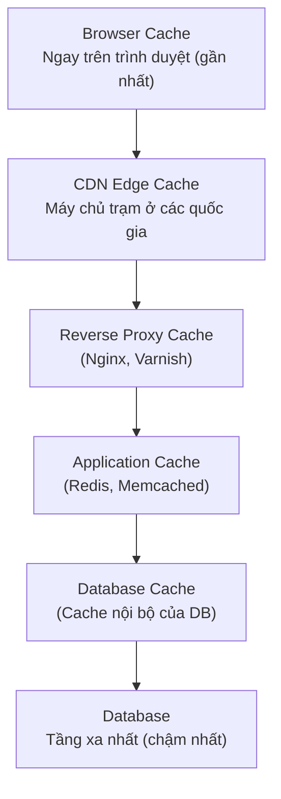

# Caching & CDN (Bộ nhớ đệm & Mạng phân phối nội dung)

### Caching (Bộ nhớ đệm)

#### Tổng quan
Caching là việc lưu trữ dữ liệu tạm thời ở những nơi "gần" với người dùng nhất để phục vụ cực kỳ nhanh. 
**Ví dụ dễ hiểu:** Bạn làm thu ngân quán trà sữa. Thay vì mỗi lần khách hỏi "Có món gì?", bạn lại phải chạy tuốt vào bếp hỏi đầu bếp (Database), bạn in luôn cái Menu để ngay quầy thu ngân (Cache). Khách tới nhìn Menu là biết ngay. Rất nhanh và không làm phiền đầu bếp!

Mục tiêu chính: Giảm tải cho Database, giảm độ trễ (latency) và giúp hệ thống chịu được lượng truy cập lớn hơn.

#### Caching được đặt ở đâu?
Hệ thống hiện đại thường có nhiều lớp Cache:

#### Các chiến lược Caching (Cache Strategies)

| Chiến lược | Cơ chế hoạt động & Ví dụ |
|---|---|
| **Cache-Aside (Lazy Loading)** | **Cơ chế:** Hỏi Cache trước. Nếu không có (miss), mới vào Database lấy, rồi đem ra lưu vào Cache cho người sau dùng. **Ví dụ:** Khách hỏi món A, bạn nhìn Menu (Cache) không thấy. Bạn chạy vào bếp (DB) hỏi. Bếp bảo còn, bạn mang ra bán và ghi thêm món A lên Menu để lần sau khỏi chạy vào bếp. |
| **Write-Through** | **Cơ chế:** Khi có dữ liệu mới, ghi đồng thời vào cả Cache và Database. **Ví dụ:** Bếp ra món mới B, đầu bếp vừa ghi vào sổ của bếp (DB), vừa chạy ra quầy viết luôn lên Menu (Cache). Đảm bảo Menu luôn mới nhất. |
| **Write-Behind (Write-Back)** | **Cơ chế:** Ghi luôn vào Cache cho nhanh, báo thành công luôn. Sau đó âm thầm đồng bộ vào DB sau. **Ví dụ:** Đang giờ cao điểm, khách gọi món, thu ngân cứ ghi nháp ra giấy (Cache) rồi làm nước cho khách luôn. Cuối ngày mới rảnh rỗi đem giấy đó nhập vào phần mềm kế toán (DB). (Nhanh nhưng rủi ro nếu mất tờ giấy nháp). |

---

### Cache Invalidation (Làm mới Cache)

> **Câu nói kinh điển:** Có 2 bài toán khó nhất trong Khoa học máy tính: "Xóa cache khi nào?" (Cache invalidation) và "Đặt tên biến là gì?".

Vấn đề: Làm sao để biết Menu ngoài quầy đã cũ (ví dụ bếp vừa hết trân châu) để gạch đi? Đó là bài toán Cache Invalidation.

| Chiến lược | Mô tả & Ưu/Nhược điểm |
|---|---|
| **TTL (Time-to-Live)** | Gắn hẹn giờ tự hủy. Cứ 5 phút Menu tự biến mất, bắt buộc chạy vào bếp lấy Menu mới. Rất dễ làm nhưng đôi khi dữ liệu chưa cũ đã bị xóa, hoặc dữ liệu cũ rồi nhưng chưa hết 5 phút nên khách vẫn thấy. |
| **Event-driven (Chủ động xóa)** | Khi nào bếp hết trân châu (DB update), bếp sẽ chủ động bấm chuông báo thu ngân xóa trân châu trên Menu đi. Dữ liệu luôn chính xác tuyệt đối nhưng code phức tạp hơn. |

---

### Các chính sách dọn dẹp Cache (Eviction Policies)
Khi Cache (Menu) đã đầy chỗ, bạn phải xóa bớt món cũ để nhét món mới vào. Xóa món nào?

- **LRU (Least Recently Used):** Món nào LÂU NHẤT KHÔNG AI GỌI thì xóa đi. (Hay dùng nhất).
- **LFU (Least Frequently Used):** Món nào ÍT ĐƯỢC GỌI NHẤT từ trước đến giờ thì xóa đi.
- **FIFO (First In, First Out):** Xóa món được viết lên Menu đầu tiên.

---

### CDN (Content Delivery Network)

#### Tổng quan
CDN là mạng lưới các máy chủ đặt khắp nơi trên thế giới. Nó chuyên dùng để lưu trữ các file tĩnh (như hình ảnh, video, CSS, JS).

**Ví dụ thực tế:** 
Máy chủ chính (Origin) của trang web đặt ở Mỹ. Nếu người dùng ở Việt Nam muốn xem một cái ảnh 5MB, phải tải trực tiếp từ Mỹ về rất chậm.
Giải pháp: Web thuê một hệ thống CDN. Hệ thống này có một máy chủ phụ đặt ngay tại Hà Nội. Cái ảnh 5MB được sao chép sẵn ra Hà Nội. Người dùng VN chỉ cần lấy ảnh từ máy chủ Hà Nội nên tốc độ "nhanh như chớp".

Lợi ích của CDN:
- **Giảm độ trễ (Latency):** Lấy dữ liệu ở gần thì phải nhanh hơn ở xa.
- **Giảm tải cho Server chính:** Server chính không phải còng lưng trả về hàng triệu bức ảnh nữa.
- **Chống sập web (DDoS):** Mạng CDN cực kỳ lớn, ai muốn tấn công làm sập web cũng rất khó vì bị CDN cản lại hết.

#### Các nhà cung cấp CDN nổi tiếng:
- **Cloudflare:** Phổ biến nhất, có gói miễn phí chống DDoS rất ngon.
- **AWS CloudFront:** Dành cho các hệ thống dùng hệ sinh thái Amazon.
- **Akamai:** Siêu to khổng lồ, thường dành cho các tập đoàn lớn.

---

### Sử dụng Redis làm Cache

Redis là công cụ làm Application Cache phổ biến nhất hiện nay. Nó lưu dữ liệu trên RAM nên tốc độ đọc ghi cực nhanh.

| Lệnh cơ bản | Ý nghĩa |
|---|---|
| `SET key value EX ttl` | Lưu dữ liệu kèm thời gian sống (TTL). Ví dụ: `SET user:1 "Huy" EX 3600` (Sống 1 tiếng). |
| `GET key` | Lấy dữ liệu ra. |
| `DEL key` | Xóa dữ liệu. |

---

### Những "Cạm bẫy" khi dùng Cache (Anti-Patterns)

| Cạm bẫy | Vấn đề | Giải pháp |
|---|---|---|
| **Cache mọi thứ vô tội vạ** | Tốn tiền mua RAM (Redis rất đắt), rác đầy bộ nhớ. | Chỉ cache những dữ liệu "Đọc nhiều, ít thay đổi". Đừng cache những thứ liên tục thay đổi như số lượt view Youtube theo realtime. |
| **Không set TTL (Hạn sử dụng)** | RAM cứ tăng dần đều cho đến khi tràn bộ nhớ sập server. | LUÔN LUÔN set TTL (ví dụ 1 tiếng, 1 ngày) cho dữ liệu. |
| **Cache Stampede (Hiệu ứng bầy đàn)** | 1000 người cùng lúc vào xem một bài báo. Đột nhiên lúc đó bài báo hết hạn Cache. Cả 1000 request lập tức chọc thẳng vào Database làm DB quá tải sập luôn. | Dùng kỹ thuật Lock (chỉ cho 1 request vào DB lấy data, 999 người khác đứng đợi), hoặc thêm một chút "thời gian ngẫu nhiên" vào TTL để cache không hết hạn cùng một lúc. |

> **💡 Mẹo phỏng vấn:** Khi thiết kế hệ thống có đọc nhiều (Read-heavy), hãy luôn nhớ thêm Cache và CDN vào. Phải biết giải thích Cache-Aside pattern vì đây là cách dùng phổ biến nhất (hỏi Redis -> miss -> hỏi DB -> ghi vào Redis).
