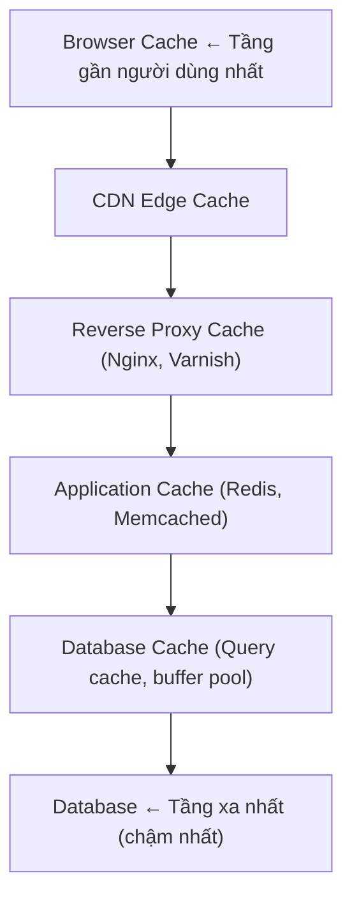

# System Design

## 11. Caching & CDN

### 11.1. Caching

#### 11.1.1. Tổng quan

Caching tạm thời lưu trữ dữ liệu ở các tầng gần người dùng để phục vụ các request nhanh. Mục tiêu là giảm tải database, giảm latency, và cải thiện overall system throughput.

#### 11.1.2. Caching trong System Stack



#### 11.1.3. Cache Strategies

| Chiến lược | Mô tả | Use Case |
|---|---|---|
| **Cache-Aside (Lazy Loading)** | App check cache trước; miss thì fetch từ DB và populate cache | Read-heavy workloads |
| **Read-Through** | Cache tự động load data từ DB khi miss | Đơn giản hóa code |
| **Write-Through** | Write vào cache và DB đồng thời | Khi data không được phép mất |
| **Write-Behind (Write-Back)** | Write vào cache; async write vào DB | High write throughput |
| **Refresh-Ahead** | Chủ động refresh các entries即将过期 | Predictable access patterns |

```typescript
// Cache-Aside pattern
async function getUser(userId: string): Promise<User> {
  // Bước 1: Check cache
  const cached = await redis.get(`user:${userId}`);
  if (cached) {
    return JSON.parse(cached);
  }

  // Bước 2: Cache miss — fetch từ database
  const user = await db.users.findById(userId);
  if (!user) {
    throw new Error('User not found');
  }

  // Bước 3: Populate cache với TTL
  await redis.setex(`user:${userId}`, 3600, JSON.stringify(user));

  return user;
}
```

---

### 11.2. Cache Invalidation

> **Hai bài toán khó nhất trong khoa học máy tính:** cache invalidation, đặt tên, và lỗi off-by-one.

| Chiến lược | Mô tả | Ưu điểm | Nhược điểm |
|---|---|---|---|
| **TTL (Time-to-Live)** | Tự hết hạn sau thời gian cố định | Đơn giản, dễ predict | Data có thể stale |
| **Event-driven** | Invalidate khi write vào DB | Consistency tức thì | Phức tạp, cần pub/sub |
| **Versioned keys** | Version trong cache key | Precise invalidation | Tốn memory hơn |
| **Manual** | Explicitly invalidate | Full control | Dễ quên, lỗi |

---

### 11.3. Eviction Policies

| Policy | Mô tả | Phù hợp cho |
|---|---|---|
| **LRU (Least Recently Used)** | Xóa item được truy cập ít gần đây nhất | General purpose |
| **LFU (Least Frequently Used)** | Xóa item ít được truy cập nhất | Item phổ biến được giữ lại |
| **FIFO (First In, First Out)** | Xóa item cũ nhất | Đơn giản |
| **TTL-based** | Xóa theo thời gian hết hạn | Data nhạy cảm với thời gian |
| **Random** | Xóa ngẫu nhiên | Testing, extreme scale |

---

### 11.4. CDN (Content Delivery Network)

#### 11.4.1. Tổng quan

CDN là một mạng lưới server phân bố toàn cầu cache và phục vụ static content (HTML, CSS, JS, images, videos) từ các edge locations gần người dùng nhất.

#### 11.4.2. CDN Providers

| Provider | Đặc điểm nổi bật |
|---|---|
| **Cloudflare** | Free tier, DDoS protection, global network |
| **AWS CloudFront** | Tích hợp sâu với AWS (S3, EC2, Lambda@Edge) |
| **Fastly** | Cache purging realtime, VCL customization |
| **Akamai** | Mạng lưới lớn nhất, enterprise-grade |
| **Google Cloud CDN** | Tích hợp GCP, global load balancing |

#### 11.4.3. Cache-Control Headers

```bash
# Các directive phổ biến
Cache-Control: max-age=3600          # Cache trong 1 giờ
Cache-Control: no-cache               # Revalidate với server mỗi lần
Cache-Control: no-store               # Không bao giờ cache (data nhạy cảm)
Cache-Control: public                 # Có thể cache bởi proxies
Cache-Control: private                # Chỉ cache bởi browser
Cache-Control: immutable              # Content không bao giờ thay đổi
```

---

### 11.5. Redis as a Cache

| Command | Mô tả | Time Complexity |
|---|---|---|
| `SET key value EX ttl` | Set với TTL | O(1) |
| `GET key` | Get value | O(1) |
| `EXISTS key` | Check key tồn tại | O(1) |
| `DEL key` | Xóa key | O(1) |
| `EXPIRE key ttl` | Set TTL trên key | O(1) |
| `HGETALL key` | Get tất cả fields trong hash | O(N) |
| `LRANGE key 0 -1` | Get list range | O(N) |

---

### 11.6. Anti-Patterns

| Anti-pattern | Vấn đề | Giải pháp |
|---|---|---|
| **Cache mọi thứ** | Memory bloat, stale data | Chỉ cache hot data |
| **Không có TTL** | Memory tăng không giới hạn | Set TTL phù hợp |
| **Single point of failure** | Redis down = system down | Redis Sentinel hoặc Cluster |
| **Cache stampede** | Nhiều request hit DB khi cache hết hạn | Dùng mutex, jitter TTL |
| **Stale reads** | Read-after-write inconsistency | Write-through |

> **Tip:** Cache hoạt động tốt nhất với **read-heavy, infrequently changing data**. Không phải giải pháp cho write-heavy workloads.
