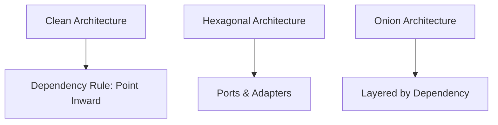
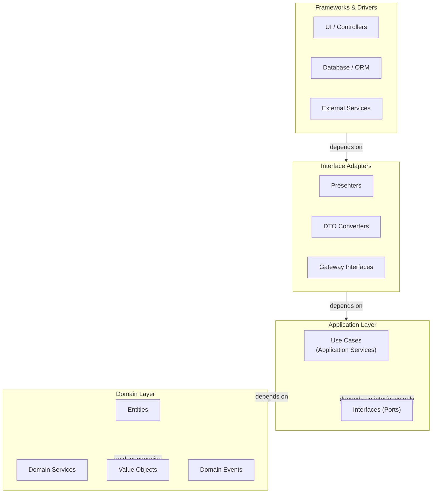
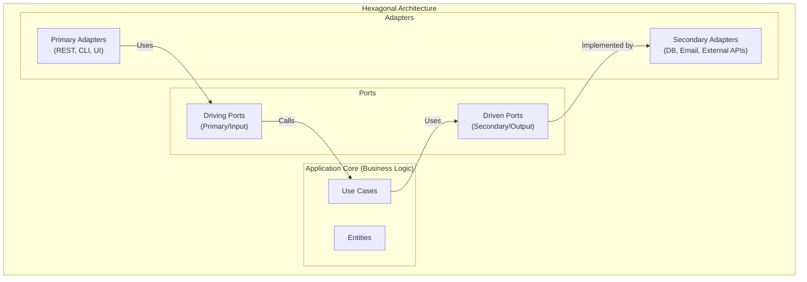
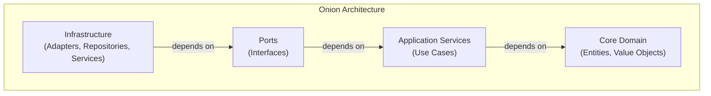

# Kiến trúc phần mềm

## Clean & Hexagonal Architecture

### 1. Tổng quan

**Clean Architecture** và **Hexagonal Architecture** (còn gọi là Ports & Adapters) là các architectural patterns chia sẻ một mục tiêu chung: tạo ra các systems **independent of frameworks, databases, và external agencies**, với business logic ở trung tâm.



Các architectures này có liên quan — tất cả nhấn mạnh:
- **Separation of concerns** qua các layers
- **Dependencies chỉ point inward** (inner layers không phụ thuộc outer)
- **Business logic isolation** khỏi infrastructure
- **Testability** ở mọi layer

---

### 2. Clean Architecture (Robert C. Martin)

Clean Architecture, được giới thiệu bởi Robert C. Martin (Uncle Bob), tổ chức code thành các layers trong đó dependencies luôn hướng vào trong.



#### 2.1. Chi tiết các Layers

| Layer | Trách nhiệm | Dependencies | Ví dụ |
|-------|-------------|--------------|---------|
| **Entities** | Core business logic, enterprise-wide rules | None (pure) | `Order`, `User`, `Money` |
| **Use Cases** | Application-specific business rules | Entities, Port interfaces | `PlaceOrderUseCase`, `TransferFundsUseCase` |
| **Interface Adapters** | Convert data between formats | Use Cases, External | `OrderController`, `OrderPresenter` |
| **Frameworks & Drivers** | External tools, DB, UI, web | Everything | `Spring MVC`, `JPA`, `REST API` |

#### 2.2. Dependency Rule

> **The Dependency Rule**: Source code dependencies chỉ có thể point inward. Outer layers có thể phụ thuộc vào inner layers, nhưng inner layers không bao giờ phụ thuộc vào outer layers.

```
    Frameworks & Drivers
           ↓
    Interface Adapters
           ↓
      Use Cases
           ↓
       Entities
```

Điều này có nghĩa:
- Entities không biết gì về databases, web frameworks, hoặc controllers
- Use Cases chỉ biết về Entities và interfaces (không phải implementations)
- Infrastructure implements interfaces được định nghĩa bởi inner layers

#### 2.3. Code Example

```java
// ========== DOMAIN LAYER (Core) ==========
// Entities: Pure business logic, no framework dependencies
public class Order {
    private final OrderId id;
    private CustomerId customerId;
    private OrderStatus status;
    private List<OrderItem> items;

    // Domain logic enforced here
    public void addItem(Product product, int quantity) {
        if (status != OrderStatus.DRAFT) {
            throw new OrderException("Cannot modify confirmed order");
        }
        if (quantity <= 0) {
            throw new OrderException("Quantity must be positive");
        }
        this.items.add(new OrderItem(product.getId(), product.getPrice(), quantity));
    }

    public void confirm() {
        if (items.isEmpty()) {
            throw new OrderException("Cannot confirm empty order");
        }
        this.status = OrderStatus.CONFIRMED;
    }
}

// Value Objects
public record Money(BigDecimal amount, Currency currency) {
    public Money add(Money other) {
        if (!this.currency.equals(other.currency)) {
            throw new IllegalArgumentException("Currency mismatch");
        }
        return new Money(this.amount.add(other.amount), this.currency);
    }
}

// Port interfaces (defined in inner layer)
public interface OrderRepository {
    Order findById(OrderId id);
    void save(Order order);
    void delete(OrderId id);
}

public interface ProductRepository {
    Product findById(ProductId id);
    List<Product> findByCategory(CategoryId categoryId);
}

public interface NotificationService {
    void sendOrderConfirmation(Order order);
}
```

```java
// ========== APPLICATION LAYER (Use Cases) ==========
// Use Case: Orchestrates domain objects, implements business rules
public class PlaceOrderUseCase {
    private final OrderRepository orderRepository;
    private final ProductRepository productRepository;
    private final NotificationService notificationService;

    public PlaceOrderUseCase(
            OrderRepository orderRepository,
            ProductRepository productRepository,
            NotificationService notificationService) {
        this.orderRepository = orderRepository;
        this.productRepository = productRepository;
        this.notificationService = notificationService;
    }

    public OrderResult execute(PlaceOrderCommand command) {
        // 1. Validate and find products
        List<OrderItemData> itemData = new ArrayList<>();
        for (ItemRequest item : command.items()) {
            Product product = productRepository.findById(item.productId());
            if (product == null) {
                throw new ProductNotFoundException(item.productId());
            }
            itemData.add(new OrderItemData(product, item.quantity()));
        }

        // 2. Create and populate order
        Order order = Order.create(command.customerId());
        for (OrderItemData item : itemData) {
            order.addItem(item.product(), item.quantity());
        }

        // 3. Persist
        orderRepository.save(order);

        // 4. Notify
        notificationService.sendOrderConfirmation(order);

        return new OrderResult(order.getId(), order.getTotal());
    }
}

// ========== INTERFACE ADAPTERS LAYER ==========
// Controller: Adapts HTTP request to Use Case input
@RestController
@RequestMapping("/api/orders")
public class OrderController {
    private final PlaceOrderUseCase placeOrderUseCase;

    @PostMapping
    public ResponseEntity<OrderResponse> createOrder(
            @RequestBody CreateOrderRequest request) {
        PlaceOrderCommand command = new PlaceOrderCommand(
            new CustomerId(request.customerId()),
            request.items().stream()
                .map(i -> new ItemRequest(new ProductId(i.productId()), i.quantity()))
                .toList()
        );

        OrderResult result = placeOrderUseCase.execute(command);

        return ResponseEntity.created(
            URI.create("/api/orders/" + result.orderId()))
            .body(new OrderResponse(result.orderId().toString(),
                                   result.total().toString()));
    }
}
```

```java
// ========== FRAMEWORKS & DRIVERS LAYER (Infrastructure) ==========
// Repository Implementation: Adapts JPA to the port interface
@Repository
public class JpaOrderRepository implements OrderRepository {
    private final SpringDataOrderRepository jpaRepo;

    @Override
    public Order findById(OrderId id) {
        return jpaRepo.findById(id.getValue())
            .map(entity -> OrderMapper.toDomain(entity))
            .orElse(null);
    }

    @Override
    public void save(Order order) {
        OrderEntity entity = OrderMapper.toEntity(order);
        jpaRepo.save(entity);
    }
}

// Notification Implementation
@Service
public class EmailNotificationService implements NotificationService {
    private final JavaMailSender mailSender;

    @Override
    public void sendOrderConfirmation(Order order) {
        SimpleMailMessage email = new SimpleMailMessage();
        email.setTo(order.getCustomerId().toString());
        email.setSubject("Order Confirmed: " + order.getId());
        email.setText("Your order has been confirmed...");
        mailSender.send(email);
    }
}
```

---

### 3. Hexagonal Architecture (Ports & Adapters)

Hexagonal Architecture, được giới thiệu bởi Alistair Cockburn, sử dụng metaphor của một **hexagon** trong đó trung tâm là application core và các cạnh là ports được kết nối bởi adapters.



#### 3.1. Ports

**Ports** là interfaces được định nghĩa bởi application core. Chúng có hai loại:

| Loại Port | Direction | Purpose | Ví dụ |
|-----------|-----------|---------|---------|
| **Driving (Primary)** | Inward | How external actors interact with the core | `OrderService` interface |
| **Driven (Secondary)** | Outward | What the core needs from external systems | `OrderRepository`, `EmailService` |

```java
// Driving Port (Primary) — how external world drives the application
public interface OrderServicePort {
    OrderId placeOrder(CustomerId customerId, List<OrderItemRequest> items);
    OrderDTO getOrder(OrderId orderId);
    void cancelOrder(OrderId orderId);
}

// Driven Port (Secondary) — what the application needs from outside
public interface OrderRepositoryPort {
    Order findById(OrderId id);
    void save(Order order);
}

public interface ProductCatalogPort {
    Product findById(ProductId id);
}

public interface NotificationPort {
    void sendOrderConfirmation(Order order);
}
```

#### 3.2. Adapters

**Adapters** là implementations kết nối ports với outside world.

```java
// Primary Adapter: REST API
@RestController
public class OrderRestAdapter implements OrderServicePort {
    private final OrderServicePort orderService;

    @PostMapping("/orders")
    public ResponseEntity<OrderId> placeOrder(@RequestBody CreateOrderRequest req) {
        OrderId orderId = orderService.placeOrder(req.customerId(), req.items());
        return ResponseEntity.created(URI.create("/orders/" + orderId)).build();
    }
}

// Secondary Adapter: JPA Repository
@Repository
public class JpaOrderAdapter implements OrderRepositoryPort {
    private final OrderJpaRepository jpaRepo;

    @Override
    public Order findById(OrderId id) {
        return jpaRepo.findById(id.getValue()).map(OrderMapper::toDomain).orElse(null);
    }
}

// Secondary Adapter: Email Service
@Service
public class SmtpNotificationAdapter implements NotificationPort {
    private final JavaMailSender mailSender;

    @Override
    public void sendOrderConfirmation(Order order) {
        // Send email
    }
}
```

---

### 4. Onion Architecture

Onion Architecture, được giới thiệu bởi Jeffrey Palermo, tổ chức các layers thành các vòng tròn đồng tâm xung quanh core domain.



Rất giống với Clean Architecture — main difference là naming:
- **Domain Core** = Entities layer
- **Application Services** = Use Cases layer
- **Ports** = Interface Adapters
- **Infrastructure** = Frameworks & Drivers

---

### 5. Layered Architecture (So sánh)

**Traditional Layered Architecture** là ancestor của các patterns này:

```
┌─────────────────────────┐
│   Presentation Layer    │  (Controllers, Views)
├─────────────────────────┤
│    Service Layer        │  (Business Logic)
├─────────────────────────┤
│     Data Access         │  (Repositories, DAOs)
├─────────────────────────┤
│    Database Layer       │  (SQL, NoSQL)
└─────────────────────────┘
```

| Khía cạnh | Layered | Clean/Hexagonal |
|-----------|---------|-----------------|
| **Dependency Direction** | All layers depend downward | Only inward dependencies |
| **Framework Coupling** | Service layer often coupled to framework | Domain isolated from frameworks |
| **Testability** | Harder to unit test business logic | Easy to test domain in isolation |
| **Flexibility** | Changes to DB affect service layer | DB changes isolated to outer layer |
| **Complexity** | Simpler for small projects | More structure, better for large projects |

---

### 6. Dependency Injection in Practice

Tất cả các architectures này được hưởng lợi từ **Dependency Injection (DI)** để đạt được loose coupling:

```java
// Spring Boot auto-configuration wires adapters to ports
@Configuration
public class AppConfig {

    @Bean
    public OrderRepositoryPort orderRepository(JpaOrderRepository jpaRepo) {
        return new JpaOrderAdapter(jpaRepo);
    }

    @Bean
    public NotificationPort notificationService(JavaMailSender mailSender) {
        return new SmtpNotificationAdapter(mailSender);
    }

    @Bean
    public PlaceOrderUseCase placeOrderUseCase(
            OrderRepositoryPort orderRepository,
            ProductCatalogPort productCatalog,
            NotificationPort notification) {
        return new PlaceOrderUseCase(orderRepository, productCatalog, notification);
    }

    @Bean
    public OrderController orderController(PlaceOrderUseCase useCase) {
        return new OrderController(useCase);
    }
}
```

---

### 7. Testing at Each Layer

Một major benefit của các architectures này là **testability at every layer**.

```java
// 1. Domain Layer: Pure unit tests (no dependencies)
class OrderTest {
    @Test
    void cannotConfirmEmptyOrder() {
        Order order = Order.create(customerId);
        assertThrows(OrderException.class, order::confirm);
    }
}

// 2. Use Case Layer: Mock ports
class PlaceOrderUseCaseTest {
    @Mock OrderRepositoryPort orderRepository;
    @Mock ProductCatalogPort productCatalog;
    @Mock NotificationPort notification;

    @Test
    void placeOrderSavesAndNotifies() {
        when(productCatalog.findById(any())).thenReturn(testProduct);
        PlaceOrderUseCase useCase = new PlaceOrderUseCase(
            orderRepository, productCatalog, notification);
        useCase.execute(command);
        verify(orderRepository).save(any());
        verify(notification).sendOrderConfirmation(any());
    }
}

// 3. Controller Layer: Mock use case
class OrderControllerTest {
    @Mock PlaceOrderUseCase useCase;

    @Test
    void createOrderReturns201() {
        when(useCase.execute(any())).thenReturn(new OrderResult(testOrderId, total));
        OrderController controller = new OrderController(useCase);
        ResponseEntity<?> response = controller.createOrder(testRequest);
        assertEquals(201, response.getStatusCode());
    }
}
```

---

### 8. Khi nào nên dùng mỗi Pattern

| Pattern | Phù hợp cho | Cân nhắc khi |
|---------|-------------|--------------|
| **Clean Architecture** | Large projects, DDD, complex business logic | Cần testable business rules, multiple deployment options |
| **Hexagonal** | Systems cần multiple delivery mechanisms (REST, CLI, MQ) | Core business phải stable trong khi adapters thay đổi |
| **Onion** | Tương tự Clean, prefer naming convention | Team quen với "onion" metaphor |
| **Layered** | Small to medium projects, simple CRUD | Project đơn giản đủ để full isolation là overkill |

> **Start simple**: Với các small projects, một well-structured layered architecture có thể đủ. Khi complexity tăng, migrate toward Clean/Hexagonal. Goal là **sufficient structure** — không phải maximum complexity.

---

### 9. Câu hỏi phỏng vấn

**Q: Dependency Rule trong Clean Architecture là gì?**

> **Dependency Rule** nói rằng source code dependencies chỉ có thể point inward. Outer layers (UI, frameworks, databases) có thể phụ thuộc vào inner layers (use cases, entities), nhưng inner layers không được phụ thuộc vào outer layers. Điều này có nghĩa: entities không biết gì về databases hoặc frameworks; use cases chỉ biết về entities và interface abstractions; infrastructure implements interfaces được định nghĩa bởi inner layers. Rule này đảm bảo business logic được isolate và không bị ảnh hưởng bởi changes trong external systems.

**Q: Hexagonal Architecture và Clean Architecture khác nhau thế nào?**

> Chúng rất giống nhau và thường được coi là cùng một pattern với terminology khác nhau. **Hexagonal** nhấn mạnh ports-and-adapters metaphor — application core được bao quanh bởi driving ports (input) và driven ports (output), với adapters kết nối chúng với outside world. **Clean Architecture** nhấn mạnh layered dependency structure và dependency rule. Core principles là identical: isolate business logic, define ports as interfaces, và implement adapters trong outer layer. Hexagonal hơi cũ hơn và sử dụng vocabulary khác nhau; Clean Architecture cung cấp layer definitions chi tiết hơn.

**Q: Làm thế nào để implement các architectures này trong Spring Boot?**

> Các bước chính: Định nghĩa **domain entities** không có Spring annotations hoặc framework dependencies. Định nghĩa **port interfaces** (ví dụ: `OrderRepository`, `NotificationService`) trong domain hoặc application layer. Implement **use cases** phụ thuộc chỉ vào port interfaces. Trong infrastructure layer, implement **adapters** (JPA repositories, email services) implement các port interfaces. Configure **dependency injection** (qua `@Bean` methods hoặc constructor injection) để wire adapters tới ports của chúng. Bằng cách này, core business logic hoàn toàn isolated khỏi Spring — bạn có thể test nó mà không cần Spring, và thay đổi framework mà không cần viết lại business logic.

**Q: Lợi ích chính của các architectures này so với traditional layered architecture là gì?**

> Primary benefit là **framework và infrastructure independence**. Trong traditional layered architecture, service/business logic layer thường phụ thuộc vào specific database frameworks, ORM annotations, hoặc web framework classes. Trong Clean/Hexagonal architecture, domain hoàn toàn isolated — nó không có imports từ Spring, Hibernate, hoặc bất kỳ framework nào khác. Điều này có nghĩa: business logic là **testable in complete isolation**, **framework có thể được replace** mà không cần viết lại business logic, và **same core** có thể được expose qua REST, GraphQL, hoặc CLI mà không cần modification.
