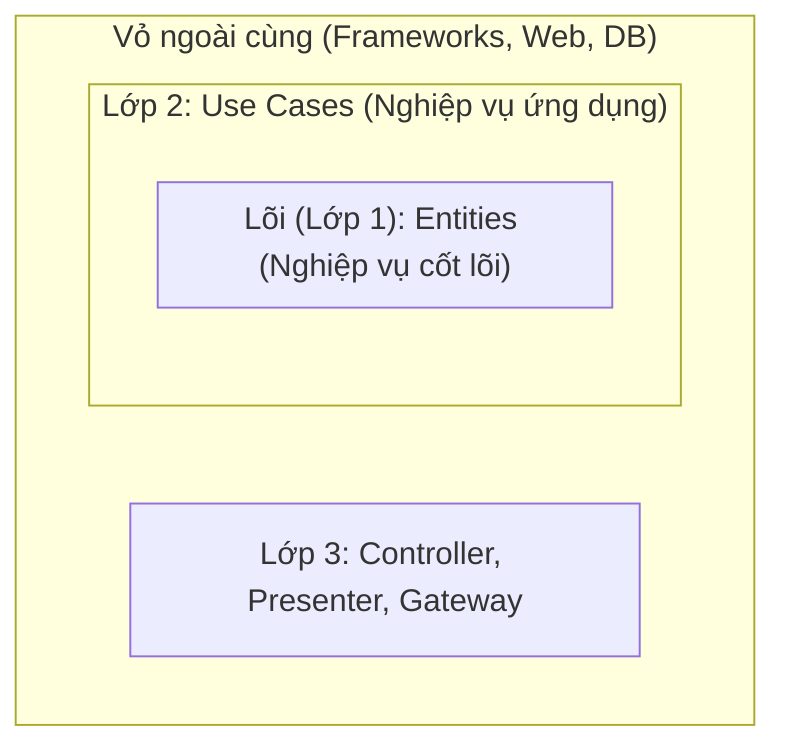
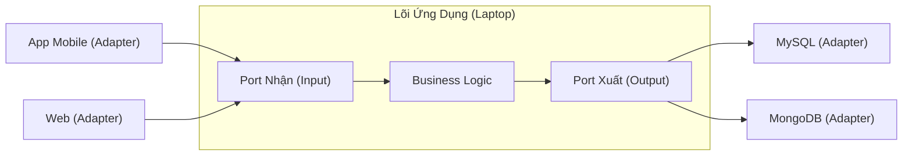

# Clean Architecture & Hexagonal Architecture

## Tổng quan

**Clean Architecture** (Kiến trúc sạch) và **Hexagonal Architecture** (Kiến trúc lục giác / Ports & Adapters) tuy tên gọi khác nhau nhưng đều hướng tới một mục đích duy nhất: **Bảo vệ phần cốt lõi của ứng dụng (Business Logic) khỏi những thứ râu ria bên ngoài (Database, Framework, UI).**

**Ví dụ thực tế:** 
Bạn mở một quán Phở gia truyền. Công thức nấu phở (Business Logic) là thứ quý giá nhất, không bao giờ thay đổi. Còn việc bạn bán phở ngoài vỉa hè hay trong trung tâm thương mại (UI), hay việc bạn mua thịt bò từ chợ hay siêu thị (Database) thì có thể thay đổi linh hoạt. Công thức nấu phở không được phép phụ thuộc vào việc bạn mua thịt bò ở đâu!

---

## 1. Clean Architecture (Kiến trúc củ hành)

Do "Uncle Bob" (Robert C. Martin) tạo ra. Nó chia mã nguồn thành các lớp (layers) giống như một củ hành tây.



### Luật tối thượng (The Dependency Rule)
> **Mũi tên chỉ được phép hướng vào trong!** Lớp ngoài được phép biết và gọi lớp trong. Nhưng lớp trong **tuyệt đối không được biết** sự tồn tại của lớp ngoài.

Nghĩa là: Lõi (Entities) không được chứa bất kỳ dòng code nào liên quan đến SQL, MongoDB, hay React. Nó chỉ chứa logic thuần túy (VD: `if (tuoi < 18) throw new Error()`).

### Giải phẫu các lớp:

| Lớp | Trách nhiệm | Ví dụ |
|-------|-------------|---------|
| **1. Entities (Lõi)** | Luật lệ bất di bất dịch của doanh nghiệp. | Tính lãi suất ngân hàng. Không phụ thuộc bất kỳ Framework nào. |
| **2. Use Cases** | Quy trình nghiệp vụ cụ thể. | Quy trình "Rút tiền": Kiểm tra số dư -> Trừ tiền -> Ghi lịch sử. |
| **3. Interface Adapters** | Người phiên dịch. Chuyển đổi dữ liệu từ dạng Web (JSON) sang dạng Use Case hiểu được. | Controller (nhận HTTP request), Presenter. |
| **4. Frameworks & Drivers** | Những thứ bên ngoài (Database, Web Framework, Tool). | MySQL, Spring Boot, Express.js. |

---

## 2. Hexagonal Architecture (Ports & Adapters)

Do Alistair Cockburn tạo ra. Cách tiếp cận này dùng hình ảnh thực tế hơn: **Cổng cắm (Ports)** và **Cục sạc chuyển đổi (Adapters)**.

**Ví dụ thực tế:**
Cái Laptop của bạn (Business Logic) có một cái lỗ cắm sạc (Port). Nó đưa ra quy định: *"Tôi cần dòng điện 20V cắm vào lỗ tròn này"*. 
Nó không thèm quan tâm bạn lấy điện từ ổ cắm điện lưới (220V), từ cục sạc dự phòng, hay từ bình ắc quy. Nhiệm vụ biến điện 220V thành 20V là của **Cục sạc (Adapter)**.



### Phân tích:
- **Port:** Là các Interface (Bản hợp đồng). Lõi ứng dụng định nghĩa Interface `IUserRepository` (Tôi cần 1 cái kho để lấy User).
- **Adapter:** Là các class thực thi Interface đó. Class `MySQLUserRepository` hoặc `MongoUserRepository` sẽ cắm vào Port đó để làm việc.

---

## 3. Mã nguồn minh họa (Code Example)

Đây là cách bạn viết code thể hiện Clean Architecture trong thực tế:

### Lõi (Core / Domain) - Hoàn toàn trong sạch, không Framework
```typescript
// 1. Entity (Lõi)
class Account {
    constructor(public balance: number) {}
    
    // Luật kinh doanh thuần túy
    withdraw(amount: number) {
        if (amount > this.balance) throw new Error("Không đủ tiền!");
        this.balance -= amount;
    }
}

// 2. Cổng cắm ra ngoài (Port / Interface) - Do Lõi định nghĩa!
interface IAccountRepository {
    save(acc: Account): void;
    findById(id: string): Account;
}
```

### Lớp ứng dụng (Use Cases)
```typescript
// 3. Use Case
class WithdrawMoneyUseCase {
    // Chỉ phụ thuộc vào Interface (Port), không phụ thuộc DB thật
    constructor(private repo: IAccountRepository) {}

    execute(accountId: string, amount: number) {
        const acc = this.repo.findById(accountId);
        acc.withdraw(amount); // Gọi logic lõi
        this.repo.save(acc);  // Lưu lại
    }
}
```

### Lớp vỏ ngoài cùng (Adapters / Frameworks)
```typescript
// 4a. Adapter cho Database (Cục sạc)
// Class này implement Port mà Lõi đã định nghĩa
class MySQLAccountRepository implements IAccountRepository {
    save(acc: Account) { 
        // Viết code SQL UPDATE ở đây
    }
    findById(id: string): Account { 
        // Viết code SQL SELECT ở đây
        return new Account(1000); 
    }
}

// 4b. Adapter cho Web (Controller)
class AccountController {
    constructor(private useCase: WithdrawMoneyUseCase) {}
    
    // Nhận Request từ React/Vue
    postWithdraw(req: Request) {
        this.useCase.execute(req.body.id, req.body.amount);
    }
}
```

---

## 4. Tại sao phải làm khổ mình như vậy? (Câu hỏi phỏng vấn)

Viết code kiểu này rất dài dòng (thêm nhiều file, nhiều Interface), vậy lợi ích là gì?

1. **Test cực kỳ dễ:** Bạn muốn test hàm `withdraw`? Không cần bật MySQL lên! Bạn chỉ cần tạo một `MockRepository` (một cái Adapter giả) cắm vào Port là test được ngay.
2. **Thay Database/Framework như thay áo:** Sếp bảo chuyển từ MySQL sang MongoDB. Bạn chỉ việc viết thêm class `MongoAccountRepository` (Cục sạc mới) cắm vào Port cũ. Lõi (Use Case, Entity) không phải sửa lấy 1 dòng code!
3. **Trì hoãn quyết định (Defer decisions):** Bạn có thể bắt đầu code logic nghiệp vụ (Core) ngay ngày đầu tiên mà chưa cần quyết định xem sẽ dùng Database gì hay UI dùng React hay Angular.

---

## 5. Lời khuyên phỏng vấn (Chốt hạ)

> **Hỏi:** "Em có áp dụng Clean Architecture cho mọi dự án không?"
>
> **Trả lời:** "Dạ không. Clean Architecture đem lại sự độc lập nhưng đổi lại là chi phí viết code dài dòng (Boilerplate) và hệ thống file phức tạp. 
> - Với các dự án nhỏ, yêu cầu chỉ là CRUD (Thêm, Sửa, Xóa) đơn giản, em sẽ dùng kiến trúc MVC truyền thống để chạy nhanh. 
> - Em chỉ dùng Clean Architecture khi dự án có nghiệp vụ (Business Logic) rất phức tạp, cần viết Unit Test cho logic đó, và có khả năng sống thọ (maintain lâu dài) cần sự tách biệt rõ ràng."
