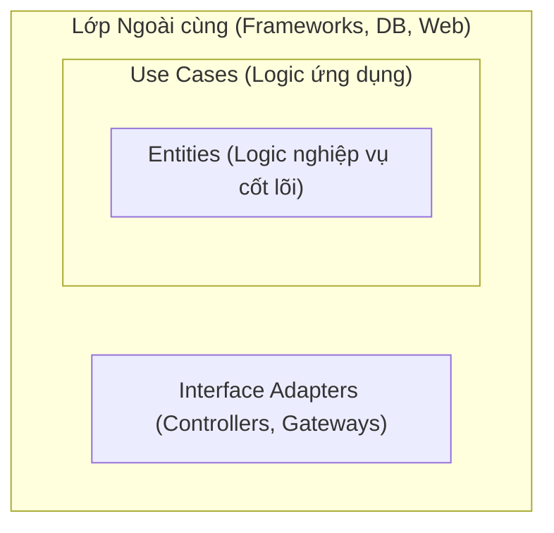

# Clean Architecture & Hexagonal Architecture

## 1. Tổng quan

**Clean Architecture** (của Uncle Bob) và **Hexagonal Architecture** (Ports & Adapters) tuy tên gọi khác nhau nhưng cùng chung một mục tiêu: **Bảo vệ lõi của ứng dụng (Business Logic) khỏi sự thay đổi của thế giới bên ngoài (Database, UI, Frameworks).**

**Ví dụ thực tế: Tiệm Phở gia truyền**
Công thức nấu nước dùng (Business Logic) là giá trị cốt lõi. Dù bạn bán ở vỉa hè hay trong nhà hàng sang trọng (UI), dù bạn dùng bếp ga hay bếp than (Infrastructure), công thức vẫn không đổi. Công thức không được phép phụ thuộc vào cái bếp!

---

## 2. Clean Architecture (Mô hình Củ Hành)

Kiến trúc này chia ứng dụng thành các lớp đồng tâm.

### Quy tắc phụ thuộc (Dependency Rule)
> **Sự phụ thuộc chỉ được hướng vào bên trong!** Các lớp bên ngoài biết về lớp bên trong, nhưng lớp bên trong **tuyệt đối không được biết gì** về lớp bên ngoài.



### Chi tiết các lớp và Code minh họa:

#### 1. Entities (Lõi)
Chứa các quy tắc nghiệp vụ quan trọng nhất. Không phụ thuộc vào bất kỳ framework nào (Spring, Hibernate...).
```java
// Pure Java, no JPA/Hibernate annotations
public class Order {
    private String id;
    private List<Item> items;
    
    public double calculateTotal() {
        return items.stream().mapToDouble(Item::getPrice).sum();
    }
}
```

#### 2. Use Cases
Chứa các kịch bản cụ thể của ứng dụng. Nó điều phối dữ liệu đi và đến các Entities.
```java
public class PlaceOrderUseCase {
    private final OrderRepository repository; // Chỉ là Interface

    public void execute(Order order) {
        if (order.calculateTotal() > 0) {
            repository.save(order);
        }
    }
}
```

#### 3. Interface Adapters (Controllers/Presenters)
Chuyển đổi dữ liệu từ dạng tiện lợi cho Use Cases sang dạng tiện lợi cho DB hoặc Web.

#### 4. Frameworks & Drivers
Lớp ngoài cùng chứa các công cụ như Spring Boot, MySQL, MongoDB...

---

## 3. Hexagonal Architecture (Ports & Adapters)

Kiến trúc này dùng hình ảnh cái **Laptop và các cổng cắm (Port).**

- **Port:** Là Interface. Core định nghĩa: *"Tôi cần một cách để lưu User"*.
- **Adapter:** Là lớp thực thi (Implementation). Cục sạc Samsung hay sạc Dell đều có thể "cắm" vào nếu đúng chân sạc (Port).

```java
// PORT (Trong lõi)
public interface UserRepository {
    void save(User user);
}

// ADAPTER (Ở lớp ngoài - Infrastructure)
@Repository
public class MySQLUserRepository implements UserRepository {
    @Override
    public void save(User user) {
        // Code JDBC/Hibernate thực tế ở đây
    }
}
```

---

## 4. Tại sao phải làm phức tạp như vậy? (Lợi ích kỹ thuật)

Việc viết nhiều file và interface hơn đem lại những lợi ích cực lớn mà bạn cần nêu khi phỏng vấn:

1.  **Dễ dàng viết Unit Test:** Bạn có thể test logic nghiệp vụ (Core) mà không cần bật Database, không cần bật Server Web. Chỉ cần dùng Mock cho các Port.
2.  **Độc lập Framework:** Nếu ngày mai muốn đổi từ Spring Boot sang Quarkus, hoặc từ MySQL sang MongoDB, bạn chỉ cần viết lại các **Adapter** lớp ngoài. Lớp **Core** không đổi một dòng code nào.
3.  **Trì hoãn quyết định (Defer decisions):** Bạn có thể tập trung code xong logic nghiệp vụ phức tạp trước khi phải đau đầu chọn dùng Database gì.

---

## 5. Lời khuyên phỏng vấn (Chốt hạ)

> **Hỏi: "Em có áp dụng Clean Architecture cho mọi dự án không?"**
>
> **Trả lời:** "Dạ không. Clean Architecture đem lại sự độc lập nhưng đổi lại là chi phí viết code dài dòng (Boilerplate) và hệ thống file phức tạp. 
> - Với các dự án nhỏ, yêu cầu chỉ là CRUD đơn giản, em sẽ dùng kiến trúc MVC truyền thống để chạy nhanh (KISS principle). 
> - Em chỉ dùng Clean Architecture cho các hệ thống lớn, nghiệp vụ (Business Logic) phức tạp, cần bảo trì lâu dài và yêu cầu Unit Test nghiêm ngặt."
