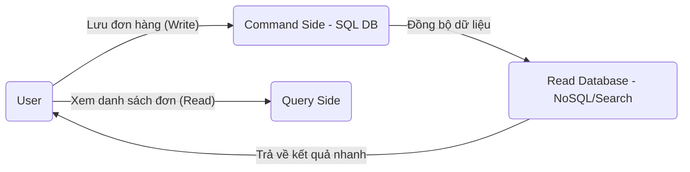

# CQRS & Event Sourcing

## 1. CQRS (Separate Read & Write)

**CQRS** giải quyết một bài toán đau đầu trong các hệ thống lớn: Một Database duy nhất thường không thể vừa phục vụ việc Ghi (Write) cực nhanh, vừa phục vụ việc Đọc (Read) dữ liệu tổng hợp phức tạp mà không bị chậm.

### Tại sao phải tách đôi?
- **Phía Ghi (Command):** Tập trung vào tính chính xác, ràng buộc dữ liệu (Validation) và các giao dịch (Transactions).
- **Phía Đọc (Query):** Tập trung hoàn toàn vào tốc độ. Dữ liệu thường được dàn phẳng (Denormalized) để chỉ cần 1 câu lệnh SELECT là lấy được đủ thông tin hiển thị lên UI, không cần JOIN nhiều bảng lằng nhằng.

**✅ Ví dụ thực tế: Sàn thương mại điện tử.**
- **Write:** Khi bạn nhấn "Đặt hàng", hệ thống phải check kho, trừ tiền, tạo vận đơn (Cần sự chính xác tuyệt đối của SQL).
- **Read:** Khi bạn tìm kiếm sản phẩm hoặc xem danh sách đơn hàng đã mua, hệ thống lấy từ một Database chuyên để tìm kiếm (như Elasticsearch) để trả về kết quả trong tích tắc cho hàng triệu người cùng lúc.

---

## 2. Event Sourcing (Lưu vết mọi biến động)

Thay vì chỉ lưu trạng thái hiện tại (ví dụ: Số dư = 1000), chúng ta lưu **tất cả các sự kiện (Events)** đã dẫn đến trạng thái đó.

### So sánh State-based vs. Event Sourcing
- **Cách cũ (State-based):** Lưu `Status = "Đã giao hàng"`. Bạn không hề biết trước đó nó đã qua những trạng thái nào, ai là người cập nhật.
- **Event Sourcing:** Lưu một chuỗi các sự kiện:
    1. `Order Created` (10:00 AM)
    2. `Payment Confirmed` (10:05 AM)
    3. `Shipped` (11:00 AM)
    4. `Delivered` (15:00 PM)

**Giá trị "vàng" cho doanh nghiệp:**
1.  **Audit Trail tuyệt đối:** Không ai có thể gian lận hay sửa dữ liệu mà không để lại dấu vết. Rất quan trọng trong Tài chính, Ngân hàng.
2.  **Time Travel:** Bạn muốn biết hệ thống trông như thế nào vào lúc 10:05 sáng nay? Chỉ cần chạy lại (Replay) các event đến đúng thời điểm đó.
3.  **Khôi phục dữ liệu:** Nếu Database bị sập, bạn chỉ cần nạp lại danh sách Event từ đầu để tái tạo lại toàn bộ dữ liệu hiện tại.

---

## 3. Sự kết hợp CQRS + Event Sourcing

Đây là "cặp bài trùng" mạnh nhất trong kiến trúc Microservices. Event Sourcing đóng vai trò là **Source of Truth** (Nguồn sự thật duy nhất). Mỗi khi có Event mới, hệ thống sẽ đẩy nó sang phía Đọc (Query side) để cập nhật dữ liệu hiển thị.

---

## 4. Câu hỏi phỏng vấn "Sát sườn"

> **Q: "Nhược điểm lớn nhất khiến người ta ngại dùng mô hình này là gì?"**
>
> **Trả lời:** 
> 1. **Eventual Consistency (Nhất quán sau cùng):** Vì phía Đọc và Ghi tách biệt, sẽ có một khoảng trễ nhỏ (mili giây). User vừa nhấn "Lưu", load lại trang có khi vẫn thấy dữ liệu cũ. Phải giải quyết bằng cách xử lý UI/UX hoặc dùng cơ chế thông báo.
> 2. **Độ phức tạp:** Code sẽ không còn là các câu lệnh `save()`, `update()` đơn giản nữa mà phải quản lý Event, Store, Projection... Độ phức tạp có thể tăng gấp nhiều lần so với CRUD thông thường.

---

## Tóm tắt nhanh
- **CQRS:** Tách riêng đường Đọc và đường Ghi để tối ưu tốc độ.
- **Event Sourcing:** Không lưu kết quả cuối, hãy lưu lịch sử (như sổ cái kế toán).
- **Dùng khi:** Hệ thống cực lớn, cần lưu vết dữ liệu nghiêm ngặt hoặc cần Đọc/Ghi cực nhanh độc lập.
