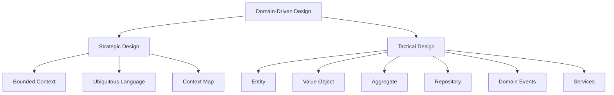
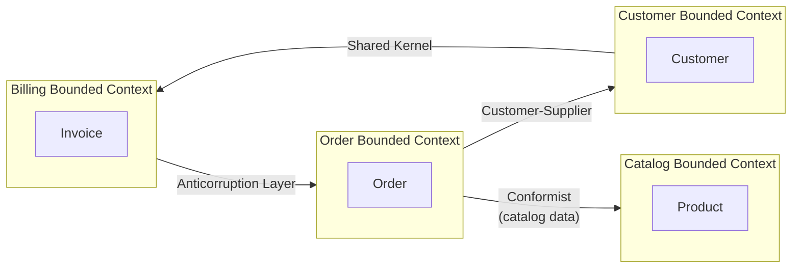
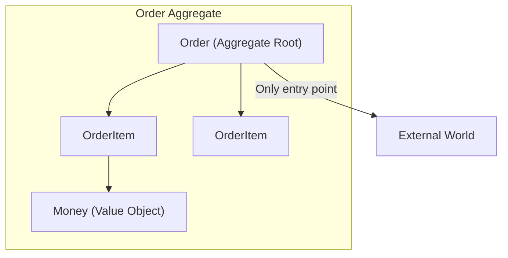

# Kiến trúc phần mềm

## Domain-Driven Design (DDD)

### 1. Tổng quan

**Domain-Driven Design (DDD)** là một phương pháp phát triển phần mềm tập trung vào việc hiểu sâu về **business domain** và xây dựng phần mềm phản ánh sự hiểu biết đó. Thay vì bắt đầu với các concerns kỹ thuật, DDD bắt đầu với các khái niệm, ngôn ngữ và quy tắc nghiệp vụ.



DDD được phổ biến bởi Eric Evans trong cuốn sách **"Domain-Driven Design: Tackling Complexity in the Heart of Software"** (2003).

### 2. Strategic Design

Strategic design giúp hiểu **bức tranh lớn** — các phần khác nhau của domain liên quan với nhau như thế nào, ranh giới ở đâu, và cách teams nên được tổ chức.

#### 2.1. Bounded Context

**Bounded Context** là một ranh giới giới hạn trong đó một domain model cụ thể là hợp lệ và nhất quán. Bên trong ranh giới, các thuật ngữ có ý nghĩa cụ thể, và model là đầy đủ.

```
┌─────────────────────────────────────────────────────────┐
│                    E-Commerce Domain                     │
│                                                          │
│  ┌─────────────────┐  ┌─────────────────┐               │
│  │  Catalog BC     │  │  Order BC       │               │
│  │                 │  │                 │               │
│  │  - Product      │  │  - Order        │               │
│  │  - Category     │  │  - OrderItem    │               │
│  │  - Inventory    │  │  - Shipment     │               │
│  │                 │  │                 │               │
│  │  "Product" =    │  │  "Product" =    │               │
│  │  items for sale │  │  items ordered  │               │
│  └─────────────────┘  └─────────────────┘               │
│                                                          │
│  ┌─────────────────┐  ┌─────────────────┐               │
│  │  Customer BC    │  │  Billing BC     │               │
│  │  - Customer     │  │  - Invoice      │               │
│  │  - Address      │  │  - Payment      │               │
│  │  - Preferences  │  │  - Tax          │               │
│  └─────────────────┘  └─────────────────┘               │
└─────────────────────────────────────────────────────────┘
```

Tại sao boundaries quan trọng:
- Các contexts khác nhau có thể dùng cùng một từ với **ý nghĩa khác nhau**
- "Product" trong Catalog (mặt hàng để bán) khác với "Product" trong Order (sản phẩm đã đặt)
- Ép buộc một unified model qua các boundaries dẫn đến **god objects** và **anemia**

#### 2.2. Ubiquitous Language

**Ubiquitous Language** là ngôn ngữ chung, nhất quán được sử dụng bởi cả developers và domain experts. Nó được dùng trong code, cuộc trò chuyện, tài liệu và tests.

| Domain Expert nói | Code (Ubiquitous Language) |
|---|---|
| "Tạo đơn hàng cho khách hàng" | `Order.create(customerId)` |
| "Thêm laptop vào giỏ hàng" | `Cart.addItem(product, quantity)` |
| "Đơn hàng đang chờ thanh toán" | `Order.status == PENDING_PAYMENT` |
| "Giao hàng đến địa chỉ khách hàng" | `Shipment.deliverTo(address)` |

> Tránh technical jargon trong domain language. Ngôn ngữ nên phản ánh **cách doanh nghiệp thực sự nói chuyện**.

#### 2.3. Context Map

**Context Map** hiển thị các mối quan hệ giữa các Bounded Contexts trong hệ thống.



### 3. Các mối quan hệ giữa Bounded Contexts

#### 3.1. Shared Kernel

Hai contexts **chia sẻ một phần** của domain model. Thay đổi phần chia sẻ ảnh hưởng cả hai contexts. Sử dụng ít — yêu cầu phối hợp chặt chẽ.

#### 3.2. Customer-Supplier

Một context (Supplier) cung cấp services/data cho context khác (Customer). Customer có thể yêu cầu thay đổi, và Supplier quyết định có đáp ứng hay không.

#### 3.3. Conformist

Context downstream **chấp nhận** model của upstream context mà không cần translation. Đơn giản hơn nhưng tạo dependency.

#### 3.4. Anticorruption Layer (ACL)

Context downstream tạo một **adapter layer** dịch giữa các models, bảo vệ domain riêng khỏi các thay đổi bên ngoài.

```java
// Anticorruption Layer - Order Context bảo vệ khỏi Catalog Context
public class CatalogProductAdapter {
    private final CatalogClient catalogClient;

    public OrderableProduct adapt(CatalogProduct externalProduct) {
        // Translate external CatalogProduct thành internal OrderableProduct
        return new OrderableProduct(
            externalProduct.getId().toString(),
            externalProduct.getDisplayName(),
            externalProduct.getPrice().getAmount(),
            externalProduct.isAvailable() && externalProduct.getStock() > 0
        );
    }
}
```

#### 3.5. Open Host Service (OHS) & Published Language (PL)

Context upstream định nghĩa một **protocol** (Open Host Service) và một **data format** (Published Language) mà các downstream contexts có thể dùng để integrate.

---

### 4. Tactical Design (Building Blocks)

Tactical design cung cấp các **implementation patterns** để xây dựng models trong một Bounded Context.

#### 4.1. Entity vs Value Object

| Khía cạnh | Entity | Value Object |
|-----------|--------|-------------|
| **Identity** | Có unique identifier | Không có identity |
| **Mutability** | Mutable | Immutable |
| **Equality** | By ID | By all attributes |
| **Lifecycle** | Có lifecycle (created, updated) | Không có lifecycle |
| **Examples** | User, Order, Product, Account | Address, Money, DateRange, Color |

```java
// Entity: Có identity, mutable
public class Order {
    private OrderId id;        // Unique identity
    private CustomerId customerId;
    private OrderStatus status;
    private List<OrderItem> items;

    public OrderId getId() { return id; }

    public void addItem(Product product, int quantity) {
        if (status != OrderStatus.DRAFT) {
            throw new IllegalStateException("Cannot add items to non-draft order");
        }
        // Business rule enforced here
        items.add(new OrderItem(product.getId(), product.getPrice(), quantity));
    }

    public void confirm() {
        if (items.isEmpty()) {
            throw new IllegalStateException("Cannot confirm empty order");
        }
        this.status = OrderStatus.CONFIRMED;
    }
}

// Value Object: Immutable, identified by attributes
public class Money {
    private final BigDecimal amount;
    private final Currency currency;

    public Money(BigDecimal amount, Currency currency) {
        this.amount = amount;
        this.currency = currency;
    }

    public Money add(Money other) {
        if (!this.currency.equals(other.currency)) {
            throw new IllegalArgumentException("Cannot add different currencies");
        }
        return new Money(this.amount.add(other.amount), this.currency);
    }

    @Override
    public boolean equals(Object o) {
        if (this == o) return true;
        if (o == null || getClass() != o.getClass()) return false;
        Money money = (Money) o;
        return Objects.equals(amount, money.amount) &&
               Objects.equals(currency, money.currency);
    }

    @Override
    public int hashCode() {
        return Objects.hash(amount, currency);
    }
}
```

#### 4.2. Aggregate

**Aggregate** là một cluster các entities và value objects liên quan với một **Aggregate Root** duy nhất — đây là đối tượng duy nhất accessible từ bên ngoài.



Rules:
- **Aggregate Root** là đối tượng duy nhất mà external code có thể reference
- Changes to the aggregate được điều phối qua root
- Aggregate enforces **invariants** (business rules luôn phải đúng)
- Mỗi aggregate có **Repository** riêng

```java
// Aggregate Root: Order
public class Order extends AggregateRoot {
    private OrderId id;
    private CustomerId customerId;
    private OrderStatus status;
    private List<OrderItem> items;

    // External code chỉ access qua root
    public void addItem(Product product, int quantity) {
        // Invariant: Không sửa non-draft order
        if (status != OrderStatus.DRAFT) {
            throw new DomainException("Cannot modify confirmed order");
        }

        // Invariant: Số lượng phải dương
        if (quantity <= 0) {
            throw new DomainException("Quantity must be positive");
        }

        // Invariant: Check product availability
        if (!product.isAvailable()) {
            throw new DomainException("Product is not available");
        }

        this.items.add(new OrderItem(product.getId(), product.getPrice(), quantity));
        registerEvent(new OrderItemAddedEvent(this.id, product.getId(), quantity));
    }
}

// OrderItem: Internal entity — external code không truy cập trực tiếp
class OrderItem {
    private final ProductId productId;
    private final Money unitPrice;
    private int quantity;
}

// External code: Chỉ tương tác qua Order
public class OrderService {
    public void addProductToOrder(OrderId orderId, ProductId productId) {
        Order order = orderRepository.findById(orderId);
        Product product = productRepository.findById(productId);
        order.addItem(product, 1);
        orderRepository.save(order);
    }
}
```

#### 4.3. Repository Pattern

**Repository** cung cấp access tới Aggregates. Nó abstract persistence layer, cho domain một collection-like interface.

```java
// Repository interface (trong domain layer)
public interface OrderRepository {
    Order findById(OrderId id);
    Order findByCustomerId(CustomerId customerId);
    List<Order> findByStatus(OrderStatus status);
    void save(Order order);
    void delete(OrderId id);
}

// Repository implementation (trong infrastructure layer)
@Repository
public class JpaOrderRepository implements OrderRepository {
    private final SpringDataOrderRepository springDataRepo;

    @Override
    public Order findById(OrderId id) {
        return springDataRepo.findById(id.getValue())
            .map(entity -> orderMapper.toDomain(entity))
            .orElse(null);
    }

    @Override
    public void save(Order order) {
        OrderEntity entity = orderMapper.toEntity(order);
        springDataRepo.save(entity);
    }
}
```

> **Nguyên tắc quan trọng**: Repository interfaces sống trong **domain layer**, nhưng implementations sống trong **infrastructure layer**. Domain không bao giờ phụ thuộc infrastructure.

#### 4.4. Domain Events

**Domain Events** biểu diễn điều gì đó quan trọng đã xảy ra trong domain. Chúng là các records bất biến của một sự kiện trong quá khứ.

```java
// Domain Event
public class OrderConfirmedEvent extends DomainEvent {
    private final OrderId orderId;
    private final CustomerId customerId;
    private final Money totalAmount;

    public OrderConfirmedEvent(OrderId orderId, CustomerId customerId,
                              Money totalAmount, Instant occurredOn) {
        super(occurredOn);
        this.orderId = orderId;
        this.customerId = customerId;
        this.totalAmount = totalAmount;
    }
}

// Raising events từ Aggregate Root
public class Order extends AggregateRoot {
    public void confirm() {
        this.status = OrderStatus.CONFIRMED;
        registerEvent(new OrderConfirmedEvent(
            this.id, this.customerId, this.getTotal(), Instant.now()
        ));
    }
}

// Event handler
public class OrderEventHandler {
    @EventHandler
    public void handleOrderConfirmed(OrderConfirmedEvent event) {
        emailService.sendOrderConfirmation(event.getCustomerId(), event.getOrderId());
        analyticsService.trackOrderConfirmed(event.getTotalAmount());
        warehouseService.prepareShipment(event.getOrderId());
    }
}
```

#### 4.5. Domain Services vs Application Services vs Infrastructure Services

| Loại Service | Trách nhiệm | Location | Dependencies |
|---|---|---|---|
| **Domain Service** | Business logic không thuộc về một entity duy nhất | Domain Layer | Chỉ domain objects |
| **Application Service** | Orchestrates domain objects, use cases | Application Layer | Domain Services, Repositories |
| **Infrastructure Service** | External concerns (email, SMS, file storage) | Infrastructure Layer | External systems |

```java
// Domain Service: Pure business logic across entities
public class PricingService {
    public Money calculateDiscountedPrice(Money originalPrice,
                                          DiscountPolicy policy,
                                          Customer customer) {
        BigDecimal discountRate = policy.getDiscountRate(customer.getTier());
        BigDecimal discount = originalPrice.getAmount().multiply(discountRate);
        return new Money(
            originalPrice.getAmount().subtract(discount),
            originalPrice.getCurrency()
        );
    }
}

// Application Service: Orchestrates use case
public class PlaceOrderService {
    private final OrderRepository orderRepository;
    private final ProductRepository productRepository;
    private final DomainEventPublisher eventPublisher;

    public OrderId placeOrder(CustomerId customerId,
                              List<OrderItemRequest> items) {
        Order order = Order.create(customerId);

        for (OrderItemRequest item : items) {
            Product product = productRepository.findById(item.getProductId());
            order.addItem(product, item.getQuantity());
        }

        orderRepository.save(order);
        eventPublisher.publish(new OrderPlacedEvent(order.getId()));
        return order.getId();
    }
}

// Infrastructure Service: External integrations
@Service
public class EmailNotificationService implements NotificationService {
    @Override
    public void sendOrderConfirmation(OrderId orderId, CustomerEmail email) {
        emailClient.send(email, "Order Confirmed", buildEmailBody(orderId));
    }
}
```

#### 4.6. Factory Pattern in DDD

**Factory** pattern encapsulate complex object creation, đặc biệt cho Aggregates với complex creation rules.

```java
public class OrderFactory {
    private final ProductRepository productRepository;

    public OrderFactory(ProductRepository productRepository) {
        this.productRepository = productRepository;
    }

    public Order createOrder(CustomerId customerId, List<OrderItemRequest> items) {
        Order order = Order.create(customerId);

        for (OrderItemRequest item : items) {
            Product product = productRepository.findById(item.getProductId());
            if (product == null) {
                throw new ProductNotFoundException(item.getProductId());
            }
            order.addItem(product, item.getQuantity());
        }

        if (order.isEmpty()) {
            throw new EmptyOrderException();
        }

        return order;
    }
}
```

---

### 5. Khi nào nên dùng DDD

#### 5.1. Phù hợp với DDD

- **Complex business domains** với rich rules và logic (ngân hàng, bảo hiểm, y tế, thương mại điện tử)
- **Large teams** nơi shared understanding của domain là critical
- **Long-lived systems** nơi domain model evolution quan trọng
- **Strategic importance** — domain là lợi thế cạnh tranh cốt lõi

#### 5.2. DDD có thể overkill khi

- **Simple CRUD applications** với minimal business logic
- **Data-centric systems** nơi mục tiêu chính là storage và retrieval
- **Small teams** với simple domains
- **Short-lived prototypes** nơi speed quan trọng hơn structure

---

### 6. Câu hỏi phỏng vấn

**Q: Entity và Value Object khác nhau thế nào?**

> **Entity** có một identity riêng biệt tồn tại theo thời gian, ngay cả khi attributes của nó thay đổi. Hai entities với cùng attributes nhưng ID khác nhau là hai entities khác nhau. **Value Object** không có identity và được định nghĩa hoàn toàn bởi attributes của nó. Hai value objects với cùng attributes được coi là equal. Value objects là immutable, trong khi entities là mutable. Ví dụ: `Order` (Entity, có OrderId) vs `Address` (Value Object, equal nếu tất cả address fields match).

**Q: Aggregate Root là gì và tại sao nó quan trọng?**

> **Aggregate Root** là entity duy nhất trong một aggregate đóng vai trò là điểm vào duy nhất cho external access. Tất cả changes tới objects trong aggregate phải đi qua root. Điều này quan trọng vì: nó enforces **invariants** (business rules phải luôn đúng) từ một location duy nhất, nó cung cấp một **clear transaction boundary**, và nó ngăn external code bypass business rules bằng cách modify internal state trực tiếp.

**Q: Domain Events và Application Events khác nhau thế nào?**

> **Domain Events** biểu diễn điều gì đó đã xảy ra trong business domain và là một phần của domain model. Chúng sử dụng Ubiquitous Language và được định nghĩa trong domain layer. **Application Events** là cơ chế kỹ thuật cho communication, thường dùng cho framework integration, cross-cutting concerns, hoặc async processing. Domain events nên được raise bởi domain, trong khi application services hoặc infrastructure xử lý dispatch và processing của chúng.

**Q: Khi nào KHÔNG nên dùng DDD?**

> DDD thêm complexity và overhead. Không nên dùng cho simple CRUD applications nơi business logic là minimal, cho data-centric systems tập trung vào storage và retrieval, cho small projects với short lifespan, hoặc khi team thiếu experience với DDD patterns. Giá trị gia tăng của rich modeling trong DDD đi kèm với chi phí là design effort và architectural complexity.
