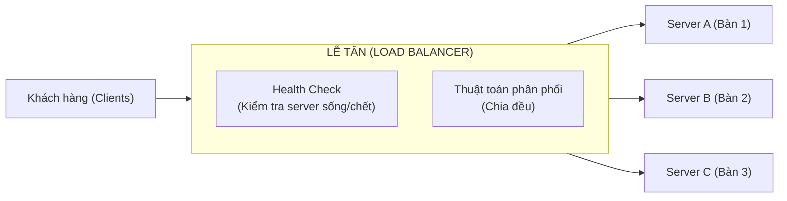

# Load Balancer (Cân bằng tải)

### Tổng quan

**Load balancer (Bộ cân bằng tải)** là công cụ phân phối lượng truy cập (requests) từ người dùng đến dàn máy chủ (backend servers) một cách thông minh và đồng đều. 

**Ví dụ thực tế:** Load balancer giống hệt như **bạn Lễ tân ở một nhà hàng siêu đông**. Thay vì để hàng trăm khách hàng chen lấn ùa vào tranh giành bàn, lễ tân đứng ngoài cửa quan sát:
- Thấy bàn 1 (Server A) đang rảnh -> Xếp khách vào bàn 1.
- Thấy bàn 2 (Server B) đang bù đầu phục vụ -> Không đưa thêm khách vào đó nữa.
- Nếu bàn 3 (Server C) bị hỏng ghế (Server sập) -> Báo lỗi bàn 3 và chỉ chia khách vào bàn 1 và 2.

Nhờ vậy, hệ thống không bao giờ bị quá tải cục bộ tại một máy chủ nào cả!



---

### Phân loại Load Balancer (Layer 4 vs Layer 7)

Trong mô hình OSI mạng máy tính, Load Balancer thường hoạt động ở 2 tầng: Layer 4 hoặc Layer 7. Hãy xem sự khác biệt.

| Tiêu chí | Layer 4 (Transport) | Layer 7 (Application) |
|---|---|---|
| **Ví dụ vui** | Giống **ông bảo vệ giữ xe**: Chỉ nhìn biển số xe (IP) và thẻ giữ xe (Port) rồi nhắm mắt chỉ đại xe vào bãi, không cần biết trong cốp xe chứa gì. Rất nhanh! | Giống **bảo vệ kiểm tra thiệp mời**: Kiểm tra kỹ thiệp VIP hay thường (URL, Headers, Cookies). Nếu VIP thì dẫn vào phòng VIP, khách thường dẫn ra sảnh. Chậm hơn một chút nhưng siêu thông minh. |
| **Cách hoạt động** | Chỉ phân phối dựa theo IP và Port (TCP, UDP). | Phân phối sâu dựa vào nội dung HTTP (Path, Headers). |
| **Tốc độ** | Rất nhanh (vì không cần mở gói tin ra đọc). | Chậm hơn xíu (vì tốn công đọc gói tin HTTP). |
| **Ứng dụng** | Cân bằng tải cho Database, các dịch vụ TCP thuần. | Phổ biến nhất cho Web API. Có thể điều phối `/api/user` sang Server A, `/api/payment` sang Server B. |
| **Ví dụ thực tế** | AWS NLB (Network Load Balancer), HAProxy (mode TCP) | Nginx, AWS ALB (Application Load Balancer) |

---

### Các thuật toán chia tải (Load Balancing Algorithms)
Bạn Lễ tân chia bàn cho khách theo quy luật nào?

| Thuật toán | Cơ chế hoạt động |
|---|---|
| **Round Robin (Chia vòng)** | Cứ xoay vòng: Khách 1 vào bàn A, Khách 2 vào bàn B, Khách 3 vào bàn C. Lại quay lại A, B, C. (Cơ bản nhất). |
| **Weighted Round Robin** | Bàn A là bàn VIP sức chứa lớn, Bàn B nhỏ hơn. Vậy chia 3 khách vào A mới chia 1 khách vào B. (Gán trọng số). |
| **Least Connections** | Bàn nào đang ít khách phục vụ nhất thì nhét thêm khách vào. Rất hay dùng cho hệ thống thật. |
| **IP Hash** | Khách có khuôn mặt quen (IP không đổi) thì luôn luôn xếp cho thợ cũ phục vụ. (Dùng cho Sticky Session). |

---

### Session Persistence (Sticky Sessions - Gắn bó với 1 Server)

**Tình huống:** Giống như bạn đi cắt tóc quen một thợ, bạn yêu cầu lễ tân: "Lần nào tôi đến cũng xếp tôi cho thợ cũ (Server cũ) phục vụ nhé, thợ đó quen kiểu tóc của tôi rồi". Đó là **Sticky Session**.

- Load Balancer sẽ nhớ IP của bạn (hoặc cấp Cookie) để lần sau bạn vào, nó luôn đẩy bạn về đúng cái máy chủ cũ.
- **Vấn đề:** Nếu cái máy chủ đó sập, bạn mất luôn phiên làm việc (mất giỏ hàng, văng đăng nhập).

> **💡 Khuyên dùng trong phỏng vấn:**
> Khi thiết kế hệ thống lớn hiện đại, hãy cố gắng xây dựng Backend **Stateless (Không lưu trạng thái)**. Tức là chuyển hết việc nhớ Session sang Redis. Lúc này, bất kì thợ nào (Server nào) cũng có thể phục vụ bạn vì thợ chỉ cần tra Redis là biết bạn mua gì. Khi đó, ta không cần dùng đến Sticky Session nữa, giúp hệ thống co giãn linh hoạt hơn!

---

### Kiểm tra sức khỏe (Health Checks)

Bạn Lễ tân phải biết bàn nào hỏng để không xếp khách vào.
- **Ping/TCP Check:** Nhắc máy gọi thử xem Server có nghe máy không.
- **HTTP Check:** Gọi thử vào đường dẫn `/health` của server. Nếu trả về `200 OK` thì sống, nếu trả `500` hoặc không trả lời (timeout) thì LB sẽ đánh dấu là Server chết và loại nó ra khỏi vòng phân phối.

```nginx
# Cấu hình Nginx thực tế cho việc check Health:
upstream backend {
    server 10.0.1.10:8080 max_fails=3 fail_timeout=30s;
    # Nếu server này lỗi 3 lần, nghỉ chơi nó trong 30 giây rồi mới thử lại.
}
```

---

### Các công cụ Load Balancer phổ biến
- **Nginx:** Công cụ quốc dân, cực kỳ mạnh và cấu hình linh hoạt (Software L7).
- **AWS ALB/NLB:** Xài cloud Amazon thì bấm vài nút là có ngay, tự động quản lý.
- **HAProxy:** Siêu cấp tốc độ, chuyên trị hệ thống khổng lồ.
- **Cloudflare:** Bản chất nó là CDN nhưng kiêm luôn Load Balancing toàn cầu.
