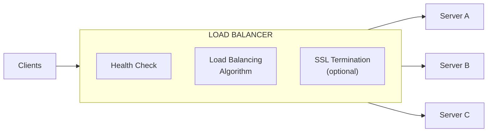

# Load Balancer

### Tổng quan

**Load balancer** phân phối lưu lượng request đến các backend server một cách đều nhau. Nó hoạt động như điểm vào duy nhất cho clients và đảm bảo không server nào phải chịu quá nhiều tải.



---

### Các loại Load Balancer

| Loại | OSI Layer | Mô tả |
|---|---|---|
| **Layer 4 (Transport)** | L4 | Phân phối theo IP và port (TCP, UDP). Nhanh hơn, ít aware về content. |
| **Layer 7 (Application)** | L7 | Phân phối theo HTTP/HTTPS content (URL, cookies, headers). Thông minh hơn nhưng overhead cao hơn. |

#### So sánh L4 vs L7

| Khía cạnh | L4 Load Balancer | L7 Load Balancer |
|---|---|---|
| **Dữ liệu examined** | IP, Port | URL, Headers, Cookies, Body |
| **Performance** | Nhanh hơn | Chậm hơn |
| **Routing decisions** | Đơn giản | Phức tạp |
| **SSL termination** | Không | Có |
| **Content-based routing** | Không | Có (ví dụ: `/api/*` → backend) |
| **Ví dụ** | HAProxy (TCP mode), AWS NLB | Nginx, AWS ALB, HAProxy (HTTP mode) |

---

### Load Balancing Algorithms

| Thuật toán | Mô tả | Phù hợp cho |
|---|---|---|
| **Round Robin** | Phân phối request theo lượt đều nhau | Server đồng nhất |
| **Weighted Round Robin** | Phân phối theo capacity của server | Hardware không đồng nhất |
| **Least Connections** | Route đến server có ít active connections nhất | Long-lived connections |
| **Weighted Least Connections** | Cân nhắc cả connections và weight | Mixed capacity |
| **IP Hash** | Hash client IP để xác định server | Session affinity |
| **Least Response Time** | Route đến server có response time thấp nhất | Latency-sensitive apps |
| **Random** | Chọn ngẫu nhiên | Đơn giản, hoạt động tốt với caching |

---

### Health Checks

| Loại | Mô tả | Ví dụ |
|---|---|---|
| **Passive** | Monitor active requests cho failures | Đánh dấu server down sau 3 consecutive failures |
| **Active** | Định kỳ gửi probes đến servers | `GET /health` mỗi 10 giây |
| **TCP Connect** | Check port có mở không | Đơn giản, overhead thấp |
| **HTTP/HTTPS** | Check endpoint cụ thể | Chi tiết hơn (có thể check DB connectivity) |

```nginx
# Ví dụ: Nginx health check configuration
upstream backend {
    least_conn;
    server 10.0.1.10:8080 max_fails=3 fail_timeout=30s;
    server 10.0.1.11:8080 max_fails=3 fail_timeout=30s;
    server 10.0.1.12:8080 backup;  # Chỉ dùng khi others fail
}
```

---

### Session Persistence (Sticky Sessions)

| Phương pháp | Mô tả | Ưu điểm | Nhược điểm |
|---|---|---|---|
| **Cookie-based** | LB set cookie để track server | Đơn giản | Cookie manipulation risk |
| **IP Hash** | Hash client IP đến cùng server | Không cần cookie | Mobile users có thể đổi IP |
| **Application-level** | Server cấp session token | Linh hoạt nhất | Extra app logic |

> **Lưu ý:** Sticky sessions thường không cần thiết khi backend **stateless**. Dùng JWT tokens hoặc store sessions trong Redis thay vì dựa vào server affinity.

---

### Load Balancer Solutions

| Sản phẩm | Loại | Ghi chú |
|---|---|---|
| **AWS ELB (ALB/NLB)** | Cloud-managed | Tích hợp sâu với AWS |
| **Nginx** | Software LB, L7 | Phổ biến nhất, highly configurable |
| **HAProxy** | Software LB, L4/L7 | High performance, TCP expert |
| **Traefik** | Cloud-native, L7 | Docker/Kubernetes native |
| **Envoy** | Service proxy, L7 | Dùng như sidecar trong service mesh |
| **Cloudflare** | CDN + LB | Global anycast network |

---

### DNS-Based Load Balancing

| Phương pháp | Mô tả |
|---|---|
| **Round Robin DNS** | Rotate IP addresses trong DNS responses |
| **GeoDNS** | Trả về IP khác nhau dựa trên vị trí user |
| **Anycast** | Nhiều servers chia sẻ cùng IP; routing hướng đến server gần nhất |

---

### Ví dụ cấu hình Nginx

```nginx
upstream api_backend {
    ip_hash;

    server 10.0.1.10:8080 weight=3;
    server 10.0.1.11:8080 weight=2;
    server 10.0.1.12:8080;
}

server {
    listen 443 ssl http2;
    ssl_certificate /etc/ssl/server.crt;
    ssl_certificate_key /etc/ssl/server.key;

    limit_req_zone $binary_remote_addr zone=api_limit:10m rate=10r/s;

    location /api/ {
        proxy_pass http://api_backend;
        proxy_http_version 1.1;
        proxy_set_header Host $host;
        proxy_set_header X-Real-IP $remote_addr;
        proxy_set_header X-Forwarded-For $proxy_add_x_forwarded_for;
        proxy_set_header X-Forwarded-Proto $scheme;

        proxy_next_upstream error timeout http_502 http_503;
        limit_req zone=api_limit burst=20 nodelay;
    }
}
```

> **Tip:** Đặt load balancers ở **ít nhất hai availability zones**. Một load balancer duy nhất là một single point of failure. Dùng health checks để tự động loại bỏ failed servers khỏi rotation.
