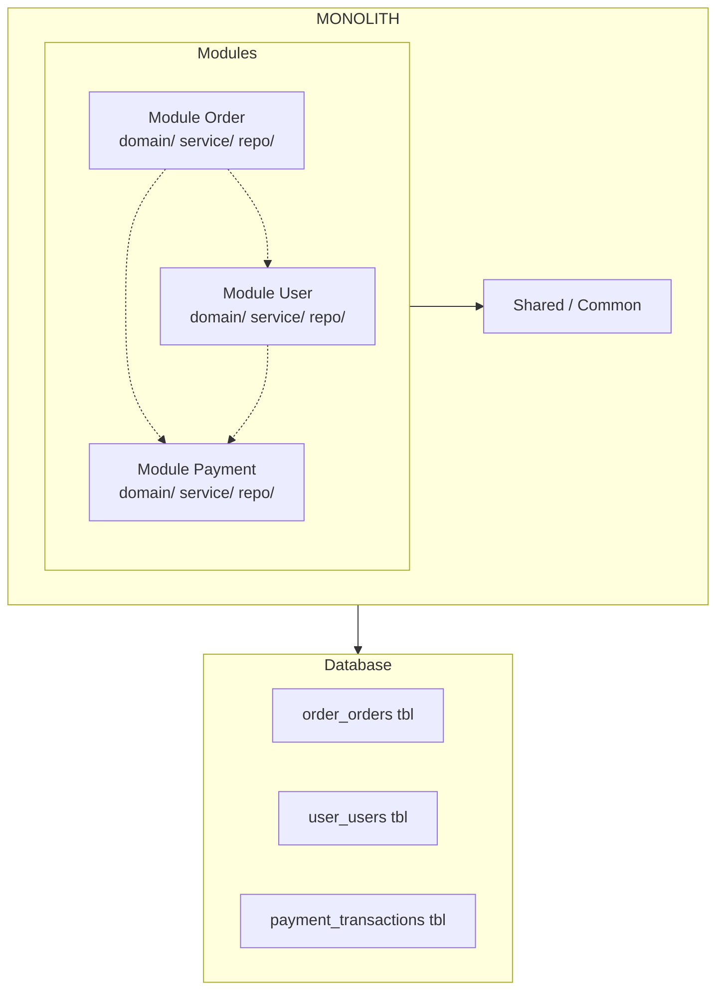

# Modular Monolith - Kiến trúc Monolith mô-đun

## 1. Tổng quan

**Modular Monolith** là kiến trúc **monolithic** nhưng được **chia thành các module độc lập** về mặt logic. Mỗi module có **boundary rõ ràng**, có thể phát triển độc lập bởi các team khác nhau. Đây được coi là "điểm khởi đầu tốt nhất" — đủ đơn giản để bắt đầu, đủ cấu trúc để mở rộng.

### 1.1. Định nghĩa đơn giản

```
Monolith thuần     →  Tất cả code trong một "nồi" (highly coupled)
Modular Monolith   →  Code vẫn trong một "nồi" nhưng được chia ngăn rõ ràng
Microservices      →  Tách thành nhiều "nồi" nhỏ riêng biệt
```

---

## 2. Đặc điểm chính

### 2.1. Giống Monolith truyền thống

| Đặc điểm | Mô tả |
|---------|-------|
| **Một artifact duy nhất** | Build, deploy như một đơn vị |
| **Chung database** | Tất cả module dùng chung một database (thường là schema chia theo module) |
| **Giao tiếp synchronous** | Các module gọi nhau trực tiếp (in-process call) |
| **Deployment đơn giản** | Chỉ cần deploy một artifact |
| **Debug đơn giản** | Một process, không cần distributed tracing phức tạp |

### 2.2. Giống Microservices

| Đặc điểm | Mô tả |
|---------|-------|
| **Module boundary rõ ràng** | Mỗi module có namespace, package riêng |
| **Low coupling** | Module chỉ giao tiếp qua interface/API internal |
| **Independent deployability** | Trong một số cách triển khai, có thể deploy module độc lập |
| **Team ownership** | Mỗi team sở hữu một hoặc nhiều module |
| **Tách biệt data** | Dùng chung DB nhưng schema/table được phân chia theo module |

### 2.3. Sơ đồ kiến trúc



---

## 3. So sánh chi tiết

| Tiêu chí | Monolith | Modular Monolith | Microservices |
|----------|----------|-----------------|---------------|
| **Deployment** | Toàn bộ ứng dụng | Toàn bộ (hoặc module) | Từng service riêng biệt |
| **Database** | Một database chung | Một database (schema chia theo module) | Mỗi service DB riêng |
| **Team ownership** | Chung toàn bộ | Module ownership | Service ownership |
| **Coupling** | Cao (thường) | **Thấp** (boundary rõ) | Thấp |
| **Communication** | In-process | In-process (qua interface) | IPC (HTTP, Message Queue) |
| **Complexity** | Thấp | **Trung bình** | Cao |
| **Testing** | Đơn giản | Đơn giản | Phức tạp (integration, contract) |
| **Debugging** | Đơn giản | Đơn giản | Cần distributed tracing |
| **Scalability** | Khó scale từng phần | Khó scale từng phần | Dễ scale từng phần |
| **Time to market** | Nhanh ban đầu | Trung bình | Chậm ban đầu |

---

## 4. Ví dụ cấu trúc project

### 4.1. Package Structure

```
src/main/java/com/example/app/
├── Application.java                    # Main entry point
│
├── order/                              # Module: Order
│   ├── OrderModule.java                # Marker interface (optional)
│   ├── domain/
│   │   ├── Order.java
│   │   ├── OrderItem.java
│   │   ├── OrderStatus.java
│   │   └── exception/
│   │       ├── OrderNotFoundException.java
│   │       └── InvalidOrderStateException.java
│   ├── repository/
│   │   ├── OrderRepository.java        # Interface (abstraction)
│   │   └── OrderRepositoryImpl.java    # Implementation
│   ├── service/
│   │   ├── OrderService.java
│   │   ├── OrderValidator.java
│   │   └── OrderEventPublisher.java
│   ├── dto/
│   │   ├── CreateOrderRequest.java
│   │   └── OrderResponse.java
│   └── mapper/
│       └── OrderMapper.java
│
├── user/                               # Module: User
│   ├── domain/
│   │   ├── User.java
│   │   ├── Address.java
│   │   └── exception/
│   │       └── UserNotFoundException.java
│   ├── repository/
│   │   └── UserRepository.java
│   ├── service/
│   │   ├── UserService.java
│   │   └── UserRegistrationService.java
│   └── dto/
│
├── payment/                            # Module: Payment
│   ├── domain/
│   │   ├── Payment.java
│   │   ├── PaymentMethod.java
│   │   └── exception/
│   │         └── PaymentFailedException.java
│   ├── repository/
│   ├── service/
│   │   ├── PaymentService.java
│   │   ├── PaymentGateway.java         # Interface
│   │   └── StripeGateway.java           # Implementation
│   └── dto/
│
└── shared/                             # Shared code
    ├── exception/
    │   ├── GlobalExceptionHandler.java
    │   └── BaseException.java
    ├── config/
    │   └── SharedConfig.java
    ├── mapper/
    │   └── BaseMapper.java
    └── util/
        └── DateUtils.java
```

### 4.2. Nguyên tắc module

```java
// ✅ Module chỉ giao tiếp qua interface/internal API
// order/service/OrderService.java
@Service
@Facade // annotation tùy chỉnh để đánh dấu public API của module
public class OrderService {

    private final OrderRepository orderRepository;
    private final PaymentService paymentService;  // Gọi qua interface, không trực tiếp
    private final UserService userService;

    public OrderService(
            OrderRepository orderRepository,
            PaymentService paymentService,
            UserService userService) {
        this.orderRepository = orderRepository;
        this.paymentService = paymentService;
        this.userService = userService;
    }

    public OrderResponse createOrder(CreateOrderRequest request) {
        User user = userService.findById(request.getUserId());
        Order order = buildOrder(user, request);
        orderRepository.save(order);
        paymentService.processPayment(order);
        return toResponse(order);
    }
}

// ❌ Vi phạm module boundary — truy cập internal details
// BAD: new OrderItemRepository().findByOrderId()
// GOOD: orderRepository.findItemsByOrderId(orderId)
```

### 4.3. Database schema per module

```sql
-- Schema chia theo module (prefix table names)
-- order module
CREATE TABLE order_orders (...);
CREATE TABLE order_items (...);

-- user module
CREATE TABLE user_users (...);
CREATE TABLE user_addresses (...);

-- payment module
CREATE TABLE payment_transactions (...);
CREATE TABLE payment_methods (...);

-- NOT shared tables — mỗi module quản lý bảng riêng
```

---

## 5. Giao tiếp giữa các module

### 5.1. Synchronous (Direct Call)

```java
// Giao tiếp synchronous qua interface
@Service
public class OrderService {

    private final OrderRepository orderRepository;
    private final PaymentService paymentService;  // Interface của payment module
    private final NotificationService notificationService;

    public void completeOrder(Long orderId) {
        Order order = orderRepository.findById(orderId);
        order.complete();

        // Gọi payment module
        paymentService.charge(order.getCustomer(), order.getTotal());

        // Gọi notification module
        notificationService.sendOrderConfirmation(order.getCustomer(), order);

        orderRepository.save(order);
    }
}
```

### 5.2. Asynchronous (Event-Driven)

```java
// Giao tiếp asynchronous qua events
@Service
public class OrderService {

    private final ApplicationEventPublisher eventPublisher;

    public void createOrder(CreateOrderRequest request) {
        Order order = buildOrder(request);
        orderRepository.save(order);

        // Publish event — không cần biết ai xử lý
        eventPublisher.publishEvent(new OrderCreatedEvent(this, order.getId()));

        return toResponse(order);
    }
}

// Trong module Payment — subscribe event
@Service
@OrderHandler  // annotation tùy chỉnh
public class PaymentEventHandler {

    @EventListener
    @Async
    public void handleOrderCreated(OrderCreatedEvent event) {
        // Xử lý payment cho order
        Order order = orderService.findById(event.getOrderId());
        paymentService.processPayment(order);
    }
}
```

---

## 6. Khi nào nên dùng Modular Monolith?

### 6.1. Lý do chọn Modular Monolith

| Lý do | Mô tả |
|-------|-------|
| **Dự án nhỏ/trung bình** | Đơn giản, nhanh để develop và deploy |
| **Team nhỏ** | Không đủ tài nguyên để vận hành nhiều service |
| **Chưa đủ lớn cho microservices** | Microservices overhead chưa xứng đáng |
| **Muốn rõ ràng về module boundary** | Dễ migrate lên microservices sau nếu cần |
| **Rapid prototyping** | Cần validate ý tưởng nhanh |
| **Legacy system migration** | Điểm trung gian tốt trước khi tách hoàn toàn |

### 6.2. Dấu hiệu nên chuyển sang Microservices

| Dấu hiệu | Mô tả |
|---------|-------|
| Module cần deploy độc lập | Một module thay đổi liên tục, cần deploy riêng |
| Scaling không đồng đều | Một module cần scale mạnh, module khác không |
| Team quá lớn | Nhiều team phát triển cùng một monolith gây conflict |
| Technology khác biệt | Một module cần dùng ngôn ngữ/framework khác |
| Fault isolation cần thiết | Một module fail không nên ảnh hưởng module khác |

---

## 7. So sánh chi phí vận hành

| Khía cạnh | Modular Monolith | Microservices |
|-----------|----------------|--------------|
| **CI/CD** | Đơn giản — 1 pipeline | Phức tạp — nhiều pipeline, orchestration |
| **Infrastructure** | 1-2 servers | Nhiều servers, service mesh |
| **Monitoring** | Đơn giản — centralized logs | Cần distributed tracing (Zipkin, Jaeger) |
| **Database** | 1 database | N database |
| **DevOps team** | Nhỏ (1-2 người) | Cần DevOps/SRE riêng |
| **Time to deploy** | Nhanh | Chậm hơn (nhiều bước) |

---

## 8. Lưu ý quan trọng

> **Lưu ý**: Modular Monolith là **điểm khởi đầu tốt**. Khi hệ thống mở rộng, có thể extract từng module thành microservice riêng biệt một cách **có kế hoạch** — lúc này boundary đã rõ ràng từ trước, việc tách ra sẽ dễ dàng hơn nhiều so với monolith truyền thống.

### 8.1. Sai lầm phổ biến

| Sai lầm | Hậu quả |
|---------|--------|
| Không thực sự tách module | Module vẫn coupled, không khác gì monolith |
| Shared database quá nhiều | Module truy cập chéo, khó tách sau |
| Violate module boundary | Truy cập internal class của module khác |
| Over-engineering quá sớm | Tạo abstraction cho module có 1 class |

### 8.2. Best Practices

1. **Mỗi module một package gốc** — đặt tên rõ ràng, không dùng chung package
2. **Chỉ giao tiếp qua interface** — giống như giao tiếp service trong microservices
3. **Schema chia theo module** — mỗi module quản lý bảng riêng
4. **Enforce boundary** — dùng ArchUnit hoặc module system để kiểm tra
5. **Bắt đầu đơn giản** — đừng tạo abstraction phức tạp khi chưa cần
6. **Review module boundary** — như review code, nhưng tập trung vào coupling
