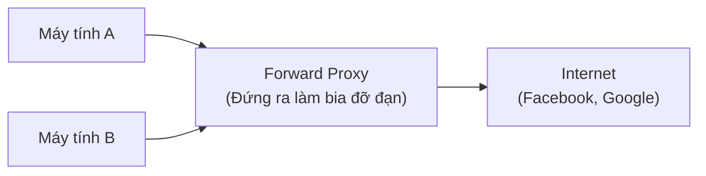
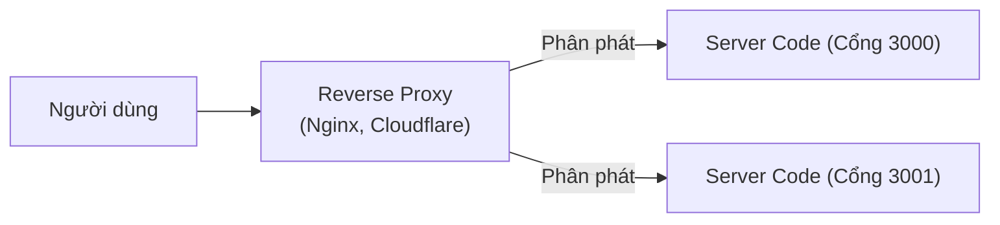

# Proxy Server (Máy chủ ủy quyền)

## Tổng quan

**Proxy Server** giống như một "kẻ đóng thế" hoặc "người trung gian" đứng giữa bạn (Client) và máy chủ (Server). 
Thay vì 2 bên nói chuyện trực tiếp với nhau, mọi yêu cầu (request) và phản hồi (response) đều phải đi qua Proxy. Việc này giúp che giấu danh tính, tăng tốc độ (nhờ bộ nhớ đệm cache), và tăng cường bảo mật.

---

## Phân loại Proxy Server

Có 2 loại Proxy bạn chắc chắn phải phân biệt rõ khi đi phỏng vấn:

| Loại | Vị trí đứng | Vai trò chính | Phân tích ví dụ |
|------|--------|---------------|----------|
| **Forward Proxy** | Đứng bảo vệ **Client** | Giúp Client giấu mặt. | Giống như bạn nhờ đứa bạn ra quán mua trà sữa giùm. Cô bán hàng chỉ biết đứa bạn đó mua, không hề biết bạn mới là người uống. |
| **Reverse Proxy** | Đứng bảo vệ **Server** | Giúp Server giấu mặt. | Giống như số tổng đài chăm sóc khách hàng. Bạn gọi vào tổng đài, họ sẽ chuyển máy cho nhân viên A hoặc B. Bạn không bao giờ biết được số điện thoại cá nhân của nhân viên A hay B. |

---

## 1. Forward Proxy (Proxy chuyển tiếp)

### Khái niệm
Nó đứng giữa **người dùng** và **Internet**. Mọi yêu cầu truy cập web của bạn đều phải gửi cho Forward Proxy, rồi nó mới đi lấy web về cho bạn. Server đích (như Facebook, Google) chỉ nhìn thấy địa chỉ IP của Proxy chứ không thấy IP thật của bạn.

### Tại sao lại cần Forward Proxy?

| Tính năng | Ứng dụng thực tế |
|-----------|-------|
| **Vượt rào (Bypass)** | Máy tính bạn bị chặn không cho vào web nước ngoài. Bạn dùng VPN (một dạng Forward Proxy nâng cao) kết nối sang máy chủ Singapore, rồi từ máy chủ đó vào web. Thế là xong! |
| **Kiểm duyệt (Filtering)** | Mạng Wi-Fi của công ty cài Forward Proxy để chặn nhân viên vào Facebook, Youtube trong giờ làm việc. Ai vào là proxy chặn lại ngay. |
| **Ẩn danh (Anonymity)** | Giấu IP thật để không bị theo dõi quảng cáo. |

---

## 2. Reverse Proxy (Proxy đảo ngược)

### Khái niệm
Đây là "trùm cuối" mà bất kỳ hệ thống Web Backend nào cũng phải có. Nó đứng chĩa mặt ra Internet để hứng toàn bộ request từ người dùng, sau đó phân phát vào cho dàn Server bên trong (Backend). 
Client không hề biết Server bên trong cấu hình ra sao, IP là gì.

### Các siêu năng lực của Reverse Proxy

1. **Load Balancing (Cân bằng tải):** Nó chính là Lễ tân. Thấy 1 triệu khách ùa vào, nó chia đều cho 10 máy chủ bên trong xử lý.
2. **Bảo vệ Server (Security):** Vì giấu địa chỉ IP thật của máy chủ bên trong, Hacker không thể bắn trực tiếp vào máy chủ của bạn được.
3. **SSL Termination (Xử lý mã hóa HTTPS):** Việc giải mã ổ khóa HTTPS rất tốn CPU. Reverse Proxy sẽ đứng ra làm nhiệm vụ giải mã này, sau đó đẩy dữ liệu dạng văn bản thô (HTTP) vào cho máy chủ bên trong xử lý cực nhanh.
4. **Caching:** Hàng ngàn người cùng gọi API lấy cấu hình web, Reverse Proxy nhớ luôn kết quả và trả về ngay, khỏi cần hỏi máy chủ bên trong.

### Các công cụ phổ biến

| Công cụ | Mô tả |
|------|-------|
| **Nginx** | Công cụ quốc dân! Vừa làm Web Server, vừa làm Reverse Proxy, vừa làm Load Balancer. Rất nhẹ và trâu bò. |
| **HAProxy** | Chuyên gia về Load Balancing và Reverse Proxy. |
| **Cloudflare** | Bản chất nó là một hệ thống Reverse Proxy (CDN) khổng lồ rải rác khắp toàn cầu để chống DDoS và cache dữ liệu. |

---

## So sánh nhanh dùng để trả lời phỏng vấn

| Câu hỏi | Forward Proxy | Reverse Proxy |
|----------|--------------|--------------|
| **Làm bia đỡ đạn cho ai?** | Cho người dùng (Client) | Cho máy chủ (Server) |
| **Ví dụ điển hình** | VPN, Tor, Proxy công ty chặn web. | Nginx đứng trước Nodejs/Java, Cloudflare. |
| **Có bắt buộc trong thực tế không?** | Không. Thích thì dùng (VPN). | **Gần như bắt buộc** khi triển khai web lên mạng (Production). |

> **💡 Lời khuyên phỏng vấn:** Khi được hỏi về Nginx, hãy nhớ ngay đến từ khóa **Reverse Proxy**. Hãy giải thích được tại sao bạn không cho người dùng gọi thẳng vào cổng 3000 của NodeJS, mà phải để Nginx chạy cổng 80/443 đứng ra hứng request rồi mới chuyển ngược vào trong cổng 3000. (Câu trả lời là: Để bảo mật, để gắn HTTPS dễ dàng, và để dễ chia tải nếu sau này chạy 2-3 con NodeJS).
