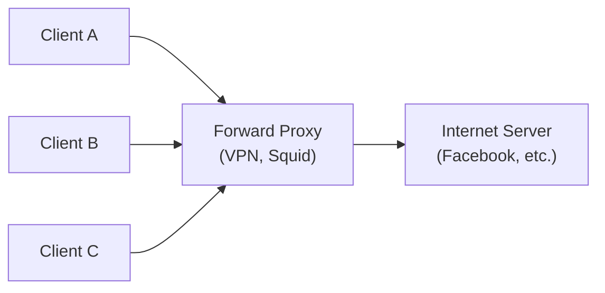
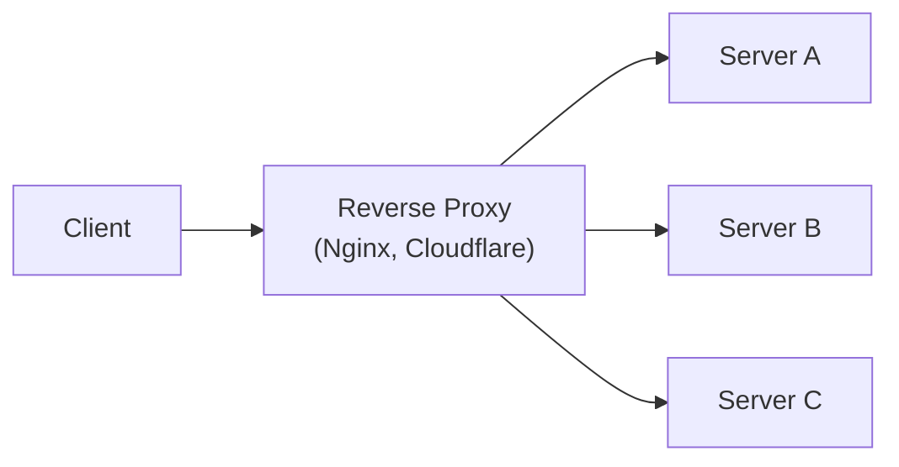

# Proxy Server

## Tổng quan

**Proxy Server** (máy chủ ủy quyền) là một máy chủ trung gian hoạt động giữa **client** và **server**, thực hiện vai trò chuyển tiếp yêu cầu (request) và phản hồi (response). Proxy che giấu danh tính của một trong hai phía, đồng thời có thể thực hiện các chức năng bổ sung như caching, filtering, load balancing và bảo mật.

---

## Phân loại Proxy Server

| Loại | Vị trí | Mục đích chính | Che giấu |
|------|--------|---------------|----------|
| **Forward Proxy** | Trước client | Kiểm soát và bảo vệ client | IP của client |
| **Reverse Proxy** | Trước server | Bảo vệ và tối ưu server | IP của server backend |

---

## Forward Proxy

### Khái niệm

**Forward Proxy** đứng giữa **user (client)** và **Internet**, thay mặt user gửi request đến server đích. Server đích chỉ biết IP của proxy, không biết IP thực của user.



### Tính năng chính

| Tính năng | Mô tả |
|-----------|-------|
| **Anonymity** | Ẩn IP thực của user khỏi website |
| **Content Filtering** | Chặn nội dung không phù hợp (corporate firewall) |
| **Caching** | Cache web content để giảm bandwidth |
| **Bypass Restrictions** | Vượt qua geo-restriction, firewall |
| **Logging/Monitoring** | Ghi lại hoạt động của user |

### Use Cases

| Use case | Ví dụ |
|----------|-------|
| **Công ty kiểm soát nhân viên** | Chặn Facebook, YouTube trong giờ làm việc |
| **Privacy/Anonymity** | User muốn ẩn IP khi browse |
| **Bypass geo-blocking** | Truy cập nội dung giới hạn theo vùng |
| **Bandwidth saving** | Cache images, CSS, JS cho nhiều user |

### Công cụ phổ biến

| Tool | Type | Notes |
|------|------|-------|
| **Squid** | Forward Proxy | Mã nguồn mở, enterprise-grade |
| **Tor** | Anonymous Proxy | Onion routing, ẩn danh cao |
| **Shadowsocks** | SOCKS Proxy | Phổ biến ở các nước có internet censorship |
| **VPN** | Forward Proxy (mở rộng) | Mã hóa toàn bộ traffic |

---

## Reverse Proxy

### Khái niệm

**Reverse Proxy** đứng trước **một hoặc nhiều server backend**, thay mặt server nhận request từ client. Client không biết IP thực của server backend.



### Tính năng chính

| Tính năng | Mô tả |
|-----------|-------|
| **Load Balancing** | Phân phối request đều cho các backend server |
| **SSL Termination** | Giải mã SSL ở proxy, giảm tải cho backend |
| **Caching** | Cache response để giảm tải backend |
| **Compression** | Nén dữ liệu (Gzip, Brotli) |
| **Security** | Ẩn infrastructure, chống DDoS, WAF |
| **A/B Testing** | Route traffic đến các phiên bản backend khác nhau |
| **Canary Deployment** | Chuyển traffic từ từ sang phiên bản mới |

### Load Balancing Algorithms

| Thuật toán | Mô tả | Khi nào dùng |
|-----------|-------|-------------|
| **Round Robin** | Phân phối đều theo thứ tự | Server có cấu hình đều nhau |
| **Least Connections** | Gửi đến server có ít kết nối nhất | Request time khác nhau |
| **IP Hash** | Hash IP client để sticky session | Cần session persistence |
| **Weighted Round Robin** | Phân phối theo capacity | Server có năng lực khác nhau |
| **Least Response Time** | Gửi đến server có response time thấp nhất | Real-time monitoring |

### SSL Termination

```mermaid
flowchart LR
    Client["Client"] -->|HTTPS (encrypted)| RP["Reverse Proxy"]
    RP -->|"Decrypt SSL"| Decrypt["Xử lý SSL"]
    Decrypt -->|"HTTP"| Backend["Backend Server"]
```

```nginx
# Nginx SSL Termination
server {
    listen 443 ssl;
    ssl_certificate     /etc/ssl/server.crt;
    ssl_certificate_key /etc/ssl/server.key;
    ssl_protocols       TLSv1.2 TLSv1.3;

    location / {
        proxy_pass http://backend:8080;
        proxy_set_header X-Forwarded-Proto https;
        proxy_set_header X-Real-IP $remote_addr;
    }
}
```

### Công cụ phổ biến

| Tool | Type | Notes |
|------|------|-------|
| **Nginx** | Reverse Proxy + Load Balancer | Phổ biến nhất, cấu hình linh hoạt |
| **HAProxy** | Reverse Proxy + Load Balancer | Hiệu năng cao, chuyên LB |
| **AWS ELB/ALB** | Managed Reverse Proxy + LB | Tự động scale, AWS integration |
| **Cloudflare** | Reverse Proxy + CDN + WAF | Bảo mật toàn diện |
| **Traefik** | Reverse Proxy (Docker/K8s) | Auto-discovery |

---

## So sánh Forward vs Reverse Proxy

| Tiêu chí | Forward Proxy | Reverse Proxy |
|----------|--------------|--------------|
| **Vị trí** | Trước client | Trước server |
| **Che giấu** | IP của **client** | IP của **server** |
| **Quản lý bởi** | User / IT department | Sysadmin / DevOps |
| **Mục đích** | Kiểm soát client, privacy | Bảo vệ server, tối ưu |
| **Caching** | Cache outbound requests | Cache inbound responses |
| **Load Balancing** | Không | Có |
| **SSL Termination** | Không (thường) | Có |
| **Authentication** | Không (thường) | Có |
| **Ai config browser** | Client | Không (transparent) |

---

## CDN như Reverse Proxy

**CDN (Content Delivery Network)** hoạt động như **reverse proxy** phân tán toàn cầu:

| Chức năng | Mô tả |
|-----------|-------|
| **Edge Caching** | Cache content tại edge location gần user nhất |
| **DDoS Protection** | Hấp thụ traffic tấn công |
| **SSL/TLS Offloading** | Xử lý certificate |
| **WAF (Web Application Firewall)** | Lọc traffic độc hại |
| **Image Optimization** | Tự động tối ưu hình ảnh |
| **Global PoP Network** | Hàng trăm điểm presence trên toàn cầu |

### Các nhà cung cấp CDN

| Provider | Features |
|----------|---------|
| **Cloudflare** | CDN + WAF + DDoS + DNS |
| **AWS CloudFront** | CDN + Lambda@Edge + AWS integration |
| **Fastly** | CDN + Real-time analytics + VCL |
| **Vercel Edge** | CDN + Serverless + Edge computing |
| **Google Cloud CDN** | GCP integration + Cloud Armor |

---

## Security Benefits

### Reverse Proxy Security

| Lợi ích | Mô tả |
|--------|-------|
| **Hide Infrastructure** | Attacker không biết IP thực của backend |
| **DDoS Protection** | Hấp thụ và phân tán traffic tấn công |
| **WAF Integration** | Lọc SQL injection, XSS, và các tấn công phổ biến |
| **Rate Limiting** | Giới hạn request/giây để ngăn abuse |
| **IP Blocking** | Chặn IP độc hại ở tầng proxy |

```nginx
# Bảo mật với Nginx
server {
    # Security headers
    add_header X-Frame-Options "SAMEORIGIN" always;
    add_header X-Content-Type-Options "nosniff" always;
    add_header X-XSS-Protection "1; mode=block" always;
    add_header Referrer-Policy "no-referrer-when-downgrade" always;

    # Rate limiting
    limit_req_zone $binary_remote_addr zone=api_limit:10m rate=10r/s;
    location /api/ {
        limit_req zone=api_limit burst=20 nodelay;
        proxy_pass http://backend;
    }

    # Block malicious IPs
    deny 192.168.1.100;
    allow all;
}
```

---

## Khi nào dùng loại nào?

### Dùng Forward Proxy khi

| Scenario | Ví dụ |
|----------|-------|
| Kiểm soát truy cập Internet của nhân viên | Corporate firewall |
| Ẩn danh khi browse | Privacy tool |
| Bypass geo-restriction | Xem nội dung từ region khác |
| Cache web content cho nhiều user | Tiết kiệm bandwidth công ty |

### Dùng Reverse Proxy khi

| Scenario | Ví dụ |
|----------|-------|
| **Luôn luôn dùng trong production** | Ẩn infrastructure, bảo mật |
| Cần load balancing | Phân phối traffic cho nhiều server |
| Cần SSL termination | Giảm tải cho backend |
| Cần caching layer | Giảm tải backend, tăng tốc độ |
| A/B testing hoặc canary deployment | Chuyển traffic có kiểm soát |
| Bảo vệ khỏi DDoS | CDN + proxy |

---

## Tóm tắt

| Đặc điểm | Forward Proxy | Reverse Proxy |
|----------|--------------|--------------|
| **Nằm ở đâu** | Trước client | Trước server |
| **Che giấu ai** | Client | Server |
| **Mục đích chính** | Kiểm soát, privacy | Bảo vệ, tối ưu server |
| **Ai sử dụng** | End user | System administrator |
| **Trong production** | Thường không bắt buộc | **Bắt buộc** (best practice) |
| **Load Balancing** | Không | Có |
| **CDN** | Không | Có (CDN là reverse proxy) |
