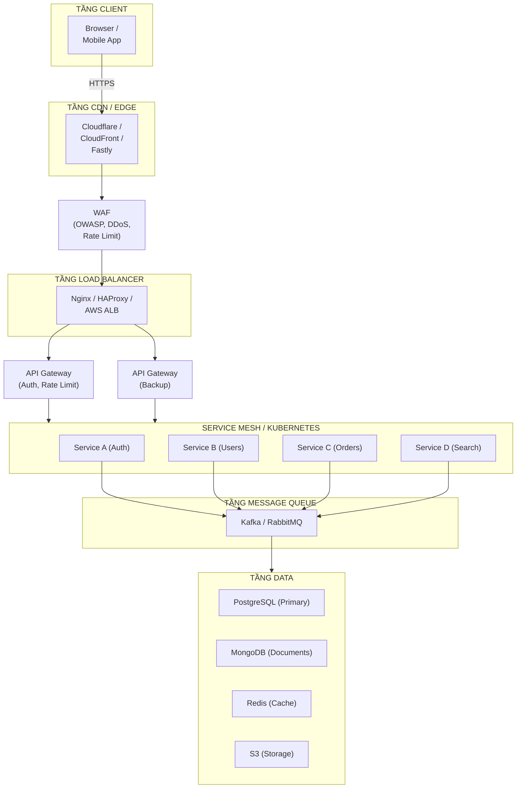

# Kiến trúc ứng dụng production

## Tổng quan kiến trúc



---

### Luồng request dễ nhớ

Một request production thường đi theo chuỗi:

```text
Browser/Mobile -> DNS -> CDN/Edge -> WAF -> Load Balancer -> API Gateway
-> Service -> Cache/Database/Message Queue/Object Storage -> Response
```

- **CDN/Edge** trả static files gần user nhất và có thể làm reverse proxy cho API.
- **WAF** chặn traffic xấu như SQL injection, XSS, bot, DDoS và rate limit thô.
- **Load balancer** phân phối request đến backend khỏe bằng health check.
- **API Gateway** xử lý routing, authentication, authorization, rate limiting ở tầng API.
- **Service** chạy business logic; dữ liệu nóng đi qua Redis/Memcached, dữ liệu bền vững vào database/object storage.

---

### Layer frontend

| Concern | Technology |
|---|---|
| **Deployment** | CDN (CloudFront, Cloudflare) |
| **Security** | HTTPS, CSP (Content Security Policy), Subresource Integrity |
| **Performance** | Lazy loading, code splitting, image optimization |
| **State Management** | Redux, Zustand, React Query |

---

### Layer backend

| Component | Description |
|---|---|
| **API Gateway** | Single entry point. Handles routing, authentication, rate limiting, request/response transformation |
| **Services** | Microservices hoặc modular monolith (Spring Boot, Node.js, Go, .NET) |
| **GraphQL Federation** | Cho nhu cầu query phức tạp across services |

---

### Layer database

| Type | Examples | Use Case |
|---|---|---|
| **Relational (RDBMS)** | PostgreSQL, MySQL | Structured data, transactions, complex queries |
| **Document Store** | MongoDB | Flexible schema, JSON documents |
| **Key-Value** | Redis, DynamoDB | Caching, session storage |
| **Time-Series** | InfluxDB, TimescaleDB | Metrics, IoT sensor data |
| **Graph** | Neo4j | Relationships, social networks |
| **Search** | Elasticsearch | Full-text search, log analysis |

#### Thực hành tốt cho database

- **Replication:** Primary-replica setup cho read scaling và failover
- **Sharding:** Horizontal partitioning cho very large datasets
- **Backup:** Regular automated backups với point-in-time recovery
- **Access Control:** Principle of least privilege cho application accounts

---

### Layer caching

| Technology | Use Case |
|---|---|
| **Redis** | Session store, distributed cache, pub/sub, rate limiting |
| **Memcached** | Simple key-value caching |
| **Varnish** | HTTP caching proxy |

---

### Layer message queue

| Technology | Characteristics |
|---|---|
| **Kafka** | High throughput, persistent, log-based. Event streaming, analytics |
| **RabbitMQ** | Flexible routing, easy setup. Business workflows, task queues |
| **AWS SQS** | Fully managed, simple queue service |
| **ActiveMQ** | Java ecosystem integration |

---

### File Storage

| Service | Description |
|---|---|
| **AWS S3** | Object storage cho images, videos, documents |
| **GCS** | Google Cloud Storage |
| **Azure Blob** | Microsoft Azure blob storage |
| **MinIO** | Self-hosted S3-compatible storage |

---

### DevOps & CI/CD

| Category | Tools |
|---|---|
| **Containerization** | Docker, containerd |
| **Orchestration** | Kubernetes, Docker Swarm |
| **CI/CD** | GitHub Actions, Jenkins, GitLab CI, ArgoCD |
| **Infrastructure as Code** | Terraform, Pulumi, AWS CDK |
| **Configuration Management** | Helm charts, Kustomize |

---

### Monitoring & logging

| Category | Tools |
|---|---|
| **Metrics** | Prometheus, Datadog |
| **Dashboards** | Grafana |
| **Logging** | ELK Stack (Elasticsearch, Logstash, Kibana), Loki |
| **Distributed Tracing** | Jaeger, Zipkin, OpenTelemetry |
| **Uptime Monitoring** | PagerDuty, UptimeRobot |

---

### Layer security

| Concern | Solution |
|---|---|
| **Transport** | HTTPS (TLS 1.3), HSTS |
| **Authentication** | JWT, OAuth 2.0, OpenID Connect |
| **Authorization** | RBAC, ABAC |
| **Secrets Management** | HashiCorp Vault, AWS Secrets Manager |
| **API Security** | API keys, rate limiting, input validation |
| **Web Protection** | WAF rules cho OWASP Top 10, bot filtering |
| **DDoS Protection** | Cloudflare, AWS Shield, Akamai |

---

### High Availability & Scalability

| Strategy | Description |
|---|---|
| **Load Balancing** | Phân phối traffic (Nginx, HAProxy, AWS ELB) |
| **Auto-scaling** | Horizontal Pod Autoscaler (HPA), AWS ASG |
| **Multi-region** | Deploy across geographic regions cho DR và latency |
| **Circuit Breaker** | Ngăn cascade failures (Resilience4j, Hystrix) |
| **Graceful Degradation** | Giữ core features chạy under load |

> **Tip:** Khi thiết kế production system, luôn bắt đầu với kiến trúc đơn giản nhất đáp ứng được yêu cầu hiện tại. Thêm complexity (caching, message queues, multiple services) chỉ khi có bằng chứng rõ ràng (metrics, user growth).
