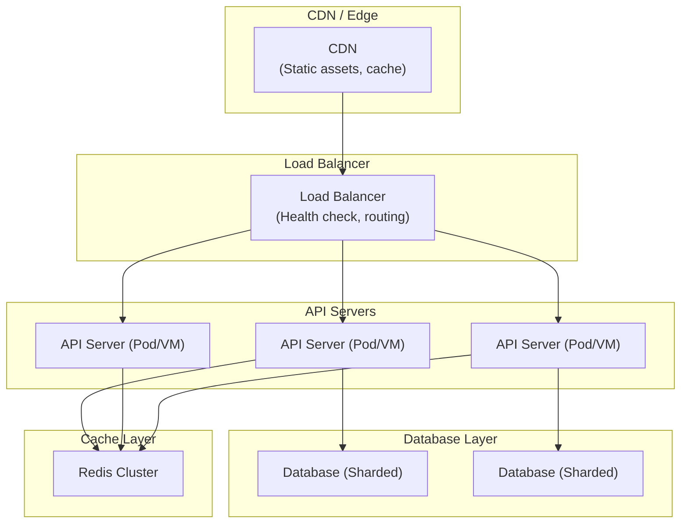
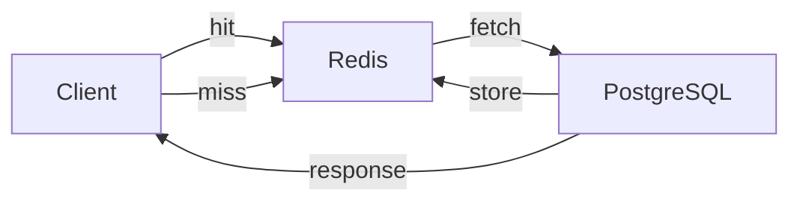
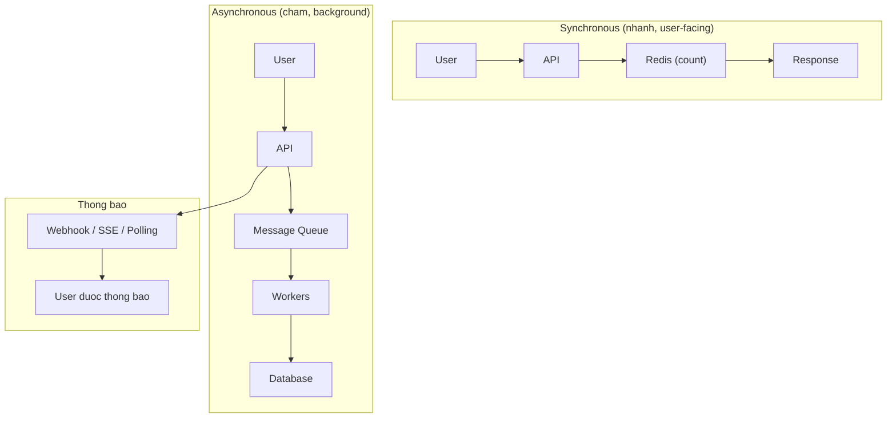

# Thiết kế cho Hàng Triệu Người Dùng

## Những điểm quan trọng để tối ưu hệ thống

### 1. Chiến lược Scale



### 2. Scale Ngang vs Scale Dọc

| Chiến lược | Ưu điểm | Nhược điểm |
|----------|------|------|
| **Scale dọc** (máy lớn hơn) | Đơn giản, không cần thay đổi code | Giới hạn phần cứng, single point of failure |
| **Scale ngang** (nhiều máy hơn) | Scale không giới hạn, fault tolerance | Phức tạp, data consistency |

**Khuyến nghị:** Luôn ưu tiên scale ngang cho hàng triệu người dùng.

### 3. Tối ưu Database

```
Chiến lược Sharding theo User ID:
┌─────────────┬─────────────┬─────────────┐
│ Shard 0     │ Shard 1     │ Shard 2     │
│ user_id % 3 │ user_id % 3 │ user_id % 3 │
│ = 0         │ = 1         │ = 2         │
│             │             │             │
│ PostgreSQL  │ PostgreSQL  │ PostgreSQL  │
└─────────────┴─────────────┴─────────────┘
```

**Điểm quan trọng:**
- **Read replicas** cho workload đọc nhiều
- **Write sharding** khi DB không xử lý được writes
- **Connection pooling** (HikariCP) là thiết yếu
- **Indexing đúng** trên các hot query patterns

### 4. Chiến lược Caching

| Tầng Cache | Cache gì | TTL |
|------------|----------|-----|
| **CDN** | Static assets (images, CSS, JS) | 1 ngày - 1 năm |
| **Redis** | API responses, sessions, hot data | 1 phút - 1 giờ |
| **Local cache** | Config, enum values | Suốt vòng đời app |



### 5. API Design cho Scale

```java
// Tốt: Pagination, field selection
GET /api/v1/products?page=1&size=20&sort=createdAt,desc&fields=id,name,price

// Tốt: ETag cho conditional requests
GET /api/v1/users/123
Response: ETag: "v1-abc123"
→ Subsequent: If-None-Match: "v1-abc123" → 304 Not Modified

// Tốt: Async cho operations dài
POST /api/v1/reports  → 202 Accepted { "jobId": "123" }
GET  /api/v1/jobs/123 → 200 OK { "status": "completed", "url": "..." }
```

### 6. Message Queue cho xử lý Async



**Use cases cho message queue:**
- Gửi emails/SMS notifications
- Xử lý file uploads (resize, transcode)
- Generate reports
- Social media activity feeds
- Bất kỳ operation nào > 100ms

### 7. Các con số quan trọng cần nhớ

| Chỉ số | Giá trị |
|--------|---------|
| CDN latency | < 10 ms |
| In-memory cache (Redis) | 0.1 - 1 ms |
| Database query (đã tối ưu) | 1 - 50 ms |
| Peak concurrent connections/server | ~10,000 (connection pooling critical) |

### 8. Monitoring & Observability

```
Golden Signals (Google SRE):
┌─────────────────────────────────────────────────────┐
│ 1. Latency     - p50, p95, p99 response times       │
│ 2. Traffic     - Requests per second, throughput    │
│ 3. Errors      - Error rate (4xx, 5xx)             │
│ 4. Saturation  - CPU %, Memory %, Queue depth      │
└─────────────────────────────────────────────────────┘
```

**Công cụ thiết yếu:** Prometheus + Grafana, ELK Stack, distributed tracing (Jaeger/Zipkin)

### 9. Capacity Planning

```
Ước tính cho 1 triệu người dùng:

DAU (Daily Active Users) = 1,000,000 × 10% = 100,000
Peak concurrent = DAU × 20% = 20,000
Avg requests/user/day = 50
Total requests/day = 5,000,000
Requests/second = 5,000,000 / 86400 ≈ 58 RPS
Peak RPS = 58 × 10 = 580 RPS

→ Bắt đầu với 4 API servers, 2 DB instances, 1 Redis cluster
→ Scale dựa trên actual metrics
```

### 10. Checklist Scale

- [ ] Application servers stateless (scale ngang được)
- [ ] Database: connection pooling + read replicas + sharding strategy
- [ ] Multi-layer caching (CDN → Redis → local)
- [ ] Async processing cho non-critical operations
- [ ] Load balancer với health checks
- [ ] Rate limiting + API throttling
- [ ] Indexing đúng trên tất cả hot queries
- [ ] Monitoring: latency, errors, saturation
- [ ] Graceful degradation khi under load
- [ ] CDN cho tất cả static assets
