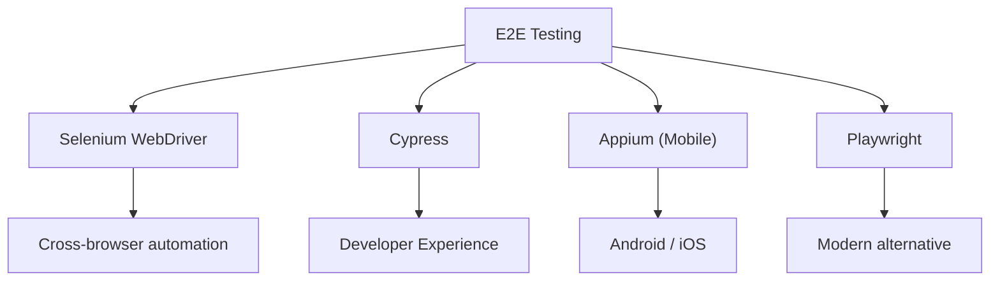
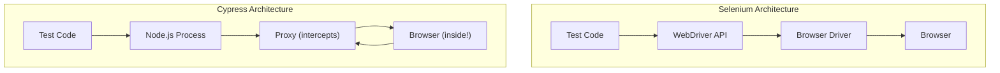

# Kĩ năng khác

## Selenium & Cypress (E2E Testing)

### 1. Tổng quan

**E2E testing** (End-to-End testing) xác minh toàn bộ flow của một ứng dụng từ perspective của user. Khác với unit tests test các components riêng lẻ, E2E tests mô phỏng real user interactions qua toàn bộ stack — browser, frontend, backend, và database.



### 2. Selenium WebDriver

**Selenium WebDriver** là framework browser automation tiêu chuẩn công nghiệp. Nó điều khiển browser bằng cách gửi commands qua browser-specific drivers (ChromeDriver, GeckoDriver, v.v.).

#### 2.1. Architecture

```
Test Script (Selenium API)
        ↓
  WebDriver API
        ↓
  Browser Driver (chromedriver, geckodriver, etc.)
        ↓
  Browser (Chrome, Firefox, Safari, Edge)
```

#### 2.2. Element Locators

| Locator | Syntax | Ví dụ |
|---------|--------|---------|
| **ID** | `By.id()` | `driver.findElement(By.id("submit"))` |
| **Name** | `By.name()` | `driver.findElement(By.name("email"))` |
| **CSS Selector** | `By.cssSelector()` | `driver.findElement(By.cssSelector(".btn.primary"))` |
| **XPath** | `By.xpath()` | `driver.findElement(By.xpath("//button[@type='submit']"))` |
| **Link Text** | `By.linkText()` | `driver.findElement(By.linkText("Sign In"))` |
| **Partial Link** | `By.partialLinkText()` | `driver.findElement(By.partialLinkText("Sign"))` |

#### 2.3. XPath Expressions

```java
// Basic XPath
// Tìm element by text
By.xpath("//button[text()='Submit']")

// Tìm element by attribute
By.xpath("//input[@type='email']")

// Tìm element by multiple attributes
By.xpath("//input[@type='text' and @name='username']")

// Relative path với contains()
By.xpath("//div[contains(@class, 'error-message')]")

// Navigate DOM: parent, child, sibling
By.xpath("//form[@id='login']/div[2]/input")        // child
By.xpath("//input[@name='email']/parent::div")     // parent
By.xpath("//label[text()='Email']/following-sibling::input")  // sibling

// Index-based selection
By.xpath("(//table[@class='data']//tr)[2]/td[3]")  // 2nd row, 3rd cell
```

#### 2.4. Selenium Java Example

```java
import org.openqa.selenium.By;
import org.openqa.selenium.WebDriver;
import org.openqa.selenium.WebElement;
import org.openqa.selenium.chrome.ChromeDriver;
import org.openqa.selenium.support.ui.ExpectedConditions;
import org.openqa.selenium.support.ui.WebDriverWait;

public class LoginTest {
    public static void main(String[] args) {
        System.setProperty("webdriver.chrome.driver", "/path/to/chromedriver");
        WebDriver driver = new ChromeDriver();

        try {
            driver.get("https://app.example.com/login");
            driver.manage().window().maximize();

            // Nhập email
            WebElement emailField = driver.findElement(By.id("email"));
            emailField.clear();
            emailField.sendKeys("user@example.com");

            // Nhập password
            WebElement passwordField = driver.findElement(By.name("password"));
            passwordField.sendKeys("password123");

            // Click submit
            WebElement submitBtn = driver.findElement(By.cssSelector("button[type='submit']"));
            submitBtn.click();

            // Chờ navigation
            WebDriverWait wait = new WebDriverWait(driver, 10);
            wait.until(ExpectedConditions.urlContains("/dashboard"));

            // Verify
            String currentUrl = driver.getCurrentUrl();
            if (currentUrl.contains("/dashboard")) {
                System.out.println("Test PASSED: Login thành công");
            }

        } finally {
            driver.quit();
        }
    }
}
```

#### 2.5. Selenium với TestNG

```java
import org.openqa.selenium.By;
import org.openqa.selenium.WebDriver;
import org.openqa.selenium.chrome.ChromeDriver;
import org.testng.Assert;
import org.testng.annotations.*;

public class SeleniumTestNGTest {
    WebDriver driver;

    @BeforeClass
    public void setup() {
        System.setProperty("webdriver.chrome.driver", "/path/to/chromedriver");
        driver = new ChromeDriver();
    }

    @Test(priority = 1, description = "Login với credentials hợp lệ")
    public void testLoginSuccess() {
        driver.get("https://app.example.com/login");
        driver.findElement(By.id("email")).sendKeys("user@example.com");
        driver.findElement(By.name("password")).sendKeys("password123");
        driver.findElement(By.cssSelector("button[type='submit']")).click();
        Assert.assertTrue(driver.getCurrentUrl().contains("/dashboard"));
    }

    @Test(priority = 2, description = "Login với credentials không hợp lệ")
    public void testLoginFailure() {
        driver.get("https://app.example.com/login");
        driver.findElement(By.id("email")).sendKeys("invalid@example.com");
        driver.findElement(By.name("password")).sendKeys("wrongpass");
        driver.findElement(By.cssSelector("button[type='submit']")).click();

        WebElement errorMsg = driver.findElement(By.cssSelector(".error-message"));
        Assert.assertTrue(errorMsg.isDisplayed());
    }

    @AfterClass
    public void teardown() {
        if (driver != null) {
            driver.quit();
        }
    }
}
```

---

### 3. Selenium Grid

**Selenium Grid** cho phép parallel test execution trên nhiều máy và browsers.

#### 3.1. Hub and Node Architecture

```
                    ┌─────────────┐
                    │    Hub      │  (Port 4444)
                    │ (Controller)│
                    └──────┬──────┘
                           │
          ┌────────────────┼────────────────┐
          │                │                │
    ┌─────▼─────┐    ┌─────▼─────┐    ┌─────▼─────┐
    │   Node 1  │    │   Node 2  │    │   Node 3  │
    │  Chrome   │    │  Firefox  │    │   Edge    │
    │  Windows  │    │   Linux   │    │  Windows  │
    └───────────┘    └───────────┘    └───────────┘
```

#### 3.2. Starting Selenium Grid

```bash
# Start Hub
java -jar selenium-server-standalone.jar -role hub

# Start Node (trên cùng máy)
java -jar selenium-server-standalone.jar -role node
#        -hub http://hub-host:4444/grid/register
#        -browser "browserName=chrome,maxInstances=5"

# Docker (Docker Compose)
version: '3'
services:
  selenium-hub:
    image: selenium/hub:4.0
    ports:
      - "4444:4444"
  chrome:
    image: selenium/node-chrome:4.0
    depends_on:
      - selenium-hub
    environment:
      - HUB_HOST=selenium-hub
      - HUB_PORT=4444
```

#### 3.3. Remote WebDriver

```java
// Kết nối tới Selenium Grid
WebDriver driver = new RemoteWebDriver(
    new URL("http://hub-host:4444/wd/hub"),
    DesiredCapabilities.chrome()
);

// Với specific capabilities
DesiredCapabilities caps = new DesiredCapabilities();
caps.setBrowserName("chrome");
caps.setPlatform(Platform.WIN10);
caps.setVersion("latest");

WebDriver driver = new RemoteWebDriver(
    new URL("http://hub-host:4444/wd/hub"),
    caps
);
```

---

### 4. Cypress

**Cypress** là modern E2E testing framework được xây dựng trên một architecture độc đáo. Khác với Selenium (chạy bên ngoài browser), Cypress chạy **bên trong browser**, cho nó direct access tới mọi thứ.

#### 4.1. Cypress Architecture (vs Selenium)



| Khía cạnh | Selenium | Cypress |
|-----------|----------|---------|
| **Runs** | Bên ngoài browser | Bên trong browser |
| **Languages** | Bất kỳ (Java, Python, JS, C#) | JavaScript/TypeScript only |
| **Browser Support** | Tất cả browsers | Chromium-based + Firefox + Electron |
| **Speed** | Chậm hơn (network protocol) | Nhanh hơn (in-browser) |
| **Debugging** | Khó hơn | Xuất sắc (built-in time travel) |
| **Parallel Execution** | Cần Grid | Via Dashboard hoặc third-party |
| **Community** | Lớn, trưởng thành | Phát triển nhanh |

#### 4.2. Cypress Commands

```javascript
// cypress/e2e/login.cy.js

describe('Login Flow', () => {
  beforeEach(() => {
    cy.visit('/login');
  });

  it('should login successfully with valid credentials', () => {
    cy.get('[data-testid="email"]').type('user@example.com');
    cy.get('[data-testid="password"]').type('password123');
    cy.get('[data-testid="login-button"]').click();

    cy.url().should('include', '/dashboard');
    cy.contains('Welcome back').should('be.visible');
  });

  it('should show error with invalid credentials', () => {
    cy.get('[data-testid="email"]').type('wrong@example.com');
    cy.get('[data-testid="password"]').type('wrongpass');
    cy.get('[data-testid="login-button"]').click();

    cy.get('[data-testid="error-message"]')
      .should('be.visible')
      .and('contain', 'Invalid credentials');
  });
});
```

#### 4.3. Cypress Intercepts và Mocks

```javascript
// Mock API response
cy.intercept('GET', '/api/users', {
  statusCode: 200,
  body: [
    { id: 1, name: 'Alice', email: 'alice@example.com' },
    { id: 2, name: 'Bob', email: 'bob@example.com' },
  ],
}).as('getUsers');

// Mock slow API
cy.intercept('GET', '/api/products/*', {
  delayMs: 3000,  // 3 second delay
  body: [...],
}).as('slowProducts');

// Wait for intercepted request
cy.wait('@getUsers').then((interception) => {
  expect(interception.response.statusCode).to.equal(200);
  expect(interception.response.body).to.have.length(2);
});

// Intercept và modify response
cy.intercept('POST', '/api/orders', (req) => {
  req.body.customerId = 'modified-123';
  req.continue((res) => {
    res.body.orderId = 'ORD-MOCK-999';
  });
});
```

#### 4.4. Cypress Best Practices

```javascript
// NÊN: Dùng data-testid thay vì CSS selectors
cy.get('[data-testid="submit-button"]')

// KHÔNG NÊN: Dùng brittle CSS selectors
cy.get('.btn-primary.form-submit:nth-child(3)')

// NÊN: Dùng cy.wait() với alias cho waiting
cy.intercept('/api/users').as('getUsers');
cy.wait('@getUsers');

// KHÔNG NÊN: Dùng arbitrary sleep
cy.wait(5000); // XẤU!

// NÊN: Scope commands trong specific containers
cy.get('[data-testid="user-list"]')
  .find('[data-testid="user-item"]')
  .first()
  .click();

// NÊN: Dùng should() cho retry-ability
cy.get('[data-testid="status"]')
  .should('not.have.class', 'loading')
  .and('contain', 'Ready');
```

---

### 5. Appium (Mobile Testing)

**Appium** là open-source tool cho automating native, mobile web, và hybrid applications trên Android và iOS.

#### 5.1. Appium Architecture

```
Test Script (WebDriver Protocol)
         ↓
   Appium Server
         ↓
   Android: UiAutomator2 / Espresso
   iOS: XCUITest / UIAutomation
         ↓
   Android Device / iOS Simulator
```

#### 5.2. Appium Java Example

```java
import io.appium.java_client.AppiumDriver;
import io.appium.java_client.android.AndroidDriver;
import org.openqa.selenium.By;
import org.openqa.selenium.remote.DesiredCapabilities;
import java.net.URL;

public class MobileTest {
    public static void main(String[] args) throws Exception {
        DesiredCapabilities caps = new DesiredCapabilities();
        caps.setCapability("platformName", "Android");
        caps.setCapability("deviceName", "Pixel_6");
        caps.setCapability("app", "/path/to/app.apk");
        caps.setCapability("automationName", "UiAutomator2");

        AppiumDriver driver = new AndroidDriver(
            new URL("http://localhost:4723/wd/hub"),
            caps
        );

        try {
            By emailField = By.xpath("//android.widget.EditText[@content-desc='Email']");
            driver.findElement(emailField).sendKeys("user@example.com");

            By loginBtn = By.androidUIAutomator("text(\"Sign In\")");
            driver.findElement(loginBtn).click();

            Thread.sleep(2000);

            By dashboardTitle = By.xpath("//android.widget.TextView[@text='Dashboard']");
            assert driver.findElement(dashboardTitle).isDisplayed();

        } finally {
            driver.quit();
        }
    }
}
```

#### 5.3. Appium iOS (XCUITest)

```java
DesiredCapabilities caps = new DesiredCapabilities();
caps.setCapability("platformName", "iOS");
caps.setCapability("deviceName", "iPhone 14");
caps.setCapability("app", "/path/to/app.ipa");
caps.setCapability("automationName", "XCUITest");
caps.setCapability("bundleId", "com.example.app");

// iOS-specific locators
By emailField = MobileBy.iOSNsPredicateString("type == 'XCUIElementTypeTextField'");
driver.findElement(emailField).sendKeys("user@example.com");

By signInBtn = MobileBy.iOSNsPredicateString("name == 'Sign In' AND enabled == true");
driver.findElement(signInBtn).click();
```

---

### 6. Best Practices

#### 6.1. Page Object Model (POM)

**Page Object Model** là design pattern tạo object repository cho web elements, giảm code duplication và cải thiện maintainability.

```java
// Page Objects/LoginPage.java
public class LoginPage {
    private WebDriver driver;
    private By emailInput = By.id("email");
    private By passwordInput = By.name("password");
    private By submitButton = By.cssSelector("button[type='submit']");
    private By errorMessage = By.cssSelector(".error-message");

    public LoginPage(WebDriver driver) {
        this.driver = driver;
    }

    public void enterEmail(String email) {
        driver.findElement(emailInput).clear();
        driver.findElement(emailInput).sendKeys(email);
    }

    public void enterPassword(String password) {
        driver.findElement(passwordInput).clear();
        driver.findElement(passwordInput).sendKeys(password);
    }

    public DashboardPage clickSubmit() {
        driver.findElement(submitButton).click();
        return new DashboardPage(driver);
    }

    public void login(String email, String password) {
        enterEmail(email);
        enterPassword(password);
        clickSubmit();
    }

    public String getErrorMessage() {
        return driver.findElement(errorMessage).getText();
    }
}

// Tests/TestLogin.java
public class TestLogin {
    private WebDriver driver;
    private LoginPage loginPage;

    @Before
    public void setup() {
        driver = new ChromeDriver();
        loginPage = new LoginPage(driver);
        loginPage.navigateToLogin();
    }

    @Test
    public void testValidLogin() {
        loginPage.login("user@example.com", "password123");
    }

    @After
    public void teardown() {
        driver.quit();
    }
}
```

#### 6.2. Waiting Strategies

```java
// XẤU: Hard-coded sleep (flaky, slow)
Thread.sleep(5000);

// TỐT HƠN: Explicit Wait (selenium)
WebDriverWait wait = new WebDriverWait(driver, Duration.ofSeconds(10));
wait.until(ExpectedConditions.elementToBeClickable(By.id("submit")));

// TỐT NHẤT: ExpectedConditions
wait.until(ExpectedConditions.and(
    ExpectedConditions.elementToBeClickable(submitBtn),
    ExpectedConditions.textToBePresentInElement(errorMsg, "")
));

// Cypress: Automatic retry
cy.get('[data-testid="loading"]').should('not.exist');
cy.get('[data-testid="data"]').should('be.visible');
```

#### 6.3. Parallel Execution

```xml
<!-- testng.xml - parallel testing -->
<suite name="Parallel Test Suite" parallel="tests" thread-count="4">
    <test name="Chrome Tests">
        <classes>
            <class name="tests.ChromeLoginTest"/>
        </classes>
    </test>
    <test name="Firefox Tests">
        <classes>
            <class name="tests.FirefoxLoginTest"/>
        </classes>
    </test>
</suite>
```

---

### 7. Câu hỏi phỏng vấn

**Q: Cypress vs Selenium — nên chọn cái nào và khi nào?**

> Chọn **Cypress** khi: cần fast feedback và excellent debugging (developer-centric workflow), làm việc với JavaScript frontend (React/Vue/Angular), muốn time-travel debugging và automatic screenshots on failure, và project có thể chấp nhận limitations của nó (JS/TS only, limited browser support). Chọn **Selenium** khi: cần multi-language support (Java, Python, C#), cross-browser testing là critical (Safari, older browsers), cần test desktop applications, hoặc đã có existing large investment in Selenium infrastructure.

**Q: Page Object Model là gì và tại sao nó quan trọng?**

> **POM** là design pattern mà web page elements được encapsulate trong một **Page Class**. Tests dùng các Page Objects này để interact với UI thay vì access elements trực tiếp. POM quan trọng vì: khi UI thay đổi (ví dụ: element IDs thay đổi), bạn chỉ cần update Page Object, không phải mọi test. Nó giảm code duplication, cải thiện maintainability, và làm tests readable hơn.

**Q: Làm thế nào để xử lý flaky tests trong E2E automation?**

> Flaky tests được gây ra bởi timing issues, network instability, hoặc test interdependencies. Các chiến lược giảm flakiness: dùng **explicit waits** thay vì hard sleeps, implement **retry mechanisms** (Cypress có built-in retries, Selenium có thể dùng TestNG retry analyzer), **isolate tests** để không share state, **mock external dependencies** khi có thể, và **run tests in a stable environment**.
