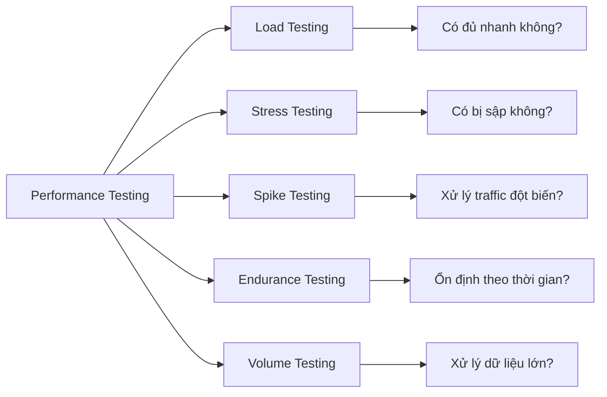
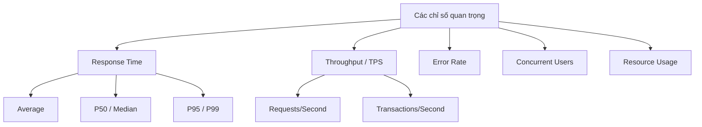

# Kĩ năng khác

## Performance & Load Testing

### 1. Tổng quan

**Performance testing** đánh giá cách hệ thống hoạt động dưới điều kiện tải dự kiến. Khác với functional testing (nó có hoạt động đúng không?), performance testing hỏi "nó nhanh và ổn định như thế nào dưới tải?"



### 2. Các loại Performance Testing

| Loại | Mục tiêu | Thời gian | Mẫu tải |
|------|----------|-----------|---------|
| **Load Testing** | Xác minh hệ thống dưới tải dự kiến | Bình thường | Tăng dần đến mục tiêu |
| **Stress Testing** | Tìm điểm gãy vượt quá giới hạn | Ngắn | Vượt công suất bình thường |
| **Spike Testing** | Xử lý traffic đột biến | Rất ngắn | Tăng đột ngột |
| **Endurance Testing** | Ổn định dưới tải kéo dài | Dài (giờ/ngày) | Duy trì tải bình thường |
| **Volume Testing** | Xử lý lượng dữ liệu lớn | Thay đổi | Dữ liệu lớn |

### 3. Các chỉ số quan trọng



| Chỉ số | Mô tả | Benchmark tốt |
|--------|-------|---------------|
| **Response Time (Avg)** | Thời gian phản hồi trung bình | < 200ms cho APIs |
| **Response Time (P95/P99)** | Latency percentile 95/99 | P99 < 1s cho đường dẫn quan trọng |
| **TPS / Throughput** | Số transactions hoặc requests mỗi giây | Phụ thuộc SLA |
| **Error Rate** | Tỷ lệ requests thất bại | < 1% (hoặc 0% cho critical) |
| **Concurrent Users** | Số users hoạt động đồng thời | Target: 1000+ tùy hệ thống |
| **CPU Usage** | Tỷ lệ sử dụng CPU | < 70-80% liên tục |
| **Memory Usage** | Sử dụng RAM | Ổn định, không rò rỉ |

> **P95 vs P99:** P95 nghĩa là 95% requests nhanh hơn thời gian này. P99 nghĩa là 99%. P99 quan trọng hơn cho SLA vì outliers ảnh hưởng tới top percentile.

### 4. Quy trình Performance Testing

```
Requirements → Planning → Scripting → Execution → Analysis → Report
     ↓            ↓           ↓           ↓           ↓         ↓
  Định nghĩa   Chọn tool   Record     Chạy test   Tìm      Trình bày
  SLAs,        & topology  scripts     scenarios   bottleneck findings
  thresholds
```

#### Step 1: Phân tích yêu cầu
- Định nghĩa **SLA targets** (ví dụ: P99 < 500ms, 10,000 concurrent users)
- Xác định **user journeys** quan trọng (login, search, checkout)
- Xác định **load patterns** (steady, peak, gradual)

#### Step 2: Lập kế hoạch test
- Chọn **tool** phù hợp (JMeter, k6, Gatling)
- Thiết kế **scenarios** (tải bình thường, peak, stress)
- Lên kế hoạch **environment** và **data requirements**

#### Step 3: Scripting
- Record hoặc viết scripts mô phỏng user behavior
- Parameterize data (usernames, search terms)
- Thêm correlations, think times, assertions

#### Step 4: Thực thi
- Chạy trong **non-production** environment
- Monitor **resource utilization** trong test
- Collect **metrics** từ APM tools

#### Step 5: Phân tích
- Xác định **bottlenecks** (CPU, memory, DB, network)
- Phân tích **response time distribution**
- So sánh với **SLA thresholds**

---

### 5. JMeter

**Apache JMeter** là open-source load testing tool được sử dụng rộng rãi nhất. Nó mô phỏng tải nặng trên servers, networks, hoặc objects để test sức mạnh hoặc phân tích hiệu năng tổng thể.

#### 5.1. Các thành phần cốt lõi

| Thành phần | Mục đích |
|-----------|---------|
| **Thread Group** | Định nghĩa số users, ramp-up time, loop count |
| **Samplers** | Gửi requests (HTTP, JDBC, FTP, v.v.) |
| **Listeners** | Xem/lưu kết quả test (View Results Tree, Summary Report) |
| **Controllers** | Logic thực thi request (Loop, If, Random, Transaction) |
| **Timers** | Thêm delays giữa các requests (Constant, Gaussian, Uniform) |
| **Config Elements** | Defaults, variables (CSV Data Set Config) |
| **Assertions** | Validate responses (Response Assertion, JSON Assertion) |

#### 5.2. Cấu hình Thread Group cơ bản

```
Thread Group:
  Number of Threads: 1000      (concurrent users)
  Ramp-up Period: 300          (ramp up over 300 seconds)
  Loop Count: 10               (each user repeats 10 times)
```

Điều này nghĩa là: 1000 users × 10 loops = 10,000 total requests, ramp up trong 5 phút.

#### 5.3. JMeter Script Example (HTTP Request)

```
Thread Group
  └─ Once Only Controller
  │    └─ Login Request (POST /api/login)
  │         Body: {"email": "user@test.com", "password": "pass123"}
  │
  └─ Loop Controller (10 times)
       └─ Search Request (GET /api/search?q=${searchTerm})
            Response Assertion: Contains "results"
            Duration Assertion: < 2000ms
```

#### 5.4. CSV Data Set Config

```bash
# users.csv
username,password,searchTerm
user1@test.com,pass123,laptop
user2@test.com,pass456,phone
user3@test.com,pass789,tablet
```

Trong JMeter: Thêm **CSV Data Set Config** trỏ tới `users.csv`. Reference variables như `${username}`, `${password}`, `${searchTerm}`.

#### 5.5. JMeter via CLI

```bash
# Run headless (non-GUI) test
jmeter -n -t test-plan.jmx -l results.jtl -e -o report/

# Options:
# -n: non-GUI mode
# -t: test plan file
# -l: results file (binary)
# -e: generate HTML report after test
# -o: output folder for HTML report
```

---

### 6. k6

**k6** là một modern load testing tool viết bằng Go. Scripts được viết bằng **JavaScript**, giúp developers dễ dàng viết và maintain tests.

#### 6.1. Basic Script

```javascript
// load-test.js
import http from 'k6/http';
import { check, sleep } from 'k6';
import { Rate, Counter } from 'k6/metrics';

// Custom metrics
const errorRate = new Rate('errors');
const requests = new Counter('http_requests');

export const options = {
  // Key configurations for the test
  stages: [
    { duration: '2m', target: 100 },   // Ramp up to 100 users
    { duration: '5m', target: 100 },   // Stay at 100 users
    { duration: '2m', target: 200 },   // Ramp up to 200 users
    { duration: '5m', target: 200 },   // Stay at 200 users
    { duration: '2m', target: 0 },     // Ramp down
  ],

  thresholds: {
    // Assertions on metrics
    'http_req_duration': ['p(95)<500', 'p(99)<1000'],
    'http_req_failed': ['rate<0.01'],
    'errors': ['rate<0.1'],
  },
};

const BASE_URL = 'https://api.example.com';

export default function () {
  requests.add(1);

  // Login
  const loginRes = http.post(`${BASE_URL}/auth/login`, {
    email: 'test@example.com',
    password: 'password123',
  });

  check(loginRes, {
    'login status 200': (r) => r.status === 200,
    'login has token': (r) => r.json('accessToken') !== '',
  });
  errorRate.add(loginRes.status !== 200);

  // Search products
  const searchRes = http.get(`${BASE_URL}/products?search=laptop`, {
    headers: { Authorization: `Bearer ${loginRes.json('accessToken')}` },
  });

  check(searchRes, {
    'search status 200': (r) => r.status === 200,
    'search returns results': (r) => r.json('results').length > 0,
  });
  errorRate.add(searchRes.status !== 200);

  sleep(1); // Think time
}
```

#### 6.2. Chạy k6

```bash
# Run locally
k6 run load-test.js

# Run with environment variables
k6 run -e BASE_URL=https://staging.example.com load-test.js

# Run cloud test (k6.io cloud)
k6 cloud load-test.js

# Run with custom metrics output
k6 run --out influxdb=http://localhost:8086/k6 load-test.js
```

#### 6.3. k6 Checks vs Thresholds

```javascript
// Checks: Per-VU pass/fail conditions (don't fail the test)
// Dùng cho: Business logic validation
check(response, {
  'has user data': (r) => r.json('user') !== null,
  'email is valid': (r) => r.json('user.email').includes('@'),
});

// Thresholds: Global pass/fail criteria for the test run
// Dùng cho: SLA enforcement
thresholds: {
  'http_req_duration': ['p(95)<300'],  // Test FAILS nếu p95 > 300ms
  'http_req_failed': ['rate<0.05'],    // Test FAILS nếu error rate > 5%
}
```

---

### 7. Gatling

**Gatling** là load testing framework dựa trên **Scala**. Nó highly performant, với DSL (Domain Specific Language) làm scripts dễ đọc và maintain.

#### 7.1. Gatling Script Example

```scala
// Simulations/LoginSimulation.scala
package simulations

import io.gatling.core.Predef._
import io.gatling.http.Predef._
import scala.concurrent.duration._

class LoginSimulation extends Simulation {

  // HTTP Configuration
  val httpProtocol = http
    .baseUrl("https://api.example.com")
    .acceptHeader("application/json")
    .contentTypeHeader("application/json")

  // Scenario: User Login Flow
  val userScenario = scenario("User Login Flow")
    .exec(
      http("Login Request")
        .post("/auth/login")
        .body(StringBody("""{
          "email": "user@example.com",
          "password": "password123"
        }""")).asJson
        .check(status.is(200))
        .check(jsonPath("$.accessToken").saveAs("accessToken"))
    )
    .pause(1) // Think time
    .exec(
      http("Get User Profile")
        .get("/users/me")
        .header("Authorization", "Bearer ${accessToken}")
        .check(status.is(200))
    )

  // Load Configuration
  setUp(
    userScenario
      .inject(
        rampUsers(1000).during(5.minutes),  // 1000 users over 5 minutes
        constantUsersPerSec(100).during(10.minutes)  // 100 req/s for 10 minutes
      )
      .protocols(httpProtocol)
      .assertions(
        global.responseTime.percentile(95).lt(500),
        global.successfulRequests.percent(gt(99))
      )
  )
}
```

#### 7.2. So sánh Gatling vs JMeter vs k6

| Tính năng | JMeter | k6 | Gatling |
|-----------|--------|-----|--------|
| **Ngôn ngữ** | GUI / XML | JavaScript | Scala |
| **Learning Curve** | Trung bình | Thấp | Cao |
| **Scalability** | Trung bình | Cao | Cao |
| **Reporting** | Cơ bản | Tốt (HTML) | Xuất sắc |
| **CI/CD Integration** | Tốt | Xuất sắc | Xuất sắc |
| **Phù hợp cho** | Teams thích GUI | Devs quen code | Scenarios phức tạp |

---

### 8. Artillery (Node.js)

**Artillery** là Node.js-based load testing tool dùng **YAML** cho test configuration. Nó đơn giản, nhẹ, phù hợp cho teams đã dùng Node.js.

```yaml
# config.yml
config:
  target: "https://api.example.com"
  phases:
    - duration: 60
      arrivalRate: 10
      name: "Warm up"
    - duration: 120
      arrivalRate: 50
      name: "Sustained load"
    - duration: 60
      arrivalRate: 100
      name: "Stress test"

scenarios:
  - name: "User Login and Search"
    flow:
      - post:
          url: "/auth/login"
          json:
            email: "user@example.com"
            password: "password123"
          capture:
            - json: "$.accessToken"
              as: "token"

      - think: 1

      - get:
          url: "/products?search=laptop"
          headers:
            Authorization: "Bearer {{ token }}"
          expect:
            - statusCode: 200
            - contentType: /application\/json/
```

```bash
# Run Artillery test
artillery run config.yml

# Generate HTML report
artillery report

# Quick smoke test
artillery quick --duration 10 --num 50 https://api.example.com/health
```

---

### 9. APM Tools (Application Performance Monitoring)

APM tools giám sát performance ứng dụng trong production và cung cấp insights trong quá trình load testing.

#### 9.1. APM Metrics Comparison

| Tool | APM Features | Distributed Tracing | Infrastructure | Chi phí |
|------|-------------|---------------------|----------------|---------|
| **New Relic** | Full APM | Yes | Basic | Per GB ingested |
| **Datadog** | Full APM | Yes | Deep | Per host + ingested |
| **Dynatrace** | Full APM | Yes | Deep | Per host |
| **Prometheus + Grafana** | Metrics focused | Manual | Deep | Open source |

---

### 10. Câu hỏi phỏng vấn

**Q: Load Testing khác Stress Testing như thế nào?**

> **Load Testing** xác minh hiệu năng hệ thống dưới điều kiện tải dự kiến/bình thường. **Stress Testing** đẩy hệ thống vượt quá công suất bình thường để tìm điểm gãy và cách nó phục hồi. Load testing hỏi "nó có xử lý được số users dự kiến không?", trong khi stress testing hỏi "điều gì xảy ra nếu traffic tăng 10x?"

**Q: P95/P99 latency nghĩa là gì, và tại sao nó quan trọng?**

> P95 latency nghĩa là 95% requests hoàn thành nhanh hơn giá trị này. P99 nghĩa là 99%. Những giá trị này quan trọng vì averages có thể ẩn outliers. Nếu average response time là 100ms nhưng P99 là 5000ms, hầu hết users hài lòng nhưng 1% gặp delay nghiêm trọng. P99 rất quan trọng cho SLA commitments.

**Q: Làm thế nào để mô phỏng realistic user behavior trong load testing?**

> Realistic behavior bao gồm: **ramp-up period** (users không đến cùng lúc), **think time** (delays giữa các actions), **correlation** (sessions/tokens được chia sẻ giữa các requests), **parameterization** (data khác nhau cho mỗi user), và **mixing scenarios** (không phải ai cũng làm cùng một việc — đa số browse, ít người checkout).
