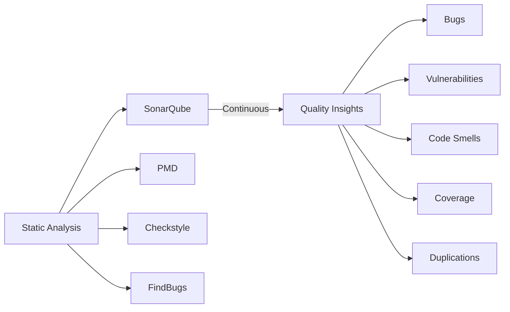
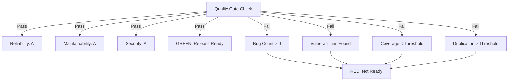

# Kĩ năng khác

## SonarQube (Static Code Analysis)

### 1. Tổng quan

**SonarQube** là một open-source platform cho continuous code quality inspection. Nó thực hiện **static code analysis** — kiểm tra source code mà không cần thực thi — để phát hiện bugs, vulnerabilities, code smells, security hotspots, và đo code coverage.



> **Static Analysis** khác với **dynamic analysis**. Static analysis kiểm tra code structure, patterns, và style mà không chạy chương trình. Dynamic analysis (như testing) thực thi code. Cả hai bổ trợ cho nhau — static analysis bắt issues mà testing có thể bỏ sót.

### 2. SonarQube Architecture

```
┌──────────────────────────────────────────────────────┐
│                    SonarQube Server                   │
│                                                      │
│  ┌────────────┐  ┌──────────────┐  ┌────────────┐  │
│  │  Web Server │──│ Scanner (CLI) │──│  Database   │  │
│  │ (Dashboard) │  │              │  │  (PostgreSQL│  │
│  └──────┬─────┘  └──────────────┘  │   / H2)     │  │
│         │            ┌──────────────┐└────────────┘  │
│         └────────────│ SonarQube DB  │              │
│                      └──────────────┘              │
└──────────────────────────────────────────────────────┘
                              ↑
                    ┌─────────┴─────────┐
                    │   Scanner Runs     │
                    │  (CI/CD Pipeline)  │
                    └─────────┬─────────┘
                              ↓
              ┌───────────────────────────────────┐
              │ Maven / Gradle / MSBuild / CLI    │
              │     Analyze Source Code           │
              │    Report to SonarQube Server     │
              └───────────────────────────────────┘
```

| Component | Role |
|-----------|------|
| **Web Server** | UI dashboard, project management, rule configuration |
| **Database** | Lưu analysis results, metrics, và project history |
| **Scanner** | Phân tích source code và gửi results tới server |

### 3. Quality Gates

**Quality Gate** là một tập hợp các điều kiện mà project phải đáp ứng để được coi là production-ready. Nó hoạt động như một gatekeeper cho code quality.

#### 3.1. Default Quality Gate Conditions

| Metric | Condition | Rating |
|--------|-----------|--------|
| **Bugs** | 0 | A |
| **Vulnerabilities** | 0 | A |
| **Security Hotspots** | Reviewed | A |
| **Code Smells** | Maintainability rating >= A | A |
| **Coverage** | >= 80% (hoặc 0% nếu không liên quan) | A |
| **Duplications** | < 3% | A |
| **Lines of Code** | Within size limits | Pass |

#### 3.2. Maintainability, Reliability, Security Ratings

SonarQube đánh giá projects trên ba trục:

| Rating | Letter | Definition |
|--------|--------|------------|
| **Reliability** | A | Không có known bugs, 0 Bugs |
| **Maintainability** | A | Code dễ maintain, low tech debt |
| **Security** | A | Không vulnerabilities, không unpatched security hotspots |
| D, E | Failing | Cần attention ngay lập tức |



### 4. Các loại Issues

#### 4.1. Bugs

**Bugs** là những coding mistakes tạo ra behavior không đúng, không như mong đợi, hoặc không có chủ đích.

```java
// Bug: NullPointerException risk
public String getUserName(Long userId) {
    User user = userRepository.findById(userId);
    return user.getName();  // BUG: user có thể null!
}

// Fixed
public String getUserName(Long userId) {
    User user = userRepository.findById(userId);
    if (user == null) {
        throw new UserNotFoundException(userId);
    }
    return user.getName();
}
```

#### 4.2. Vulnerabilities

**Vulnerabilities** là những security weaknesses mà attackers có thể khai thác.

```java
// Vulnerability: SQL Injection
public List<User> searchUsers(String query) {
    String sql = "SELECT * FROM users WHERE name LIKE '%" + query + "%'";
    return jdbcTemplate.query(sql);  // VULN: SQL Injection!
}

// Fixed: Use parameterized query
public List<User> searchUsers(String query) {
    String sql = "SELECT * FROM users WHERE name LIKE ?";
    return jdbcTemplate.query(sql, "%" + query + "%");  // Safe
}
```

```java
// Vulnerability: Hardcoded password
String password = "admin123";  // VULN: Never hardcode secrets!

// Fixed: Use environment variables
String password = System.getenv("DB_PASSWORD");
```

#### 4.3. Code Smells (Maintainability Issues)

**Code smells** là những characteristics của code gợi ý deeper problems. Chúng không gây ra bugs nhưng làm code khó maintain hơn.

| Loại Smell | Ví dụ | Fix |
|------------|-------|-----|
| **Long Method** | Method > 20 lines | Split thành smaller methods |
| **Duplicate Code** | Cùng code ở 3+ chỗ | Extract thành common method |
| **Unused Parameters** | Parameters không bao giờ dùng | Remove parameter |
| **Cognitive Complexity** | Nested if/else/loops | Simplify logic |
| **Magic Numbers** | `if (status == 1)` | Dùng named constants |
| **Long Class** | Class > 500 lines | Split thành smaller classes |

```java
// Code Smell: Cognitive Complexity (khó hiểu)
public boolean isValid(Order order) {
    if (order != null) {                        // level 1
        if (order.getItems() != null) {       // level 2
            if (order.getItems().size() > 0) { // level 3
                if (order.getTotal() > 0) {    // level 4
                    return true;
                }
            }
        }
    }
    return false;
}

// Fixed: Simplified với early returns
public boolean isValid(Order order) {
    if (order == null) return false;
    if (order.getItems() == null) return false;
    if (order.getItems().isEmpty()) return false;
    return order.getTotal() > 0;
}
```

#### 4.4. Security Hotspots

**Security Hotspots** highlight những đoạn code nhạy cảm về security cần human review. Khác với vulnerabilities, chúng không tự động có nghĩa là code có thể bị khai thác — chúng cần developer review và confirm code là safe.

```java
// Security Hotspot: Cryptographic operation
public String hashPassword(String password) {
    // S2544: Make sure that using a non-standard cryptographic algorithm is safe here.
    return DigestUtils.md5Hex(password);  // HOTSPOT: MD5 is weak!
}
```

### 5. Clean as You Code

**Clean as You Code** là cách tiếp cận của SonarQube về code quality. Thay vì cố gắng fix tất cả legacy code cùng một lúc, nó tập trung vào việc đảm bảo rằng **new code được thêm vào là clean**.

```
┌─────────────────────────────────────────────────────┐
│           Clean as You Code Principle               │
│                                                     │
│  Focus: Only the code YOU change needs to be clean │
│                                                     │
│  Legacy code: Won't fail the gate (it's old code)  │
│  New code (yours): Must meet all quality standards │
│                                                     │
└─────────────────────────────────────────────────────┘
```

Lợi ích:
- Developers chỉ chịu trách nhiệm cho những thay đổi của chính họ
- Quality gates fail trên **new code**, không phải legacy debt
- Cải thiện từ từ theo thời gian mà không cần massive refactoring
- Motivate teams giữ code clean một cách increment

### 6. SonarScanner Integration

#### 6.1. Maven

```xml
<!-- pom.xml -->
<properties>
    <sonar.host.url>http://localhost:9000</sonar.host.url>
</properties>
```

```bash
# Run Maven with SonarQube
mvn clean verify sonar:sonar
# Hoặc với specific properties
mvn clean verify -Dsonar.projectKey=my-project \
  -Dsonar.host.url=http://localhost:9000 \
  -Dsonar.token=sqp_xxxxxxxxxxxxx
```

#### 6.2. Gradle

```groovy
// build.gradle
plugins {
    id 'org.sonarqube' version '4.0.0.2929'
}

sonarqube {
    properties {
        property "sonar.projectKey", "my-java-app"
        property "sonar.host.url", "http://localhost:9000"
    }
}
```

```bash
./gradlew sonarqube -Dsonar.token=sqp_xxxxxxxxxxxxx
```

#### 6.3. CLI (SonarScanner)

```bash
# sonar-scanner.properties
sonar.host.url=http://localhost:9000
sonar.projectKey=my-project
sonar.sourceEncoding=UTF-8
sonar.sources=src
sonar.java.source=17

# Run
sonar-scanner
```

#### 6.4. NPM

```bash
npm install --save-dev sonar-scanner
# "sonar": "sonar-scanner"
npm run sonar
```

### 7. CI/CD Integration

#### 7.1. GitHub Actions

```yaml
# .github/workflows/sonar.yml
name: SonarQube Analysis

on:
  push:
    branches: [main, develop]
  pull_request:
    branches: [main]

jobs:
  sonarcloud:
    name: SonarCloud Scan
    runs-on: ubuntu-latest

    steps:
      - uses: actions/checkout@v4
        with:
          fetch-depth: 0

      - name: Set up JDK 17
        uses: actions/setup-java@v4
        with:
          java-version: '17'
          distribution: 'temurin'

      - name: Cache Maven packages
        uses: actions/cache@v3
        with:
          path: ~/.m2/repository
          key: ${{ runner.os }}-m2-${{ hashFiles('**/pom.xml') }}

      - name: Run Maven tests
        run: mvn clean verify

      - name: SonarCloud Scan
        uses: SonarSource/sonarcloud-github-action@v2
        env:
          SONAR_TOKEN: ${{ secrets.SONAR_TOKEN }}
          GITHUB_TOKEN: ${{ secrets.GITHUB_TOKEN }}
```

#### 7.2. Jenkins

```groovy
// Jenkinsfile
pipeline {
    agent any

    stages {
        stage('Checkout') {
            steps {
                checkout scm
            }
        }

        stage('Build & Test') {
            steps {
                sh 'mvn clean verify'
            }
        }

        stage('SonarQube Analysis') {
            steps {
                script {
                    def scannerHome = tool 'SonarScanner';
                    withSonarQubeEnv('SonarQube') {
                        sh "${scannerHome}/bin/sonar-scanner"
                    }
                }
            }
        }
    }
}
```

### 8. SonarQube Rules

SonarQube đi kèm hàng nghìn **language-specific rules**:

| Category | Language Coverage |
|----------|------------------|
| **Java** | 600+ rules |
| **JavaScript/TypeScript** | 300+ rules |
| **Python** | 200+ rules |
| **C#** | 400+ rules |
| **Go** | 150+ rules |
| **Kotlin** | 200+ rules |

Rules được tổ chức theo:
- **Impact**: Mức độ nghiêm trọng? (High, Medium, Low)
- **Likelihood**: Khả năng gây ra vấn đề? (High, Medium, Low)
- **Remediation Cost**: Độ khó fix? (Low, Medium, High)

### 9. Câu hỏi phỏng vấn

**Q: Bug, Vulnerability, và Code Smell khác nhau thế nào?**

> **Bug** là coding error tạo ra behavior không đúng — code sai về mặt logic. **Vulnerability** là security weakness mà attackers có thể khai thác (SQL injection, XSS, v.v.). **Code Smell** không sai về mặt kỹ thuật, nhưng vi phạm good design principles và làm code khó maintain. Code smells không gây bugs trực tiếp, nhưng tăng technical debt và khả năng bugs trong tương lai.

**Q: Quality Gate trong SonarQube là gì?**

> **Quality Gate** là tập hợp các threshold conditions (như "0 bugs", "coverage >= 80%", "duplications < 3%") mà project phải đáp ứng để được coi là production-ready. Nếu bất kỳ condition nào fail, quality gate là red và code không nên được release. Nó là một checklist enforce minimum quality standards.

**Q: Clean as You Code là gì?**

> **Clean as You Code** nghĩa là tập trung quality efforts vào code bạn đang viết hoặc thay đổi, thay vì cố gắng fix tất cả legacy code cùng một lúc. New code bạn thêm vào phải meet all quality standards, trong khi legacy code sẽ không block quality gate của bạn. Điều này tạo ra incremental improvement mà không cần overwhelming refactoring effort.

**Q: Làm thế nào để tích hợp SonarQube vào CI/CD pipeline?**

> Flow thông thường: Cài đặt SonarScanner (Maven plugin, Gradle plugin, hoặc CLI), configure SonarQube server URL và project key trong build configuration, chạy tests và compile code, execute scanner để phân tích code và upload results tới SonarQube server, và quality gate check pass hoặc fail pipeline. Trong GitHub Actions, dùng `SonarSource/sonarcloud-github-action`. Trong Jenkins, dùng `withSonarQubeEnv` block.
