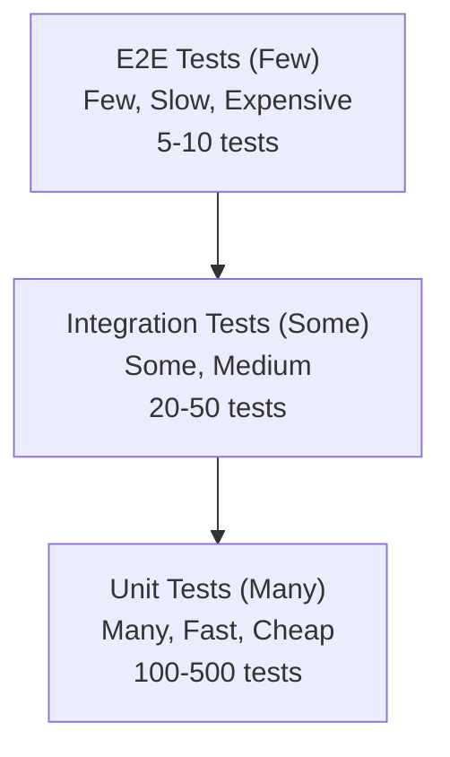

# Other Skills

## Testing

### 1. Testing Pyramid

Testing pyramid định nghĩa các loại tests theo tỷ lệ và chi phí:



---

### 2. Unit Testing

#### 2.1. Đặc điểm

- Test **từng đơn vị code** (function, class) trong isolation
- **Nhanh** — hàng nghìn tests trong vài giây
- **Isolated** — dùng mocks để loại bỏ dependencies
- **Deterministic** — cùng kết quả mỗi lần chạy

#### 2.2. Ví dụ với Jest

```typescript
// cart.ts
export class Cart {
  private items: CartItem[] = [];

  addItem(product: Product, quantity: number = 1): void {
    const existing = this.items.find(i => i.product.id === product.id);
    if (existing) {
      existing.quantity += quantity;
    } else {
      this.items.push({ product, quantity });
    }
  }

  removeItem(productId: string): void {
    this.items = this.items.filter(i => i.product.id !== productId);
  }

  getTotal(): number {
    return this.items.reduce((sum, item) => sum + item.product.price * item.quantity, 0);
  }

  getItemCount(): number {
    return this.items.reduce((sum, item) => sum + item.quantity, 0);
  }
}
```

```typescript
// cart.test.ts
import { Cart } from './cart';

describe('Cart', () => {
  let cart: Cart;

  beforeEach(() => {
    cart = new Cart();
  });

  describe('addItem()', () => {
    it('should add new item to cart', () => {
      const product = { id: 'p1', name: 'Book', price: 100 };

      cart.addItem(product);

      expect(cart.getItemCount()).toBe(1);
      expect(cart.getTotal()).toBe(100);
    });

    it('should increase quantity for existing item', () => {
      const product = { id: 'p1', name: 'Book', price: 100 };

      cart.addItem(product, 2);
      cart.addItem(product, 3);

      expect(cart.getItemCount()).toBe(5);
      expect(cart.getTotal()).toBe(500);
    });
  });

  describe('removeItem()', () => {
    it('should remove item from cart', () => {
      const product = { id: 'p1', name: 'Book', price: 100 };
      cart.addItem(product);
      cart.removeItem('p1');

      expect(cart.getItemCount()).toBe(0);
      expect(cart.getTotal()).toBe(0);
    });

    it('should do nothing for non-existent item', () => {
      cart.removeItem('non-existent');

      expect(cart.getItemCount()).toBe(0);
    });
  });

  describe('getTotal()', () => {
    it('should return 0 for empty cart', () => {
      expect(cart.getTotal()).toBe(0);
    });

    it('should calculate total correctly', () => {
      cart.addItem({ id: 'p1', name: 'Book', price: 100 }, 2); // 200
      cart.addItem({ id: 'p2', name: 'Pen', price: 20 }, 5);  // 100

      expect(cart.getTotal()).toBe(300);
    });
  });
});
```

#### 2.3. Mocks, Stubs, Spies

| Doubles | Mô tả | Ví dụ |
|---|---|---|
| **Mock** | Verify interactions (calls, args) | `expect(db.save).toHaveBeenCalledWith(user)` |
| **Stub** | Provide predefined responses | `db.save.mockResolvedValue(user)` |
| **Spy** | Wrap real object, optionally stub | `const saveSpy = jest.spyOn(db, 'save')` |

```typescript
// Mock example
describe('UserService', () => {
  it('should save user to database', async () => {
    const mockDb = { save: jest.fn().mockResolvedValue({ id: '1' }) };
    const service = new UserService(mockDb as any);

    const user = await service.createUser({ name: 'Huy', email: 'huy@example.com' });

    expect(mockDb.save).toHaveBeenCalledWith({
      name: 'Huy',
      email: 'huy@example.com'
    });
    expect(user.id).toBe('1');
  });

  it('should throw on database error', async () => {
    const mockDb = { save: jest.fn().mockRejectedValue(new Error('DB error')) };
    const service = new UserService(mockDb as any);

    await expect(
      service.createUser({ name: 'Huy', email: 'huy@example.com' })
    ).rejects.toThrow('DB error');
  });
});
```

---

### 3. Integration Testing

#### 3.1. Đặc điểm

- Test **tương tác giữa các components** (modules, DB, API)
- Chậm hơn unit tests nhưng đảm bảo integration hoạt động
- Có thể dùng **test database** thay vì mock

#### 3.2. Ví dụ: API Integration Test

```typescript
import { Test, TestingModule } from '@nestjs/testing';
import { INestApplication } from '@nestjs/common';
import * as request from 'supertest';
import { AppModule } from '../src/app.module';

describe('UserController (e2e)', () => {
  let app: INestApplication;
  let token: string;

  beforeAll(async () => {
    const moduleFixture: TestingModule = await Test.createTestingModule({
      imports: [AppModule],
    }).compile();

    app = moduleFixture.createNestApplication();
    await app.init();
  });

  it('/auth/login (POST) - should return JWT token', async () => {
    const res = await request(app.getHttpServer())
      .post('/auth/login')
      .send({ email: 'test@example.com', password: 'password123' })
      .expect(201);

    expect(res.body).toHaveProperty('accessToken');
    token = res.body.accessToken;
  });

  it('/users/me (GET) - should return current user', async () => {
    const res = await request(app.getHttpServer())
      .get('/users/me')
      .set('Authorization', `Bearer ${token}`)
      .expect(200);

    expect(res.body.email).toBe('test@example.com');
  });

  afterAll(async () => {
    await app.close();
  });
});
```

---

### 4. E2E Testing

#### 4.1. Đặc điểm

- Test **toàn bộ flow** từ perspective của user
- Slowest nhưng **most realistic**
- Cover complete scenarios: FE → BE → DB

#### 4.2. Ví dụ: Cypress

```typescript
// cypress/e2e/checkout.cy.ts

describe('Checkout Flow', () => {
  beforeEach(() => {
    cy.visit('/login');
    cy.get('[data-testid="email"]').type('user@example.com');
    cy.get('[data-testid="password"]').type('password123');
    cy.get('[data-testid="login-button"]').click();
    cy.url().should('include', '/dashboard');
  });

  it('should complete checkout successfully', () => {
    // Thêm sản phẩm vào giỏ
    cy.visit('/products');
    cy.get('[data-testid="product-1"]').click();
    cy.get('[data-testid="add-to-cart"]').click();

    // Đến checkout
    cy.get('[data-testid="cart-icon"]').click();
    cy.get('[data-testid="checkout-button"]').click();

    // Điền thông tin
    cy.get('[data-testid="address-input"]').type('123 Đường ABC, Quận 1');
    cy.get('[data-testid="payment-method"]').select('credit-card');

    // Đặt hàng
    cy.get('[data-testid="place-order"]').click();

    // Verify thành công
    cy.get('[data-testid="order-success"]').should('be.visible');
    cy.contains('Order placed successfully');
  });
});
```

#### 4.3. Playwright

```typescript
import { test, expect } from '@playwright/test';

test('login flow', async ({ page }) => {
  await page.goto('/login');
  await page.fill('[name="email"]', 'user@example.com');
  await page.fill('[name="password"]', 'password123');
  await page.click('button[type="submit"]');

  await expect(page).toHaveURL('/dashboard');
  await expect(page.locator('h1')).toContainText('Welcome');
});
```

---

### 5. Test Doubles & Mocking Strategies

#### 5.1. Khi nào dùng Mock

| Test Type | Mock Dependencies? | Reason |
|---|---|---|
| **Unit** | Yes | Isolation — test one thing at a time |
| **Integration** | Partial | Test real interactions between components |
| **E2E** | No | Test everything in real environment |

#### 5.2. Best Practices

| Practice | Description |
|---|---|
| **Mock external services** | APIs, databases, third-party services |
| **Don't mock value objects** | Simple data structures (DTOs, entities) |
| **Reset mocks between tests** | Prevent test pollution |
| **Use interfaces** | Makes mocking easier (TypeScript) |

---

### 6. Coverage

#### 6.1. Coverage Types

| Type | Mô tả |
|---|---|
| **Line coverage** | % lines executed |
| **Branch coverage** | % branches (if/else) taken |
| **Function coverage** | % functions called |
| **Statement coverage** | % statements executed |

#### 6.2. Jest Coverage

```bash
npx jest --coverage --coverageReporters=lcov,text
```

```typescript
// jest.config.js
module.exports = {
  coverageThreshold: {
    global: {
      branches: 70,
      functions: 70,
      lines: 70,
      statements: 70,
    },
  },
};
```

---

### 7. Testing Tools Comparison

| Tool | Type | Language | Features |
|---|---|---|---|
| **Jest** | Unit/Integration | JavaScript/TypeScript | Built-in mocks, coverage, snapshot |
| **Vitest** | Unit/Integration | JavaScript/TypeScript | Vite-native, Jest-compatible |
| **Mocha** | Unit/Integration | JavaScript/TypeScript | Flexible, requires setup |
| **JUnit 5** | Unit/Integration | Java | Standard for Java |
| **pytest** | Unit/Integration | Python | Simple, powerful |
| **Cypress** | E2E | JavaScript | Great DX, screenshot/video |
| **Playwright** | E2E | Multi | Cross-browser, API testing |
| **Selenium** | E2E | Multi | Oldest, most mature |
| **Testing Library** | Component | React/Vue | DOM testing, accessible |

> **Tip:** Viết tests cho **business logic** và **edge cases** trước. Coverage target là 70-80% — không phải 100%. 100% coverage với tests không có giá trị (assert) là vô nghĩa.
