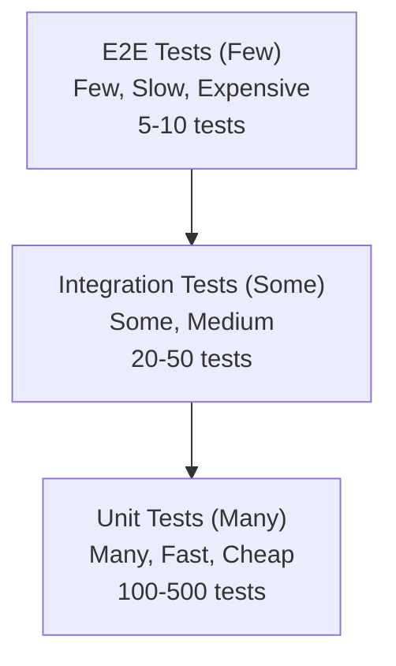

# Other Skills

## Testing

### 1. Testing Pyramid

Testing pyramid định nghĩa các loại tests theo tỷ lệ và chi phí:



---

### 2. Unit Testing

#### 2.1. Đặc điểm

- Test **từng đơn vị code** (function, class) trong isolation
- **Nhanh** — hàng nghìn tests trong vài giây
- **Isolated** — dùng mocks để loại bỏ dependencies
- **Deterministic** — cùng kết quả mỗi lần chạy

#### 2.2. Ví dụ với Jest

```typescript
// cart.ts
export class Cart {
  private items: CartItem[] = [];

  addItem(product: Product, quantity: number = 1): void {
    const existing = this.items.find(i => i.product.id === product.id);
    if (existing) {
      existing.quantity += quantity;
    } else {
      this.items.push({ product, quantity });
    }
  }

  removeItem(productId: string): void {
    this.items = this.items.filter(i => i.product.id !== productId);
  }

  getTotal(): number {
    return this.items.reduce((sum, item) => sum + item.product.price * item.quantity, 0);
  }

  getItemCount(): number {
    return this.items.reduce((sum, item) => sum + item.quantity, 0);
  }
}
```

```typescript
// cart.test.ts
import { Cart } from './cart';

describe('Cart', () => {
  let cart: Cart;

  beforeEach(() => {
    cart = new Cart();
  });

  describe('addItem()', () => {
    it('should add new item to cart', () => {
      const product = { id: 'p1', name: 'Book', price: 100 };

      cart.addItem(product);

      expect(cart.getItemCount()).toBe(1);
      expect(cart.getTotal()).toBe(100);
    });

    it('should increase quantity for existing item', () => {
      const product = { id: 'p1', name: 'Book', price: 100 };

      cart.addItem(product, 2);
      cart.addItem(product, 3);

      expect(cart.getItemCount()).toBe(5);
      expect(cart.getTotal()).toBe(500);
    });
  });

  describe('removeItem()', () => {
    it('should remove item from cart', () => {
      const product = { id: 'p1', name: 'Book', price: 100 };
      cart.addItem(product);
      cart.removeItem('p1');

      expect(cart.getItemCount()).toBe(0);
      expect(cart.getTotal()).toBe(0);
    });

    it('should do nothing for non-existent item', () => {
      cart.removeItem('non-existent');

      expect(cart.getItemCount()).toBe(0);
    });
  });

  describe('getTotal()', () => {
    it('should return 0 for empty cart', () => {
      expect(cart.getTotal()).toBe(0);
    });

    it('should calculate total correctly', () => {
      cart.addItem({ id: 'p1', name: 'Book', price: 100 }, 2); // 200
      cart.addItem({ id: 'p2', name: 'Pen', price: 20 }, 5);  // 100

      expect(cart.getTotal()).toBe(300);
    });
  });
});
```

#### 2.3. Mocks, Stubs, Spies

| Doubles | Mô tả | Ví dụ |
|---|---|---|
| **Mock** | Verify interactions (calls, args) | `expect(db.save).toHaveBeenCalledWith(user)` |
| **Stub** | Provide predefined responses | `db.save.mockResolvedValue(user)` |
| **Spy** | Wrap real object, optionally stub | `const saveSpy = jest.spyOn(db, 'save')` |

```typescript
// Mock example
describe('UserService', () => {
  it('should save user to database', async () => {
    const mockDb = { save: jest.fn().mockResolvedValue({ id: '1' }) };
    const service = new UserService(mockDb as any);

    const user = await service.createUser({ name: 'Huy', email: 'huy@example.com' });

    expect(mockDb.save).toHaveBeenCalledWith({
      name: 'Huy',
      email: 'huy@example.com'
    });
    expect(user.id).toBe('1');
  });

  it('should throw on database error', async () => {
    const mockDb = { save: jest.fn().mockRejectedValue(new Error('DB error')) };
    const service = new UserService(mockDb as any);

    await expect(
      service.createUser({ name: 'Huy', email: 'huy@example.com' })
    ).rejects.toThrow('DB error');
  });
});
```

---

### 3. Integration Testing

#### 3.1. Đặc điểm

- Test **tương tác giữa các components** (modules, DB, API)
- Chậm hơn unit tests nhưng đảm bảo integration hoạt động
- Có thể dùng **test database** thay vì mock

#### 3.2. Ví dụ: API Integration Test

```typescript
import { Test, TestingModule } from '@nestjs/testing';
import { INestApplication } from '@nestjs/common';
import * as request from 'supertest';
import { AppModule } from '../src/app.module';

describe('UserController (e2e)', () => {
  let app: INestApplication;
  let token: string;

  beforeAll(async () => {
    const moduleFixture: TestingModule = await Test.createTestingModule({
      imports: [AppModule],
    }).compile();

    app = moduleFixture.createNestApplication();
    await app.init();
  });

  it('/auth/login (POST) - should return JWT token', async () => {
    const res = await request(app.getHttpServer())
      .post('/auth/login')
      .send({ email: 'test@example.com', password: 'password123' })
      .expect(201);

    expect(res.body).toHaveProperty('accessToken');
    token = res.body.accessToken;
  });

  it('/users/me (GET) - should return current user', async () => {
    const res = await request(app.getHttpServer())
      .get('/users/me')
      .set('Authorization', `Bearer ${token}`)
      .expect(200);

    expect(res.body.email).toBe('test@example.com');
  });

  afterAll(async () => {
    await app.close();
  });
});
```

---

### 4. E2E Testing

#### 4.1. Đặc điểm

- Test **toàn bộ flow** từ perspective của user
- Slowest nhưng **most realistic**
- Cover complete scenarios: FE → BE → DB

#### 4.2. Ví dụ: Cypress

```typescript
// cypress/e2e/checkout.cy.ts

describe('Checkout Flow', () => {
  beforeEach(() => {
    cy.visit('/login');
    cy.get('[data-testid="email"]').type('user@example.com');
    cy.get('[data-testid="password"]').type('password123');
    cy.get('[data-testid="login-button"]').click();
    cy.url().should('include', '/dashboard');
  });

  it('should complete checkout successfully', () => {
    // Thêm sản phẩm vào giỏ
    cy.visit('/products');
    cy.get('[data-testid="product-1"]').click();
    cy.get('[data-testid="add-to-cart"]').click();

    // Đến checkout
    cy.get('[data-testid="cart-icon"]').click();
    cy.get('[data-testid="checkout-button"]').click();

    // Điền thông tin
    cy.get('[data-testid="address-input"]').type('123 Đường ABC, Quận 1');
    cy.get('[data-testid="payment-method"]').select('credit-card');

    // Đặt hàng
    cy.get('[data-testid="place-order"]').click();

    // Verify thành công
    cy.get('[data-testid="order-success"]').should('be.visible');
    cy.contains('Order placed successfully');
  });
});
```

#### 4.3. Playwright

```typescript
import { test, expect } from '@playwright/test';

test('login flow', async ({ page }) => {
  await page.goto('/login');
  await page.fill('[name="email"]', 'user@example.com');
  await page.fill('[name="password"]', 'password123');
  await page.click('button[type="submit"]');

  await expect(page).toHaveURL('/dashboard');
  await expect(page.locator('h1')).toContainText('Welcome');
});
```

---

### 5. Test Doubles & Mocking Strategies

#### 5.1. Khi nào dùng Mock

| Test Type | Mock Dependencies? | Reason |
|---|---|---|
| **Unit** | Yes | Isolation — test one thing at a time |
| **Integration** | Partial | Test real interactions between components |
| **E2E** | No | Test everything in real environment |

#### 5.2. Best Practices

| Practice | Description |
|---|---|
| **Mock external services** | APIs, databases, third-party services |
| **Don't mock value objects** | Simple data structures (DTOs, entities) |
| **Reset mocks between tests** | Prevent test pollution |
| **Use interfaces** | Makes mocking easier (TypeScript) |

---

### 6. Coverage

#### 6.1. Coverage Types

| Type | Mô tả |
|---|---|
| **Line coverage** | % lines executed |
| **Branch coverage** | % branches (if/else) taken |
| **Function coverage** | % functions called |
| **Statement coverage** | % statements executed |

#### 6.2. Jest Coverage

```bash
npx jest --coverage --coverageReporters=lcov,text
```

```typescript
// jest.config.js
module.exports = {
  coverageThreshold: {
    global: {
      branches: 70,
      functions: 70,
      lines: 70,
      statements: 70,
    },
  },
};
```

---

### 7. Testing Tools Comparison

| Tool | Type | Language | Features |
|---|---|---|---|
| **Jest** | Unit/Integration | JavaScript/TypeScript | Built-in mocks, coverage, snapshot |
| **Vitest** | Unit/Integration | JavaScript/TypeScript | Vite-native, Jest-compatible |
| **Mocha** | Unit/Integration | JavaScript/TypeScript | Flexible, requires setup |
| **JUnit 5** | Unit/Integration | Java | Standard for Java |
| **pytest** | Unit/Integration | Python | Simple, powerful |
| **Cypress** | E2E | JavaScript | Great DX, screenshot/video |
| **Playwright** | E2E | Multi | Cross-browser, API testing |
| **Selenium** | E2E | Multi | Oldest, most mature |
| **Testing Library** | Component | React/Vue | DOM testing, accessible |

> **Tip:** Viết tests cho **business logic** và **edge cases** trước. Coverage target là 70-80% — không phải 100%. 100% coverage với tests không có giá trị (assert) là vô nghĩa.

---

## 8. Performance Testing (Kiểm thử Hiệu năng)

### 8.1. Các loại kiểm thử hiệu năng

| Loại | Mục tiêu | Kịch bản |
|------|----------|----------|
| **Performance Testing** | Đo hiệu năng hệ thống dưới tải kỳ vọng | Validate response time đạt SLA |
| **Load Testing** | Xác minh hành vi hệ thống ở mức tải bình thường | 1000 concurrent users, ramp-up đều |
| **Stress Testing** | Tìm điểm giới hạn vượt quá dung lượng | Tải gấp 2x, 5x, 10x bình thường |
| **Soak Testing** | Phát hiện memory leaks / suy thoái theo thời gian | Tải liên tục trong nhiều giờ |
| **Spike Testing** | Xác minh phản hồi với burst tải đột ngột | Tăng traffic gấp 10x tức thì |
| **Scalability Testing** | Đo hiệu năng khi scale tài nguyên | Horizontal/vertical scaling |

### 8.2. Các metrics quan trọng

| Metric | Mô tả | Mục tiêu |
|--------|-------|----------|
| **TPS / Throughput** | Số transactions mỗi giây | Phụ thuộc thiết kế hệ thống |
| **Response Time (Avg)** | Thời gian phản hồi trung bình | < 200ms cho APIs |
| **Response Time (P50)** | Median — 50% requests | Thấp hơn average |
| **Response Time (P90)** | 90th percentile — mục tiêu SLA | < 500ms thường |
| **Response Time (P99)** | 99th percentile — worst cases | < 1s thường |
| **Error Rate** | % requests thất bại | < 1% |
| **Concurrent Users** | Số users hoạt động đồng thời | Match expected peak |
| **CPU / Memory** | Server resource utilization | < 80% liên tục |
| **Apdex Score** | User satisfaction index (0-1) | > 0.85 (Tốt) |

### 8.3. Apache JMeter

JMeter là công cụ mã nguồn mở cho load testing. Mô phỏng concurrent users và đo hiệu năng.

**Các khái niệm cốt lõi:**

- **Thread Group**: Định nghĩa số users, thời gian ramp-up, số lần lặp
- **Samplers**: HTTP Request, JDBC, FTP, etc.
- **Listeners**: Xem kết quả (Table, Tree, Graph, Summary Report)
- **Controllers**: Logic điều khiển thực thi request
  - **If Controller**: Thực thi có điều kiện
  - **Loop Controller**: Lặp lại request N lần
  - **Random Controller**: Thực thi một child ngẫu nhiên mỗi iteration
  - **Transaction Controller**: Nhóm requests thành một transaction duy nhất

```xml
<!-- JMeter Test Plan (XML) -->
<!-- Key elements: ThreadGroup, HTTP Request Defaults, Samplers, Listeners -->
<!-- View Results Tree: Debug response data -->
<!-- Summary Report: Aggregate TPS, latency, error rate -->

<!-- Ví dụ: 100 users, 10s ramp-up, 5 iterations -->
<ThreadGroup>
  <stringProp name="ThreadGroup.num_threads">100</stringProp>
  <stringProp name="ThreadGroup.ramp_time">10</stringProp>
  <stringProp name="ThreadGroup.loop_count">5</stringProp>
</ThreadGroup>
```

```bash
# Chạy JMeter ở chế độ CLI
jmeter -n -t test-plan.jmx -l results.jtl -e -o ./html-report

# Flags:
# -n    : Non-GUI mode
# -t    : Test plan file
# -l    : Results file (.jtl)
# -e    : Generate HTML report sau test
# -o    : Output folder cho report
```

**JMeter Architecture:**

```
ThreadGroup (100 threads)
  └─ Once Only Controller (Login)
  │    └─ HTTP Request: POST /api/auth/login
  │         └─ JSON Extractor: extract token
  │
  └─ Loop Controller (10 iterations)
       └─ HTTP Request: GET /api/products
       └─ HTTP Request: POST /api/cart
       └─ Transaction Controller: Checkout
            ├─ HTTP Request: GET /api/checkout
            └─ HTTP Request: POST /api/order
```

### 8.4. k6 (Grafana k6)

k6 là công cụ load testing hiện đại, thân thiện với developer, viết bằng Go. Scripts được viết bằng JavaScript.

```javascript
// k6 script example
import http from 'k6/http';
import { check, sleep } from 'k6';
import { Rate, Trend } from 'k6/metrics';

// Custom metrics
const errorRate = new Rate('errors');
const responseTime = new Trend('response_time');

export const options = {
  stages: [
    { duration: '30s', target: 100 },  // Ramp up to 100 VUs
    { duration: '1m', target: 100 },  // Stay at 100 VUs
    { duration: '30s', target: 200 },  // Spike to 200 VUs
    { duration: '30s', target: 0 },    // Ramp down
  ],

  thresholds: {
    'http_req_duration': ['p(95)<500', 'p(99)<1000'],  // 95th < 500ms, 99th < 1s
    'http_req_failed': ['rate<0.01'],                    // Error rate < 1%
    'errors': ['rate<0.05'],                             // Custom metric
  },
};

const BASE_URL = 'https://api.example.com';

export default function () {
  // Setup - runs once per VU
  const loginRes = http.post(`${BASE_URL}/auth/login`, JSON.stringify({
    email: `user${__VU}@example.com`,
    password: 'password123',
  }), {
    headers: { 'Content-Type': 'application/json' },
  });

  check(loginRes, {
    'login status 200': (r) => r.status === 200,
    'has token': (r) => r.json('accessToken') !== '',
  }) || errorRate.add(1);

  const token = loginRes.json('accessToken');

  // Main test
  const productsRes = http.get(`${BASE_URL}/products`, {
    headers: { Authorization: `Bearer ${token}` },
  });

  responseTime.add(productsRes.timings.duration);
  check(productsRes, {
    'products loaded': (r) => r.status === 200,
    'has products': (r) => r.json('data').length > 0,
  }) || errorRate.add(1);

  sleep(1);
}
```

```bash
# Chạy k6 test
k6 run script.js

# Chạy với cloud (k6 Cloud)
k6 cloud script.js

# Chạy với config file
k6 run --config k6-config.yaml script.js

# Output ra JSON
k6 run --out json=results.json script.js
```

### 8.5. Gatling

Gatling là công cụ load testing viết bằng Scala. Sử dụng DSL để viết test scenarios.

```scala
// Gatling Scala script
package simulations

import io.gatling.core.Predef._
import io.gatling.http.Predef._
import scala.concurrent.duration._

class BasicSimulation extends Simulation {

  val httpProtocol = http
    .baseUrl("https://api.example.com")
    .acceptHeader("application/json")
    .header("Authorization", "Bearer ${token}")

  val userScenario = scenario("User Journey")
    .exec(
      http("Login")
        .post("/auth/login")
        .body(StringBody("""{"email":"user@example.com","password":"password123"}"""))
        .asJson
        .check(jsonPath("$.accessToken").saveAs("token"))
    )
    .pause(2)
    .exec(
      http("Get Products")
        .get("/products")
        .check(status.is(200))
    )
    .pause(1)
    .exec(
      http("Add to Cart")
        .post("/cart/items")
        .body(StringBody("""{"productId":"p1","quantity":2}"""))
        .asJson
    )
    .exec(
      http("Checkout")
        .post("/orders")
        .body(StringBody("""{"address":"123 Main St"}"""))
        .asJson
        .check(status in 200..299)
    )

  setUp(
    userScenario
      .inject(
        rampUsers(500).during(30.seconds),
        constantUsersPerSec(100).during(2.minutes),
        rampUsers(1000).during(30.seconds)
      )
      .protocols(httpProtocol)
  )
  .assertions(
    global.responseTime.percentile(95).lt(500),
    global.responseTime.percentile(99).lt(1000),
    global.successfulRequests.percent.gt(99),
    global.allRequests.count.gt(10000)
  )
}
```

```bash
# Chạy Gatling
gatling.sh -sf src/test/resources -rf results -s simulations.BasicSimulation

# Maven/Gradle plugin
# mvn gatling:test
# gradle gatlingRun
```

### 8.6. Artillery

Artillery là công cụ load testing hiện đại, sử dụng YAML configuration.

```yaml
# artillery.yml
config:
  target: "https://api.example.com"
  phases:
    - duration: 60
      arrivalRate: 10
      name: "Warm up"
    - duration: 120
      arrivalRate: 50
      name: "Sustained load"
    - duration: 30
      arrivalRate: 200
      name: "Stress test"

  plugins:
    expect: {}
    metrics-by-endpoint: {}

  defaults:
    headers:
      Content-Type: application/json
      Authorization: "Bearer {{ token }}"

  environments:
    staging:
      target: "https://staging-api.example.com"
      variables:
        token: "staging-token-xxx"
    production:
      target: "https://api.example.com"
      variables:
        token: "prod-token-xxx"

scenarios:
  - name: "User Journey"
    flow:
      - post:
          url: "/auth/login"
          json:
            email: "user@example.com"
            password: "password123"
          capture:
            - json: "$.accessToken"
              as: "token"

      - think: 1

      - get:
          url: "/products"
          beforeRequest: "generateToken"
          expect:
            - statusCode: 200
            - contentType: application/json

      - post:
          url: "/cart/items"
          json:
            productId: "p1"
            quantity: 2
          expect:
            - statusCode: 201

      - post:
          url: "/orders"
          json:
            address: "123 Main Street"
          expect:
            - statusCode: 201
            - has: "$.orderId"
```

```bash
# Chạy với YAML
artillery run artillery.yml

# Chạy với environment
artillery run artillery.yml --environment staging

# Quick check (1 phase, 1 VU)
artillery quick --duration 10 --rate 10 https://api.example.com/health

# Generate HTML report
artillery report results.json
```

### 8.7. Quy trình Performance Testing

```
1. Requirements Gathering
   ├── Định nghĩa SLOs / SLAs
   ├── Xác định critical user journeys
   └── Đặt criteria (response time, throughput, error rate)

2. Planning
   ├── Chọn tools (JMeter, k6, Gatling, Artillery)
   ├── Thiết kế test scenarios
   └── Định nghĩa load profiles (users, ramp-up, duration)

3. Scripting
   ├── Record hoặc viết scripts cho user journeys
   ├── Parameterize data (CSV, random, functions)
   ├── Thêm assertions / checks
   └── Configure correlation (extract session/token)

4. Execution
   ├── Chạy smoke test (tải nhỏ)
   ├── Chạy load test (tải kỳ vọng)
   ├── Chạy stress/spike tests (edge cases)
   └── Monitor server metrics (CPU, memory, network)

5. Analysis
   ├── Collect metrics (response time, throughput, errors)
   ├── Phân tích bottlenecks (DB, network, GC, thread pool)
   ├── So sánh với baselines
   └── Tạo report

6. Optimization & Retest
   ├── Tune JVM, DB, cache, connection pools
   ├── Chạy lại tests
   └── Validate improvements
```

### 8.8. APM Tools

APM (Application Performance Monitoring) tools giúp xác định bottlenecks trong production và test environments.

| Tool | Mô tả | Điểm mạnh |
|------|-------|-----------|
| **New Relic** | Full-stack observability | Dashboard thân thiện, APM + infrastructure |
| **Datadog** | Cloud-scale monitoring | Logs, traces, metrics trong một platform |
| **Dynatrace** | AI-powered observability | Automatic root cause analysis |
| **Elastic APM** | Open-source APM | Self-hosted, linh hoạt |
| **Pinpoint** | Open-source APM (Naver) | Distributed tracing, low overhead |
| **Jaeger** | Open-source distributed tracing | Request flow visualization |

**New Relic Example:**

```javascript
// New Relic Browser Agent (auto-instrument)
newrelic.setCustomAttribute('userId', userId);
newrelic.setCustomAttribute('plan', 'premium');

// Track AJAX errors
newrelic.noticeError(new Error('API failed'), {
  endpoint: '/api/products',
  statusCode: 500,
});
```

**Datadog APM Example:**

```javascript
// Trace a function
const tracer = require('dd-trace').init();

tracer.trace('my.operation', (span) => {
  span.setTag('user.id', userId);
  span.setTag('feature', 'checkout');
  // ... operation code
  span.finish();
});
```

---

## 9. SonarQube / SonarCloud

### 9.1. SonarQube là gì?

> **SonarQube** là nền tảng mã nguồn mở cho **static code analysis** — quét source code để phát hiện bugs, vulnerabilities, code smells, security hotspots, và đo lường code quality theo thời gian.

### 9.2. SonarQube Architecture

```
┌──────────────────────────────────────────────────────────┐
│                        Client                             │
│   SonarScanner (Maven, Gradle, CLI, MSBuild, GitHub)     │
└──────────────────────────┬───────────────────────────────┘
                           │ Analyze & Push
                           ▼
┌──────────────────────────────────────────────────────────┐
│                    SonarQube Server                       │
│                                                           │
│  ┌─────────────────┐  ┌─────────────────────────────┐    │
│  │   Web Server    │  │        Compute Engine         │    │
│  │  (Dashboard,    │  │  (Analysis processing,       │    │
│  │   Rules,       │  │   Quality Gates, issues       │    │
│  │   Projects)    │  │   computation)                │    │
│  └────────┬────────┘  └──────────────┬────────────────┘    │
│           │                          │                    │
│           └──────────┬───────────────┘                    │
│                      ▼                                    │
│           ┌─────────────────────┐                          │
│           │      Database        │                          │
│           │  (PostgreSQL/MySQL)  │                          │
│           │  Projects, Issues,   │                          │
│           │  Rules, History      │                          │
│           └─────────────────────┘                          │
└──────────────────────────────────────────────────────────┘
```

### 9.3. Các khái niệm chính

| Khái niệm | Mô tả |
|-----------|-------|
| **Bug** | Lỗi lập trình tạo ra hành vi sai |
| **Vulnerability** | Điểm yếu bảo mật có thể bị khai thác |
| **Code Smell** | Code khó bảo trì (không sai, chỉ là "xấu") |
| **Security Hotspot** | Code nhạy cảm về bảo mật cần review bởi con người |
| **Duplications** | Code trùng lặp |
| **Coverage** | Tỷ lệ coverage từ unit tests |

### 9.4. Quality Gates

**Quality Gate** là tập hợp các điều kiện mà project phải đáp ứng để được coi là sẵn sàng release.

| Metric | Rating Thresholds |
|--------|-------------------|
| **Bugs** | 0 (Blocker), open bugs < 5 (Critical) |
| **Vulnerabilities** | 0 (Blocker) |
| **Code Smells** | Maintainability Rating >= A |
| **Coverage** | Line coverage >= 80% (configurable) |
| **Duplications** | Duplicated lines < 3% |
| **Security Hotspots** | Reviewed >= 100% |

**Quality Gate Example:**

```json
{
  "name": "Release Gate",
  "metrics": [
    { "key": "new_bugs", "op": ">", "value": 0, "error": "Must have 0 new bugs" },
    { "key": "new_vulnerabilities", "op": ">", "value": 0, "error": "Must have 0 new vulnerabilities" },
    { "key": "new_code_smells", "op": ">", "value": 50, "error": "Too many code smells" },
    { "key": "coverage", "op": "<", "value": 80, "error": "Coverage must be >= 80%" },
    { "key": "duplicated_lines_density", "op": ">", "value": 3, "error": "Duplication > 3%" }
  ]
}
```

### 9.5. Security Hotspots vs Vulnerabilities

| Loại | Mô tả | Hành động |
|------|-------|-----------|
| **Vulnerability** | Điểm yếu có thể bị khai thác (VD: SQL injection) | Sửa trước release |
| **Security Hotspot** | Code nhạy cảm bảo mật cần review (VD: cách dùng crypto) | Review và đánh dấu "Safe" |

**Security Hotspot Review:**

```java
// Security Hotspot: Weak cryptographic algorithm
import javax.crypto.Cipher;
import java.security.Key;

// HOTSPOT: DES được coi là không an toàn
public String decrypt(String data, Key key) {
    // Đây là Security Hotspot - cần human review
    // Reviewer nên xác nhận: Đây có phải legacy code không? DES có cố ý không?
    // Đánh dấu "Safe" nếu chấp nhận được, hoặc "Fixed" nếu đã thay đổi
    Cipher cipher = Cipher.getInstance("DES");
    cipher.init(Cipher.DECRYPT_MODE, key);
    return new String(cipher.doFinal(Base64.decode(data)));
}
```

### 9.6. Maintainability, Reliability, Security Ratings

SonarQube gán letter grades (A-E) dựa trên metrics:

| Rating | Score Range | Ý nghĩa |
|--------|-------------|---------|
| **A** | 0 bugs / 0 vulnerabilities | Xuất sắc |
| **B** | Vài issues nhỏ | Tốt |
| **C** | Issues ở mức trung bình | Cần chú ý |
| **D** | Nhiều issues | Kém |

**Reliability Rating:**

- **A**: 0 bugs
- **B**: at least 1 minor bug
- **C**: at least 1 major bug
- **D**: at least 1 critical bug
- **E**: at least 1 blocker bug

**Maintainability Rating:** Dựa trên code smell debt (tính bằng ngày). VD: A = debt < 0, B = debt < 5 days.

**Security Rating:** Cùng thang A-E dựa trên vulnerabilities.

### 9.7. Clean as You Code

**Clean as You Code** là cách tiếp cận của SonarQube về code quality:

> Tập trung sửa issues trong **new code** thay vì giải quyết tất cả legacy code cùng lúc.

- Mọi pull request / commit không nên tạo ra issues mới
- Quality Gate fail nếu new code có bugs, vulnerabilities, hoặc maintainability kém
- Các issues hiện có được track riêng (về mặt lý thuyết chúng giảm severity theo thời gian)

**Best Practice:** Đặt Quality Gate fail trên **new code** issues, không chỉ trên overall code.

### 9.8. Tích hợp SonarScanner

```bash
# Cài đặt SonarScanner CLI
# Download từ https://docs.sonarqube.org/latest/analysis/scan/sonarscanner/

# Chạy analysis
sonar-scanner \
  -Dsonar.projectKey=my-project \
  -Dsonar.sources=./src \
  -Dsonar.host.url=http://localhost:9000 \
  -Dsonar.token=sqp_xxxxxxxxxxxxxxxxxx
```

**Maven:**

```xml
<!-- pom.xml -->
<properties>
  <sonar.host.url>https://sonarcloud.io</sonar.host.url>
  <sonar.projectKey>my-org_my-project</sonar.projectKey>
  <sonar.organization>my-org</sonar.organization>
  <sonar.token>${SONAR_TOKEN}</sonar.token>
</properties>

<build>
  <plugins>
    <plugin>
      <groupId>org.sonarsource.scanner.maven</groupId>
      <artifactId>sonar-maven-plugin</artifactId>
      <version>3.9.1.2184</version>
    </plugin>
  </plugins>
</build>

<!-- Chạy -->
mvn verify sonar:sonar
```

**Gradle:**

```groovy
// build.gradle
plugins {
    id "org.sonarqube" version "4.4.0.3356"
}

sonarqube {
    properties {
        property "sonar.projectKey", "my-org_my-project"
        property "sonar.organization", "my-org"
        property "sonar.host.url", "https://sonarcloud.io"
    }
}

// Chạy
./gradlew sonar
```

**Node.js / npm:**

```bash
# Cài đặt
npm install --save-dev sonar-scanner

# package.json scripts
{
  "scripts": {
    "sonar": "sonar-scanner"
  }
}

# .sonarcloud.properties hoặc sonar-project.properties
sonar.projectKey=my-org_my-project
sonar.sources=src
sonar.tests=src/__tests__
sonar.javascript.lcov.reportPath=coverage/lcov.info
sonar.coverage.exclusions=src/**/*.test.ts
```

### 9.9. Tích hợp CI/CD

**GitHub Actions:**

```yaml
# .github/workflows/sonar.yml
name: SonarCloud Analysis

on:
  push:
    branches: [main, develop]
  pull_request:
    branches: [main]

jobs:
  sonarcloud:
    name: SonarCloud
    runs-on: ubuntu-latest

    steps:
      - uses: actions/checkout@v4
        with:
          fetch-depth: 0  # Cần full history cho true new code analysis

      - uses: actions/setup-node@v4
        with:
          node-version: '20'

      - name: Install dependencies
        run: npm ci

      - name: Run tests with coverage
        run: npm test -- --coverage

      - name: SonarCloud Scan
        uses: SonarSource/sonarcloud-github-action@master
        env:
          SONAR_TOKEN: ${{ secrets.SONAR_TOKEN }}
          SONAR_ORGANIZATION: ${{ secrets.SONAR_ORGANIZATION }}
```

**Jenkins:**

```groovy
// Jenkinsfile
pipeline {
    agent any

    environment {
        SONAR_TOKEN = credentials('sonar-token')
    }

    stages {
        stage('Checkout') {
            steps { checkout scm }
        }

        stage('Build & Test') {
            steps {
                sh 'mvn clean verify'
            }
        }

        stage('SonarQube Analysis') {
            steps {
                withSonarQubeEnv('SonarQube') {
                    sh '''
                        mvn sonar:sonar \
                            -Dsonar.host.url=http://sonarqube:9000 \
                            -Dsonar.token=$SONAR_TOKEN
                    '''
                }
            }
        }

        stage('Quality Gate') {
            steps {
                timeout(time: 5, unit: 'MINUTES') {
                    waitForQualityGate abortPipeline: true
                }
            }
        }
    }
}
```

### 9.10. SonarCloud vs SonarQube

| Tính năng | SonarCloud | SonarQube |
|-----------|------------|-----------|
| Hosting | Cloud (SaaS) | Self-hosted |
| Maintenance | Không cần (managed) | Tự quản lý server, DB, upgrades |
| Chi phí | Miễn phí cho open source, trả phí cho private | Miễn phí (Community Edition) |
| CI/CD | Tích hợp native GitHub/GitLab/Bitbucket | Bất kỳ CI nào qua SonarScanner |

---

## 10. Testing trong CI/CD Pipeline

### 10.1. CI/CD Pipeline hoàn chỉnh với Testing

CI/CD pipeline production điển hình bao gồm testing ở nhiều giai đoạn:

```
┌─────────────────────────────────────────────────────────────┐
│                     CI/CD Pipeline                           │
├─────────────────────────────────────────────────────────────┤
│                                                             │
│  1. Checkout                                                │
│     └─ Clone repo, fetch history                            │
│                                                             │
│  2. Lint / Code Quality                                    │
│     ├─ ESLint / Prettier (JS)                               │
│     ├─ Pylint / Black (Python)                              │
│     └─ Checkstyle / SpotBugs (Java)                         │
│     └─ SonarQube Scan (quality gate check)                  │
│                                                             │
│  3. Build                                                   │
│     ├─ Compile / Bundle                                     │
│     ├─ Dependency check (npm audit, Snyk)                  │
│     └─ Docker image build                                   │
│                                                             │
│  4. Unit Tests                                             │
│     ├─ Nhanh (< 5 min)                                     │
│     ├─ Collect code coverage                               │
│     └─ Coverage gate (VD: >= 80%)                          │
│                                                             │
│  5. Integration Tests                                      │
│     ├─ API tests (Postman/Newman)                          │
│     ├─ Database integration                                │
│     └─ Service-to-service integration                      │
│                                                             │
│  6. E2E Tests (Playwright/Cypress)                         │
│     ├─ Smoke tests (chỉ critical paths)                    │
│     └─ Run song song nếu có thể                             │
│                                                             │
│  7. SonarQube Analysis                                      │
│     ├─ Upload coverage to SonarQube                        │
│     ├─ Quality Gate evaluation                             │
│     └─ Fail pipeline nếu gate fail                         │
│                                                             │
│  8. Security Scan                                           │
│     ├─ SAST (Static Application Security Testing)          │
│     ├─ Dependency vulnerability scan                       │
│     └─ Container image scan (Trivy, Snyk)                  │
│                                                             │
│  9. Deploy                                                  │
│     ├─ Staging / Pre-production (auto)                     │
│     └─ Production (manual approval hoặc auto)              │
│                                                             │
└─────────────────────────────────────────────────────────────┘
```

### 10.2. GitHub Actions Example

```yaml
# .github/workflows/ci.yml
name: CI Pipeline

on:
  push:
    branches: [main]
  pull_request:
    branches: [main]

env:
  NODE_VERSION: '20'
  COVERAGE_THRESHOLD: 80

jobs:
  # ─── Lint & Type Check ───────────────────────────────────────
  lint:
    name: Lint & Type Check
    runs-on: ubuntu-latest
    steps:
      - uses: actions/checkout@v4

      - uses: actions/setup-node@v4
        with:
          node-version: ${{ env.NODE_VERSION }}
          cache: 'npm'

      - run: npm ci

      - run: npm run lint
      - run: npm run type-check

  # ─── Unit Tests ──────────────────────────────────────────────
  test-unit:
    name: Unit Tests
    runs-on: ubuntu-latest
    steps:
      - uses: actions/checkout@v4

      - uses: actions/setup-node@v4
        with:
          node-version: ${{ env.NODE_VERSION }}
          cache: 'npm'

      - run: npm ci

      - name: Run unit tests with coverage
        run: npm test -- --coverage --coverageThreshold='{"global":{"lines":${{ env.COVERAGE_THRESHOLD }}}}'

      - name: Upload coverage to Codecov
        uses: codecov/codecov-action@v3
        with:
          token: ${{ secrets.CODECOV_TOKEN }}

      - name: Upload test results
        uses: actions/upload-artifact@v4
        with:
          name: jest-results
          path: coverage/

  # ─── SonarQube ───────────────────────────────────────────────
  sonar:
    name: SonarCloud Analysis
    runs-on: ubuntu-latest
    needs: test-unit
    steps:
      - uses: actions/checkout@v4
        with:
          fetch-depth: 0

      - uses: actions/setup-node@v4
        with:
          node-version: ${{ env.NODE_VERSION }}
          cache: 'npm'

      - run: npm ci

      - name: Run tests (coverage only, no watchers)
        run: npm run test:ci

      - name: SonarCloud Scan
        uses: SonarSource/sonarcloud-github-action@master
        env:
          SONAR_TOKEN: ${{ secrets.SONAR_TOKEN }}

  # ─── E2E Tests ───────────────────────────────────────────────
  test-e2e:
    name: E2E Tests (Playwright)
    runs-on: ubuntu-latest
    needs: [lint, test-unit]
    steps:
      - uses: actions/checkout@v4

      - uses: actions/setup-node@v4
        with:
          node-version: ${{ env.NODE_VERSION }}
          cache: 'npm'

      - run: npm ci

      - name: Install Playwright browsers
        run: npx playwright install --with-deps

      - name: Start server
        run: npm start &

      - name: Run E2E tests
        run: npx playwright test

      - name: Upload test results
        if: always()
        uses: actions/upload-artifact@v4
        with:
          name: playwright-report
          path: playwright-report/

  # ─── Build & Deploy ───────────────────────────────────────────
  build:
    name: Build Docker Image
    runs-on: ubuntu-latest
    needs: [lint, test-unit, sonar]
    steps:
      - uses: actions/checkout@v4

      - name: Build Docker image
        run: |
          docker build -t myapp:${{ github.sha }} .

      - name: Run Trivy vulnerability scanner
        run: |
          docker run --rm -v /var/run/docker.sock:/var/run/docker.sock \
            aquasec/trivy:latest image --severity HIGH,CRITICAL \
            myapp:${{ github.sha }}

      - name: Push to registry
        run: |
          echo ${{ secrets.DOCKER_TOKEN }} | docker login -u ${{ secrets.DOCKER_USER }} --password-stdin
          docker push myapp:${{ github.sha }}
```

### 10.3. Code Coverage Reporting trong CI

**Thu thập coverage từ unit tests:**

```bash
# Jest
npm test -- --coverage --coverageReporters=lcov

# Tạo ra:
# coverage/lcov.info  (cho SonarQube / Codecov)
# coverage/lcov-report/  (HTML report)
# coverage/coverage-summary.json  (CI gate check)
```

**Coverage Gate trong CI:**

```javascript
// threshold-check.js — chạy sau tests
const coverage = require('./coverage/coverage-summary.json');

const thresholds = {
  lines: 80,
  statements: 80,
  functions: 80,
  branches: 70,
};

let failed = false;
for (const [key, value] of Object.entries(thresholds)) {
  const actual = coverage.total[key].pct;
  if (actual < value) {
    console.error(`Coverage ${key}: ${actual}% (expected >= ${value}%)`);
    failed = true;
  } else {
    console.log(`Coverage ${key}: ${actual}% OK`);
  }
}

if (failed) {
  process.exit(1);
}
```

**Upload lên SonarQube từ CI:**

```bash
# Generate LCOV coverage report, rồi:
sonar-scanner \
  -Dsonar.projectKey=my-project \
  -Dsonar.sources=src \
  -Dsonar.tests=src/__tests__ \
  -Dsonar.javascript.lcov.reportPaths=coverage/lcov.info \
  -Dsonar.host.url=https://sonarcloud.io \
  -Dsonar.token=$SONAR_TOKEN
```

### 10.4. Quality Gates trong Pipeline

Quality gates đóng vai trò checkpoint phải pass trước khi tiếp tục.

```
Pipeline: Build → Test → SonarQube → Security Scan → Deploy

Quality Gate 1 (sau Test):
  ✅ Unit test pass rate >= 99%
  ✅ Coverage >= 80%
  ✅ No new critical bugs

Quality Gate 2 (sau SonarQube):
  ✅ Quality Gate passed (SonarQube)
  ✅ No new vulnerabilities
  ✅ No unreviewed Security Hotspots
  ✅ Maintainability rating >= B

Quality Gate 3 (sau Security Scan):
  ✅ No critical/high CVEs in dependencies
  ✅ No secrets detected in code
  ✅ Container image has no critical vulnerabilities
```

**Enforce trong GitHub Actions:**

```yaml
# Gate 1: Unit test pass rate
- name: Check test results
  run: |
    PASS_RATE=$(echo "${{ secrets.TEST_RESULTS }}" | jq '.total.tests' )
    echo "Total tests: $PASS_RATE"
    if [ $PASS_RATE -lt 100 ]; then
      echo "Some tests failed"
      exit 1
    fi

# Gate 2: SonarQube quality gate
- name: Check Quality Gate
  run: |
    # Đợi SonarQube xử lý
    sleep 30
    # Query quality gate status qua API
    curl -s -u $SONAR_TOKEN: \
      "https://sonarcloud.io/api/qualitygates/project_status?projectKey=my-org_my-project" \
      | jq -e '.projectStatus.status == "OK"' || exit 1

# Gate 3: Security scan
- name: Run Snyk security scan
  uses: snyk/actions/node@master
  with:
    args: --severity-threshold=high --fail-on=all
  env:
    SNYK_TOKEN: ${{ secrets.SNYK_TOKEN }}
```

### 10.5. Best Practices cho Testing trong CI

| Practice | Mô tả |
|----------|-------|
| **Fail fast** | Chạy fastest tests trước (lint, unit) |
| **Parallelize** | Chạy independent jobs song song |
| **Caching** | Cache dependencies, node_modules, build artifacts |
| **Short feedback loop** | E2E tests chỉ cho critical paths trong CI; full suite chạy nightly |
| **Coverage gate** | Fail pipeline nếu coverage giảm dưới threshold |
| **SonarQube gate** | Fail pipeline nếu quality gate fail |
| **Immutable artifacts** | Build Docker image một lần, deploy cùng image đến tất cả environments |
| **Environment parity** | Dùng cùng process cho staging và production deployments |
| **Test data management** | Dùng test databases, factories, fixtures — không bao giờ dùng production data |
