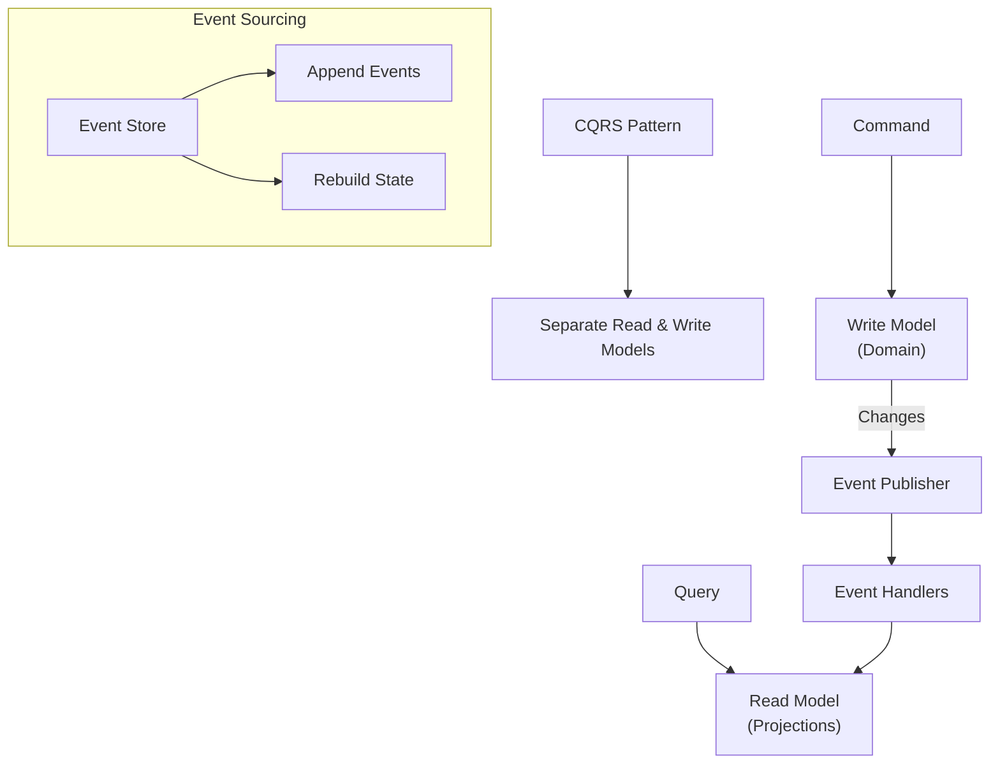
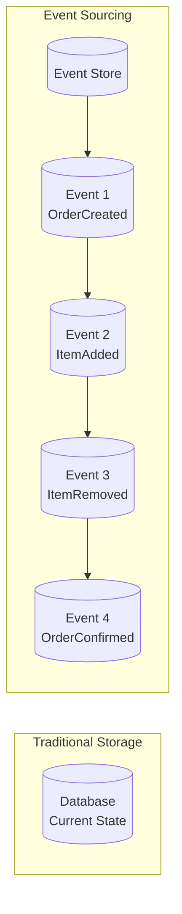
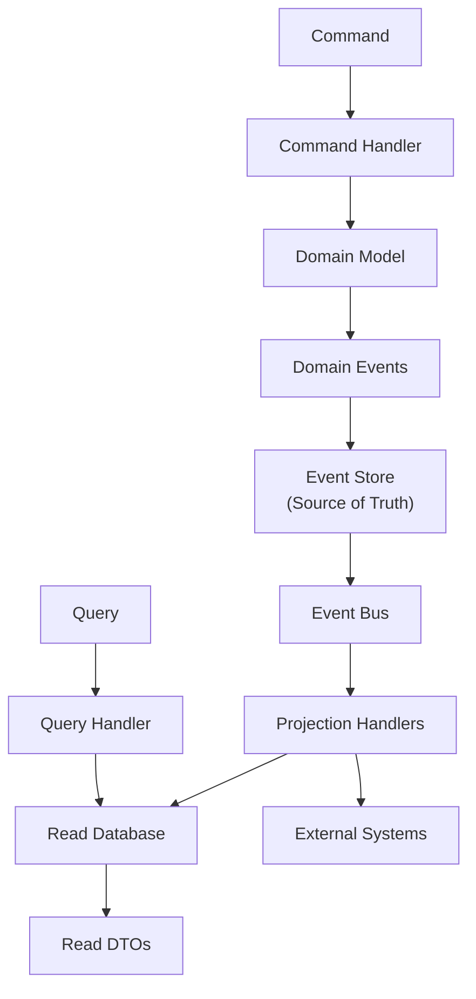

# Kiến trúc phần mềm

## CQRS & Event Sourcing

### 1. Tổng quan

**CQRS** (Command Query Responsibility Segregation) và **Event Sourcing** là hai patterns bổ trợ cho nhau, thường được sử dụng cùng nhau trong các distributed systems hiện đại. Mặc dù có thể dùng độc lập, kết hợp chúng tạo ra một architecture mạnh mẽ cho các domains phức tạp.



### 2. CQRS (Command Query Responsibility Segregation)

#### 2.1. Vấn đề với Traditional Architecture

Trong một traditional CRUD architecture, cùng một model xử lý cả reads và writes:

```
┌─────────────────────────────────────────────────────────────┐
│           Traditional: One Model for All                     │
│                                                              │
│   User ──Read──→ UserRepository ──→ Database (Users table)   │
│   User ──Write─→ UserRepository ──→ Database (Users table)   │
│                                                              │
│   Problem: Read model = Write model = same entity            │
│   - Complex queries require JOINs and denormalization hacks   │
│   - Read performance and write performance conflict           │
│   - Security: may expose data in read that shouldn't be      │
│     updatable                                               │
└─────────────────────────────────────────────────────────────┘
```

#### 2.2. CQRS Solution

CQRS tách riêng read và write sides thành distinct models, tối ưu cho mục đích tương ứng.

```
┌─────────────────────────────────────────────────────────────┐
│                    CQRS Architecture                          │
│                                                              │
│   Commands                    Queries                          │
│   (Write)                    (Read)                          │
│      ↓                           ↓                            │
│   ┌──────────┐               ┌──────────┐                   │
│   │ Command  │               │ Query    │                   │
│   │ Handler  │               │ Handler  │                   │
│   └────┬─────┘               └────┬─────┘                   │
│        ↓                           ↓                          │
│   ┌──────────┐               ┌──────────┐                   │
│   │  Write   │               │  Read    │                   │
│   │  Model   │               │  Model   │                   │
│   │ (Domain) │               │  (DTOs)  │                   │
│   └────┬─────┘               └────┬─────┘                   │
│        ↓                           ↓                          │
│   ┌──────────┐               ┌──────────┐                   │
│   │ Database │               │ Database │                   │
│   │  (Write) │               │  (Read)  │                   │
│   │  Source  │               │ Projected│                   │
│   └──────────┘               └──────────┘                   │
└─────────────────────────────────────────────────────────────┘
```

#### 2.3. Lợi ích của CQRS

| Lợi ích | Mô tả |
|---------|--------|
| **Independent Scaling** | Scale read và write sides riêng biệt theo load |
| **Optimized Models** | Read model có thể denormalized cho fast queries |
| **Different Data Stores** | Dùng SQL cho writes, NoSQL/Elasticsearch cho reads |
| **Security** | Separate read và write permissions |
| **Flexibility** | Thay đổi read model mà không ảnh hưởng write model |
| **Performance** | Tối ưu queries mà không impact domain model |

#### 2.4. CQRS Implementation

```java
// ========== COMMAND SIDE (Write) ==========

// Command: Intent to change
public record CreateOrderCommand(
    CustomerId customerId,
    List<OrderItemData> items
) {}

// Command Handler: Processes command
public class CreateOrderCommandHandler
    implements CommandHandler<CreateOrderCommand, OrderId> {

    private final OrderRepository orderRepository;
    private final ProductRepository productRepository;

    @Override
    public OrderId handle(CreateOrderCommand command) {
        Order order = Order.create(command.customerId());

        for (OrderItemData item : command.items()) {
            Product product = productRepository.findById(item.productId());
            order.addItem(product, item.quantity());
        }

        orderRepository.save(order);
        return order.getId();
    }
}

// Domain Entity (Write Model)
public class Order extends AggregateRoot {
    private OrderId id;
    private CustomerId customerId;
    private OrderStatus status;
    private List<OrderItem> items;
    private Money total;

    public static Order create(CustomerId customerId) {
        Order order = new Order();
        order.id = new OrderId(UUID.randomUUID());
        order.customerId = customerId;
        order.status = OrderStatus.DRAFT;
        order.items = new ArrayList<>();
        return order;
    }

    public void addItem(Product product, int quantity) {
        items.add(new OrderItem(product.getId(), product.getPrice(), quantity));
        recalculateTotal();
    }
}

// ========== QUERY SIDE (Read) ==========

// Read Model (DTO optimized for queries)
public record OrderSummaryDTO(
    String orderId,
    String customerName,
    Instant orderDate,
    Money total,
    int itemCount,
    String status
) {}

// Query
public record GetOrderSummaryQuery(OrderId orderId) {}

// Query Handler
public class OrderQueryHandler {
    private final JdbcTemplate jdbcTemplate;

    public OrderSummaryDTO handle(GetOrderSummaryQuery query) {
        String sql = """
            SELECT o.id, c.name, o.created_at, o.total, o.status,
                   COUNT(oi.id) as item_count
            FROM orders o
            JOIN customers c ON o.customer_id = c.id
            LEFT JOIN order_items oi ON o.id = oi.order_id
            WHERE o.id = ?
            GROUP BY o.id, c.name, o.created_at, o.total, o.status
            """;

        return jdbcTemplate.queryForObject(sql, (rs, rowNum) ->
            new OrderSummaryDTO(
                rs.getString("id"),
                rs.getString("name"),
                rs.getTimestamp("created_at").toInstant(),
                new Money(rs.getBigDecimal("total"), Currency.USD),
                rs.getInt("item_count"),
                rs.getString("status")
            ),
            query.orderId().getValue()
        );
    }
}
```

### 3. Event Sourcing

#### 3.1. Vấn đề với State-Based Storage

Traditional systems lưu trữ **current state** của entities:

```
Database Row:
order_id | customer_id | status  | total | items_json
---------|-------------|---------|-------|------------
ORD-001  | CUST-123    | CONFIRMED | 150.00 | [...]
```

Vấn đề: Chúng ta mất toàn bộ lịch sử. Không thể trả lời:
- "Khách hàng đã thêm gì vào order trước khi xóa một item?"
- "Order đã phát triển như thế nào theo thời gian?"
- "State tại 3 PM hôm qua là gì?"

#### 3.2. Event Sourcing Solution

Event Sourcing lưu trữ **events**, không phải state. Mỗi thay đổi được ghi lại như một immutable event.



Thay vì lưu: `Order(status=CONFIRMED, total=150)`
Chúng ta lưu:
```
Event: OrderCreated
Event: ItemAdded (product=laptop, qty=2, price=100)
Event: ItemRemoved (product=phone)
Event: OrderConfirmed
```

#### 3.3. Event Sourcing Implementation

```java
// ========== EVENTS ==========
public sealed interface OrderEvent extends DomainEvent {
    record OrderCreated(OrderId orderId, CustomerId customerId, Instant occurredOn)
        implements OrderEvent {}
    record ItemAdded(OrderId orderId, ProductId productId, Money price,
                     int quantity, Instant occurredOn)
        implements OrderEvent {}
    record ItemRemoved(OrderId orderId, ProductId productId, Instant occurredOn)
        implements OrderEvent {}
    record OrderConfirmed(OrderId orderId, Instant occurredOn)
        implements OrderEvent {}
}

// ========== EVENT STORE ==========
public interface EventStore {
    void append(String aggregateId, DomainEvent event, int expectedVersion);
    List<DomainEvent> load(String aggregateId);
    List<DomainEvent> load(String aggregateId, Instant from, Instant to);
}

// ========== AGGREGATE WITH EVENT SOURCING ==========
public class Order extends EventSourcedAggregate {
    private OrderId id;
    private CustomerId customerId;
    private OrderStatus status;
    private List<OrderItem> items;

    // Reconstitution từ events (called by framework)
    public Order(List<DomainEvent> events) {
        for (DomainEvent event : events) {
            apply((OrderEvent) event);
        }
    }

    private void apply(OrderEvent event) {
        switch (event) {
            case OrderCreated c -> {
                this.id = c.orderId();
                this.customerId = c.customerId();
                this.status = OrderStatus.DRAFT;
                this.items = new ArrayList<>();
            }
            case ItemAdded a -> {
                this.items.add(new OrderItem(a.productId(), a.price(), a.quantity()));
            }
            case ItemRemoved r -> {
                this.items.removeIf(i -> i.getProductId().equals(r.productId()));
            }
            case OrderConfirmed c -> {
                this.status = OrderStatus.CONFIRMED;
            }
        }
    }

    // Command methods raise events
    public void addItem(Product product, int quantity) {
        if (status != OrderStatus.DRAFT) {
            throw new DomainException("Cannot add items to confirmed order");
        }
        raise(new ItemAdded(id, product.getId(), product.getPrice(),
                           quantity, Instant.now()));
    }

    public void confirm() {
        if (items.isEmpty()) {
            throw new DomainException("Cannot confirm empty order");
        }
        raise(new OrderConfirmed(id, Instant.now()));
    }
}

// ========== EVENT STORE IMPLEMENTATION ==========
public class JpaEventStore implements EventStore {
    private final JdbcTemplate jdbcTemplate;

    @Override
    public void append(String aggregateId, DomainEvent event, int expectedVersion) {
        String sql = """
            INSERT INTO event_store (aggregate_id, event_type, event_data,
                                     sequence_number, occurred_on)
            VALUES (?, ?, ?, ?, ?)
            """;
        jdbcTemplate.update(sql,
            aggregateId,
            event.getClass().getSimpleName(),
            serialize(event),
            expectedVersion + 1,
            Instant.now()
        );
    }

    @Override
    public List<DomainEvent> load(String aggregateId) {
        String sql = """
            SELECT event_type, event_data
            FROM event_store
            WHERE aggregate_id = ?
            ORDER BY sequence_number ASC
            """;
        return jdbcTemplate.query(sql, (rs, rowNum) ->
            deserialize(rs.getString("event_type"),
                       rs.getString("event_data")),
            aggregateId
        );
    }
}
```

#### 3.4. Lợi ích của Event Sourcing

| Lợi ích | Mô tả |
|---------|--------|
| **Complete Audit Trail** | Mọi thay đổi được ghi lại, cung cấp 100% audit capability |
| **Temporal Queries** | Query state của hệ thống tại bất kỳ thời điểm nào |
| **Replay Capability** | Rebuild state bằng cách replay events, hoặc replay để fix bugs |
| **Event-Driven Architecture** | Events có thể trigger side effects (notifications, analytics) |
| **Debugging** | Replay events để hiểu chính xác điều gì đã xảy ra |
| **Time Travel** | Quay về bất kỳ thời điểm nào và xem system state |

#### 3.5. Thách thức

| Thách thức | Giải pháp |
|-----------|-----------|
| **Eventual Consistency** | Read model được update asynchronously; dùng saga patterns |
| **Event Schema Evolution** | Dùng versioning, upcasting, hoặc event transformation |
| **Querying** | Build read models (projections) từ events |
| **Snapshot** | Định kỳ snapshot aggregate state để tránh replaying all events |
| **Large Event Log** | Implement snapshots mỗi N events |

```java
// Snapshot pattern for performance
public class OrderSnapshot {
    private final OrderId orderId;
    private final int version;
    private final OrderStatus status;
    private final List<OrderItem> items;

    // Create snapshot every 100 events
    public static OrderSnapshot from(Order order) {
        return new OrderSnapshot(order.getId(), order.getVersion(),
            order.getStatus(), order.getItems());
    }
}
```

### 4. CQRS + Event Sourcing Combined

Khi kết hợp, CQRS và Event Sourcing tạo ra một architecture mạnh mẽ:



```java
// Combined: CQRS + Event Sourcing
public class OrderCommandHandler {
    private final EventStore eventStore;

    public OrderId handle(CreateOrderCommand command) {
        List<DomainEvent> events = eventStore.load(command.orderId().toString());
        Order order = new Order(events);

        order.addItem(command.product(), command.quantity());

        for (DomainEvent event : order.getUncommittedEvents()) {
            eventStore.append(order.getId().toString(), event,
                            order.getVersion() - 1);
        }

        return order.getId();
    }
}

// Projection handler (updates read model)
public class OrderProjectionHandler {
    @EventHandler
    public void handle(OrderConfirmedEvent event) {
        jdbcTemplate.update("""
            INSERT INTO order_summaries (order_id, status, confirmed_at)
            VALUES (?, ?, ?)
            ON CONFLICT (order_id) DO UPDATE SET status = ?
            """,
            event.orderId().toString(),
            OrderStatus.CONFIRMED.name(),
            event.occurredOn(),
            OrderStatus.CONFIRMED.name()
        );
    }
}
```

### 5. Axon Framework (Java)

**Axon Framework** là một Java framework phổ biến để xây dựng CQRS và Event Sourcing applications.

```java
// Axon Framework annotations
@Aggregate
public class OrderAggregate {
    @AggregateIdentifier
    private String orderId;

    @CommandHandler
    public OrderAggregate(CreateOrderCommand command) {
        apply(OrderCreatedEvent.builder()
            .orderId(command.getOrderId())
            .customerId(command.getCustomerId())
            .build());
    }

    @CommandHandler
    public void handle(AddItemCommand command) {
        if (command.getQuantity() <= 0) {
            throw new IllegalArgumentException("Quantity must be positive");
        }
        apply(ItemAddedEvent.builder()
            .orderId(orderId)
            .productId(command.getProductId())
            .quantity(command.getQuantity())
            .build());
    }

    @EventSourcingHandler
    public void on(OrderCreatedEvent event) {
        this.orderId = event.getOrderId();
    }
}
```

### 6. Eventual vs Strong Consistency

| Consistency | Mô tả | Use Case |
|-------------|--------|----------|
| **Strong Consistency** | Tất cả reads thấy latest write ngay lập tức | Financial transactions, inventory |
| **Eventual Consistency** | Reads có thể thấy stale data tạm thời | Social feeds, analytics, non-critical data |

---

### 7. Câu hỏi phỏng vấn

**Q: CQRS là gì và nó giải quyết vấn đề gì?**

> **CQRS** (Command Query Responsibility Segregation) tách riêng models dùng cho reading data khỏi models dùng cho writing data. Vấn đề nó giải quyết là trong traditional architectures, read và write operations chia sẻ cùng một model, thường là một poor compromise cho cả hai. Read models cần denormalized, query-friendly structures. Write models cần normalized, consistency-enforcing structures. Bằng cách tách riêng, mỗi side có thể được optimize độc lập. CQRS còn cho phép independent scaling, different data stores cho mỗi side, và better security isolation.

**Q: Event Sourcing là gì và tại sao nên dùng nó?**

> **Event Sourcing** lưu trữ lịch sử của các thay đổi như một chuỗi các immutable events thay vì chỉ lưu current state. Thay vì cập nhật một row, bạn append events vào một event log. Current state được reconstruct bằng cách replaying tất cả events. Bạn nên dùng nó khi cần một complete audit trail, temporal queries (state tại thời điểm T là gì?), replay capability cho debugging hoặc fixing bugs, hoặc khi domain phù hợp tự nhiên với event-driven model.

**Q: Thách thức của Event Sourcing là gì?**

> Các thách thức chính bao gồm: **Eventual consistency** — read model được update asynchronously, nên queries có thể trả về stale data tạm thời. **Event schema evolution** — khi requirements thay đổi, event schemas thay đổi, cần versioning và upcasting logic để xử lý old event formats. **Querying complexity** — vì lưu events, không phải state, querying requires building projections từ events, có thể phức tạp. **Large event logs** — theo thời gian, event stores có thể grow large, cần snapshot strategies. **Cognitive overhead** — developers cần nghĩ theo events thay vì state, có learning curve.

**Q: Khi nào nên kết hợp CQRS với Event Sourcing?**

> Kết hợp khi có một complex domain th受益 từ audit trail (tài chính, order management, regulatory compliance), khi cần high scalability với independent read/write scaling, khi muốn enable temporal queries và time-travel debugging, hoặc khi domain tự nhiên phù hợp với event-driven model. Không nên kết hợp cho simple CRUD applications hoặc khi eventual consistency không thể chấp nhận.
