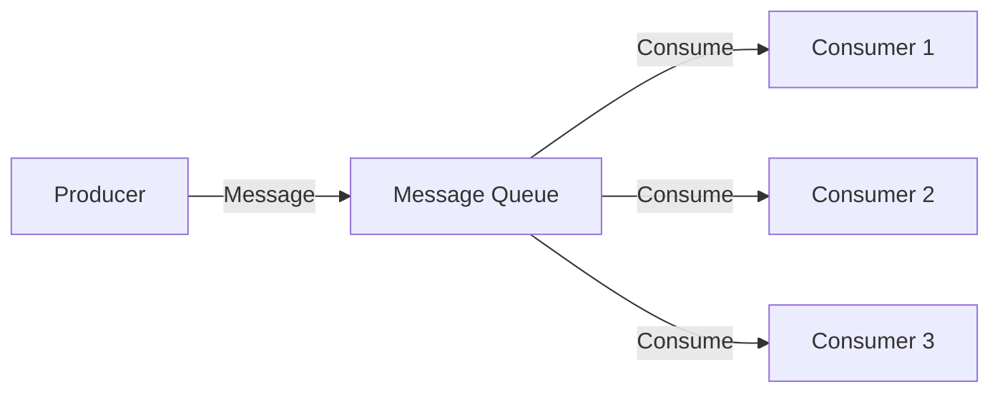
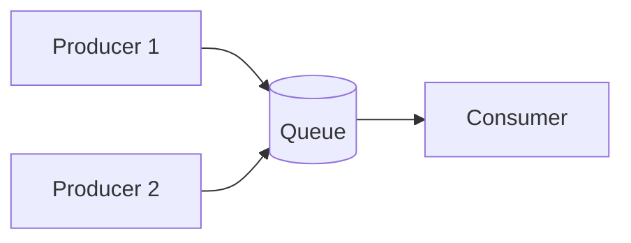
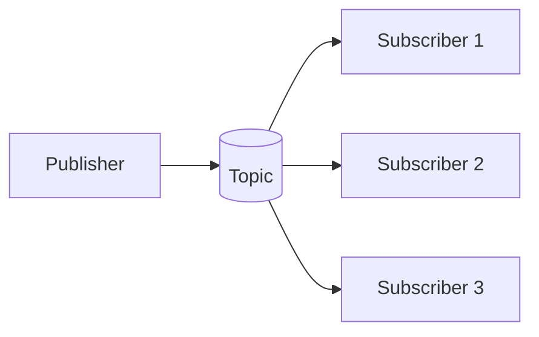
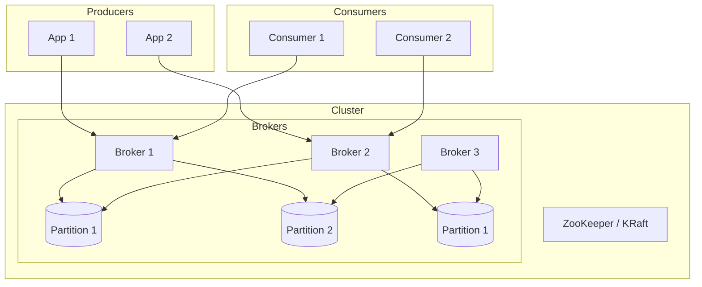
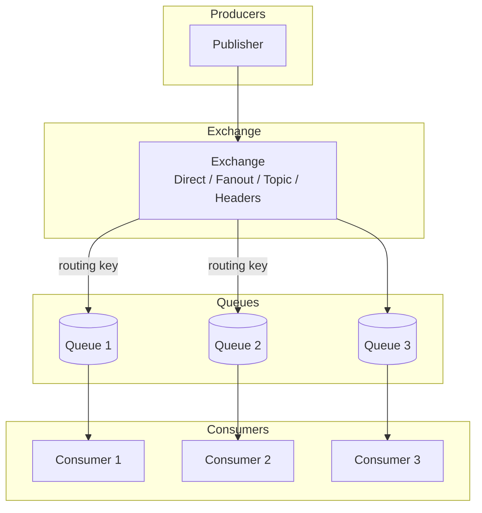
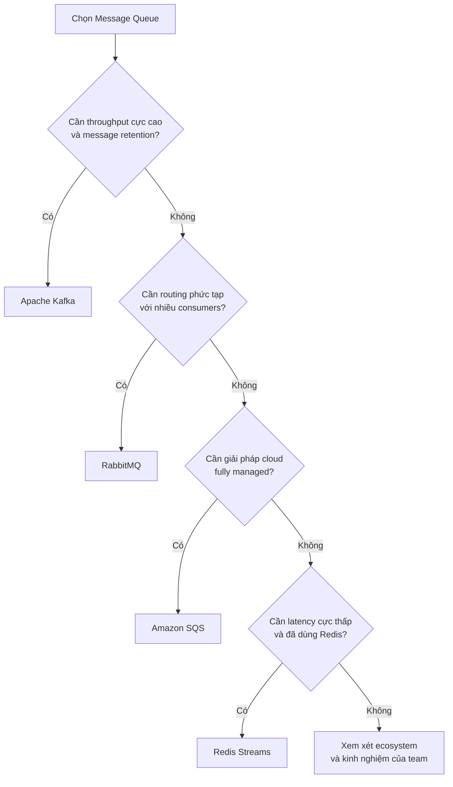

# Message Queue - Hàng đợi Tin nhắn

## Tổng quan

Message Queue (Hàng đợi tin nhắn) là một mô hình truyền thông bất đồng bộ, cho phép các service giao tiếp với nhau thông qua việc gửi và nhận messages mà không cần phải chờ response ngay lập tức. Message Queue nằm giữa Producer (người gửi) và Consumer (người nhận), đảm bảo messages được xử lý một cách đáng tin cậy ngay cả khi consumer tạm thời không khả dụng.



## Tại sao cần Message Queue?

- **Decoupling (Tách biệt)**: Producer và consumer không cần biết về nhau. Producer không cần biết consumer là ai hoặc có bao nhiêu consumer.
- **Asynchronous (Bất đồng bộ)**: Producer có thể tiếp tục xử lý mà không cần chờ consumer xử lý xong.
- **Scalability (Mở rộng)**: Dễ dàng scale consumer bằng cách thêm nhiều instances.
- **Reliability (Độ tin cậy)**: Messages được lưu trữ an toàn cho đến khi được xử lý thành công (persistent queue).
- **Load Leveling**: Xử lý burst traffic bằng cách queue messages và xử lý từ từ.
- **Resilience (Khả năng phục hồi)**: Nếu consumer fail, message vẫn còn trong queue và có thể retry.

## Các mẫu Message (Message Patterns)

### Point-to-Point

Mỗi message được consume bởi đúng một consumer. Queue xóa message sau khi consumer nhận thành công.



### Publish/Subscribe (Pub/Sub)

Một message được gửi đến topic và tất cả subscribers đều nhận được bản sao. Mỗi subscriber có thể process message theo cách riêng.



## Các khái niệm cốt lõi

### Message

Một message bao gồm:
- **Payload**: Dữ liệu cần truyền (JSON, XML, binary,...)
- **Headers**: Metadata (correlation ID, timestamp, message type,...)
- **Delivery mode**: Persistent (được lưu đĩa) hoặc Non-persistent (chỉ trong memory)

### Producer / Publisher

Ứng dụng gửi message đến queue hoặc topic. Không cần đợi consumer xử lý.

### Consumer / Subscriber

Ứng dụng nhận và xử lý message. Có thể là:
- **Push**: Consumer được notify khi có message mới
- **Pull**: Consumer chủ động pull messages từ queue

### Queue / Topic

- **Queue**: Point-to-point, FIFO (First-In-First-Out)
- **Topic**: Pub/Sub, một message gửi đến nhiều subscribers

## Message Acknowledgment

Khi consumer nhận message, nó cần acknowledge (ACK) để báo rằng đã xử lý thành công:

- **Auto ACK**: Message được auto-acknowledge ngay khi gửi đến consumer
- **Manual ACK**: Consumer chủ động ACK sau khi xử lý thành công
- **Negative ACK (NACK)**: Consumer reject message, message sẽ được requeue hoặc gửi đến Dead Letter Queue (DLQ)

## Dead Letter Queue (DLQ)

Messages không thể xử lý (sau nhiều lần retry thất bại) được chuyển đến DLQ để:
- Phân tích nguyên nhân thất bại
- Xử lý thủ công nếu cần
- Không block main queue

## So sánh các hệ thống Message Queue

| Tính năng | Apache Kafka | RabbitMQ | Apache ActiveMQ | Amazon SQS | Redis Streams |
|-----------|-------------|----------|-----------------|------------|---------------|
| **Pattern** | Pub/Sub + Queue | Cả hai | Cả hai | Queue only | Cả hai |
| **Ordering** | Per partition | Per queue | Per queue | Per queue | Per consumer group |
| **Throughput** | Rất cao (MB/s) | Cao | Trung bình | Cao | Cao |
| **Latency** | Thấp | Rất thấp | Trung bình | Thấp | Rất thấp |
| **Persistence** | Có (tùy chỉnh) | Có (tùy chọn) | Có | Có (managed) | Tùy chọn |
| **Replication** | Có (ISR) | Quorum queue | Master/Slave | Managed | Sentinel/Cluster |
| **Message Retention** | Tùy chỉnh (giờ/ngày) | Đến khi ACK | Đến khi ACK | Đến 14 ngày | Đến khi trim |
| **DLQ Support** | Có (qua topic) | Có | Có | Có (DLQ) | Có (pending) |
| **Ngôn ngữ** | Scala/Java | Erlang | Java | Managed | C |
| **Use Case** | Streaming, Event sourcing | Routing linh hoạt | Tích hợp legacy | Cloud-native, Serverless | Low-latency caching |

## Apache Kafka

### Kiến trúc



### Các khái niệm quan trọng

- **Topic**: Kênh logic cho messages (như bảng trong DB)
- **Partition**: Phân chia vật lý của topic để parallelism. Mỗi partition có thứ tự và immutable.
- **Offset**: ID tuần tự của mỗi message trong partition
- **Consumer Group**: Nhóm consumers chia sẻ workload. Mỗi partition được assign cho một consumer trong group.
- **Replication Factor**: Số bản sao của mỗi partition trên các brokers để fault tolerance
- **ISR (In-Sync Replicas)**: Các replicas đã đồng bộ hoàn toàn với leader

### Use Cases

- Event streaming và Event Sourcing
- Real-time analytics (clickstreams, IoT sensor data)
- Log aggregation (ELK stack)
- Stream processing (Kafka Streams, Apache Flink)
- Xây dựng event-driven microservices

### Ví dụ Producer (Java)

```java
Properties props = new Properties();
props.put("bootstrap.servers", "localhost:9092");
props.put("key.serializer", "org.apache.kafka.common.serialization.StringSerializer");
props.put("value.serializer", "org.apache.kafka.common.serialization.StringSerializer");

Producer<String, String> producer = new KafkaProducer<>(props);

ProducerRecord<String, String> record = new ProducerRecord<>(
    "order-events",  // topic
    "order-123",      // key
    "Order created for customer X"  // value
);

producer.send(record, (metadata, exception) -> {
    if (exception == null) {
        System.out.println("Sent: " + record.key() +
            " to partition " + metadata.partition() +
            " at offset " + metadata.offset());
    } else {
        exception.printStackTrace();
    }
});

producer.close();
```

### Ví dụ Consumer (Java)

```java
Properties props = new Properties();
props.put("bootstrap.servers", "localhost:9092");
props.put("group.id", "order-processor");
props.put("key.deserializer", "org.apache.kafka.common.serialization.StringDeserializer");
props.put("value.deserializer", "org.apache.kafka.common.serialization.StringDeserializer");
props.put("auto.offset.reset", "earliest");

KafkaConsumer<String, String> consumer = new KafkaConsumer<>(props);
consumer.subscribe(Arrays.asList("order-events"));

while (true) {
    ConsumerRecords<String, String> records = consumer.poll(Duration.ofMillis(100));
    for (ConsumerRecord<String, String> record : records) {
        System.out.println("Received: " + record.value() +
            " from partition " + record.partition() +
            " at offset " + record.offset());
        // Process the order...
    }
}
```

## RabbitMQ

### Kiến trúc



### Các loại Exchange

- **Direct**: Message được gửi đến queue dựa trên exact routing key
- **Fanout**: Message được gửi đến TẤT CẢ queues bound với exchange
- **Topic**: Routing key matching với wildcard patterns (`*.order.*`, `payment.#`)
- **Headers**: Match dựa trên message headers thay vì routing key

### Use Cases

- Task queues (xử lý background job)
- Complex routing (nhiều consumers với nhu cầu khác nhau)
- Xử lý đơn hàng thương mại điện tử
- Hệ thống thông báo

### Ví dụ RabbitMQ (Java)

```java
ConnectionFactory factory = new ConnectionFactory();
factory.setHost("localhost");
Connection connection = factory.newConnection();
Channel channel = connection.createChannel();

// Declare exchange
channel.exchangeDeclare("order.events", BuiltinExchangeType.TOPIC, true);

// Declare queue
channel.queueDeclare("order.processing", true, false, false, null);

// Bind queue to exchange
channel.queueBind("order.processing", "order.events", "order.#");

// Consumer
DeliverCallback deliverCallback = (consumerTag, delivery) -> {
    String message = new String(delivery.getBody(), "UTF-8");
    System.out.println("Received: " + message);
    channel.basicAck(delivery.getEnvelope().getDeliveryTag(), false);
};

channel.basicConsume("order.processing", false, deliverCallback, consumerTag -> {});
```

## Amazon SQS

### Tính năng

- **Fully managed** cloud service - không cần quản lý server
- **Hai loại queue**:
  - **Standard Queue**: TPS không giới hạn, at-least-once delivery, best-effort ordering
  - **FIFO Queue**: Exactly-once processing, FIFO ordering, giới hạn 300 TPS
- **Message retention**: 1 phút đến 14 ngày
- **Visibility timeout**: Thời gian consumer có để xử lý trước khi message hiển thị lại
- **Dead Letter Queue**: Cho các message thất bại
- **Long polling**: Giảm empty responses

### Use Cases

- Serverless architectures (AWS Lambda + SQS)
- Decoupling microservices
- Distributed job queues
- Buffering batch operations

## Chọn Message Queue phù hợp



## Best Practices

1. **Idempotent Processing**: Thiết kế consumers để xử lý duplicate messages một cách graceful
2. **Message Size**: Giữ messages nhỏ (< 1MB). Với payload lớn, lưu vào object storage và gửi reference.
3. **Ordering**: Chỉ expect ordering trong một partition/queue. Nếu ordering quan trọng, dùng consistent routing key.
4. **Monitoring**: Theo dõi queue depth, consumer lag, processing time, error rates
5. **Retry with Backoff**: Dùng exponential backoff cho retries để tránh thundering herd
6. **DLQ**: Luôn configure Dead Letter Queue cho các message thất bại
7. **Schema Registry**: Dùng Avro hoặc Protobuf cho message serialization trong Kafka để schema evolution
8. **Security**: Bật TLS encryption in transit, dùng IAM/ACL cho authorization

## Câu hỏi phỏng vấn thường gặp

**Q: Sự khác nhau giữa Kafka và RabbitMQ là gì?**

A: Kafka được tối ưu cho high-throughput streaming với message retention và per-partition ordering. RabbitMQ linh hoạt hơn với routing (nhiều exchange types) và phù hợp cho traditional message queuing. Kafka là pull-based (consumer pulls), RabbitMQ là push-based.

**Q: Làm sao để đảm bảo exactly-once delivery?**

A: Rất khó đạt được exactly-once thực sự. Các chiến lược bao gồm:
- Idempotent producers + idempotent consumers
- Transactional outbox pattern (write to DB + message atomically)
- Dùng Kafka transactions cho exactly-once semantics với sinks

**Q: Điều gì xảy ra khi consumer fail giữa chừng?**

A: Phụ thuộc vào acknowledgment mode:
- Auto ACK: Message bị mất nếu consumer crash sau khi nhận nhưng trước khi xử lý
- Manual ACK: Message được requeue (hoặc gửi đến DLQ sau max retries) nếu consumer không ACK
- Visibility timeout (SQS): Message hiển thị lại sau timeout nếu không được xử lý

**Q: Làm sao xử lý message ordering?**

A: Dùng một partition/queue duy nhất cho một ordering key. Tất cả messages với cùng key đi đến cùng partition. Consumer xử lý theo thứ tự. Hoặc dùng sequence numbers trong messages và để consumer đảm bảo ordering.
